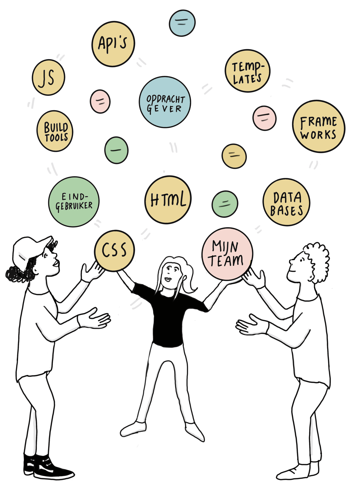
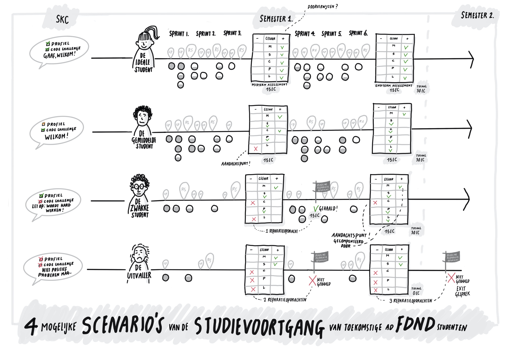

# Toets Nieuwe Opleiding

De Hogeschool van Amsterdam (HvA) heeft een aanbod aan Associate degree-opleidingen dat aansluit op de vraag van de arbeidsmarkt. Een Associate degree (Ad) leidt op tot professionals die strategisch kunnen denken en dit weten te verbinden met het handelen op de werkvloer. De Ad’er opereert daarmee op tactisch niveau en kan zowel de visie als de richting die de organisatie bepaalt doorgronden. Ook is de Ad'er in staat deze visie te vertalen naar concrete acties op de werkvloer. De Ad’er speelt in op veranderingen in de omgeving en lost ambigue praktische vraagstukken efficiënt op. Door het leren oplossen van beroepsauthentieke vraagstukken, het werken in leeromgevingen met wisselende contexten en intensieve studentbegeleiding bereiden wij de Ad’er voor op de beroepspraktijk.

De Ad Frontend Design & Development (FDND) wordt een praktijkgerichte, tweejarige hbo-opleiding waar studenten in worden opgeleid tot *Frontend professionals*. Frontenders ontwerpen en maken interactieve, toegankelijke toepassingen voor het web. Dit maakt dat een frontender opereert binnen het gebied van software development, interactieontwerp en digitaal visueel ontwerp.

## Frontend Design & Development

### Waarom een Ad Frontend Design & Development?
Landelijk, en in het bijzonder in de regio Groot Amsterdam, kunnen veel vacatures op het gebied van frontend niet worden vervuld. De verwachting is dat de vraag naar hoogopgeleide frontend professionals de komende jaren alleen nog maar gaat toenemen. Naast schaarste op de arbeidsmarkt ligt er ook een maatschappelijk vraagstuk. Het menselijke aspect verdwijnt door de technische gerichtheid van de industrie nogal eens naar de achtergrond. Commerciële partijen richten zich wel op technische vaardigheden maar niet op vakoverstijgende vaardigheden zoals kritisch denken, ethisch besef en soft-skills. Er is in Nederland nog geen opleiding die een officieel erkend Associate of bachelor degree Frontend uitschrijft. Vanuit deze behoefte van zowel de arbeidsmarkt als de maatschappij is de Associate degree Frontend Design & Development (FDND) ontworpen.

FDND leidt frontend professionals op die gespecialiseerd zijn in het ontwerpen en bouwen van webtoepassingen. Studenten leren samenwerken in multidisciplinaire teams en opereren op het snijvlak van design en development. Ook werken ze vanaf het begin van de opleiding aan opdrachten voor echte opdrachtgevers. Studenten die afgestudeerd zijn bij FDND kunnen direct aan de slag in de beroepspraktijk. Hiermee leveren zij een bijdrage aan het terugdringen van de krapte op de arbeidsmarkt.

Tijdens gesprekken met het regionale werkveld is gebleken dat er vooral vraag is naar afgestudeerden die inhoudelijke en technische vaardigheden op HBO-niveau beheersen, ook zijn vakoverstijgende vaardigheden van groot belang. Om te kunnen schakelen tussen verschillende afdelingen en disciplines, moeten Frontend professionals kunnen samenwerken, zowel multidisciplinair als met verschillende nationaliteiten. Ook is het van belang dat ze in bezit zijn van een groot probleemoplossend vermogen. Aan deze vaardigheden besteden we tijdens de opleiding veel aandacht. Hiermee sluit het vastgestelde FDND profiel aan op wat er in vacatures gevraagd wordt. De enthousiaste bijdrage van vele ‘creative agencies’ aan de totstandkoming van onze plannen laat de behoefte en noodzaak van deze Ad zien.

### Naamgeving
Frontend is een internationaal gebruikte term. Omdat frontend professionals zowel op het gebied van webdesign als van webdevelopment opereren, hebben wij gekozen voor de naam 'Frontend Design & Development'. Frontend professionals oefenen binnen hun functie verschillende rollen uit. Daarnaast wordt de functie van een frontender door werkgevers op verschillende manieren gekenmerkt. De naam Frontend Design & Development dekt alle mogelijke rollen en functies die een frontend professional kan aannemen. Deze naam wordt wereldwijd (h)erkend in het beroepenveld en veelvuldig gebruikt op internationale conferenties.

### Positionering binnen de Hogeschool van Amsterdam
FDND past in de doorlopende lijn van het cluster Mediadesign van de HvA. Dit cluster maakt onderdeel uit van de faculteit Digitale Media en Creatieve Industrie.

<table id="opleidingen-fdmci">
<caption>Opleidingen Faculteit Digitale Media & Creatieve Industrie * opleiding in ontwikkeling</caption>
<thead>
<tr>
  <th class="blank"></th>
  <th scope="col">Cluster Mediadesign</th>
  <th scope="col">Cluster ICT</th>
  <th scope="col">Cluster Media en Communicatie</th>
  <th scope="col">Cluster Fashion</th>
</tr>
</thead>
<tbody>
<tr>
  <th scope="row">Associate Degree</th>
  <td>Frontend Design & Development</td>
  <td>Software Development, Cyber Security</td>
  <td>Smart Media Production</td>
  <td></td>
</tr>
<tr>
  <th scope="row">Bachelor Degree</th>
  <td>Communication & Multimedia Design</td>
  <td>HBO-ICT</td>
  <td>Communicatie & Creative Business</td>
  <td>Amsterdam Fashion Institute</td>
</tr>
<tr>
  <th scope="row">Master Degree</th>
  <td>Digital Design</td>
  <td>Applied Artificial Intelligence, Cyber Security*</td>
  <td></td>
  <td>Fashion Master*</td>
</tr>
</tbody>
</table>

<table id="lectoraten-fdmci">
<caption>Lectoraten Faculteit Digitale Media & Creatieve Industrie</caption>
<thead>
<tr>
  <th scope="col">Create-IT Lectoraten</th>
</tr>
</thead>
<tbody>
<tr>
  <td>Crossmedia, Cyber Security, Digital Life, Fashion Research & Technology, Network Cultures, Play and Civic Media, Quantum Computing, Responsible IT, Urban Analytics, Visual Methodologies</td>
</tr>
</tbody>
</table>

De faculteit heeft voldoende kennis en expertise in huis om de Ad FDND aan te bieden. FDND wordt ontwikkeld door een team docenten van de bacheloropleiding Communication & Multimedia Design (CMD).

### Macro­doelmatigheid
De Commissie Doelmatigheid Hoger Onderwijs (CDHO) heeft de Minister van Onderwijs, Cultuur & Wetenschap geadviseerd in te stemmen met onze aanvraag om de voltijdse opleiding Ad Frontend Design & Development als bekostigd onderwijs aan te bieden. Op 14 juli 2020 heeft het ministerie van Onderwijs, Cultuur & Wetenschap hiermee ingestemd.

Ten aanzien van de naam en Croho indeling heeft de commissie geconstateerd dat voorgestelde naam van de opleiding passend is en dat indeling in het Croho onderdeel Techniek ook aansluit bij de indeling van reeds bestaande verwante opleidingen. Het aanvraagdossier en het advies macrodoelmatigheid liggen ter inzage op de visitatiedag.

### Doelgroep en toelatings­voorwaarden
FDND richt zich op ambitieuze mbo-4 studenten van bij voorkeur relevante mbo-opleidingen, en op havisten en vwo’ers die graag een hbo-opleiding met een praktijkgerichte focus willen volgen. Om tot de opleiding te worden toegelaten, worden er aan studenten met een havo, vwo of mbo-4 diploma geen nadere vooropleidingseisen gesteld. Personen van 21 jaar en ouder die niet voldoen aan de juiste vooropleidingseisen kunnen deelnemen aan een toelatingsassessment in de vorm van de 21+ toets.

### Samenwerking
FDND wordt samen met het werkveld vormgegeven en uitgevoerd. Door bedrijven uit de creatieve industrie bij het onderwijs te betrekken, doen studenten veel ervaring op in de praktijk. Het geeft studenten ook de mogelijkheid een netwerk aan te leggen waarbinnen ze mogelijk een stageplek en een werkplek vinden.

Door het aangaan van een convenant wordt een bedrijf partner in onderwijs; deze samenwerking is niet vrijblijvend. Partners in onderwijs (experts) delen hun kennis met FDND en werken mee aan de (door)ontwikkeling van het curriculum. Experts geven talks, workshops of delen gedurende een periode hun kennis als co-teacher naast een docent. Ook bezoeken studenten gedurende hun opleiding meerdere malen verschillende bedrijven en werken ze gedurende projecten intensief met experts van bedrijven samen.

Binnen de HvA hebben we een samenwerkingsovereenkomst met de lectoraten Responsible IT en Digital Life. Verder onderzoeken we de mogelijkheden met andere HvA lectoraten zoals: het lectoraat Visual Methodologies, het lectoraat Crossmedia en het Institute of Network Cultures. Door samen te werken met verschillende lectoraten zorgen we ervoor dat de opleiding aansluit bij actuele ontwikkelingen in de praktijk. Zo kan een lectoraat een actueel vraagstuk opwerpen waar wij een geschikte opdracht(gever) bij zoeken.

Ook tussen de Ad opleidingen van FDMCI wordt samengewerkt. De Ad opleidingen zijn gezamenlijk ontwikkeld en op elkaar afgestemd. Studenten krijgen in de vrije ruimte de mogelijkheid om modules bij een andere Ad opleiding te volgen.

In de regio werken we nauw samen met verschillende MBO en HBO opleidingen, in het bijzonder met de 'preferred partners' van de HvA. Deze zijn geraadpleegd bij het opstellen van het beroeps- en opleidingsprofiel en er is sprake van samenwerking en kennisdeling.

Door deze samenwerkingsverbanden doen studenten tijdens hun opleiding praktijkervaring op, blijven docent en onderzoekers op de hoogte van ontwikkelingen en verdiepen frontend professionals hun beroep door ervaring te delen en deel te worden van onze learning community.

## Standaard 1: Beoogde leer­resultaten

*De beoogde leerresultaten passen bij het niveau en de oriëntatie van de opleiding en zijn afgestemd op de verwachtingen van het beroepenveld en het vakgebied en op internationale eisen.*

De opleiding Frontend Design & Development (FDND) is samen met het werkveld ontwikkeld en ook bij het aanbieden van onderwijs wordt het bedrijfsleven ingezet. Deze samenwerking draagt aanzienlijk bij aan onze visie op het beroep die ten grondslag ligt aan onze leerresultaten.

### Visie op het beroep
Frontenders maken interactieve, toegankelijke toepassingen voor het web die beantwoorden aan de vraag van een opdrachtgever. Hierbij wordt rekening gehouden met gebruiksvriendelijkheid en behoeften van eindgebruikers. Frontenders werken in teams samen met software developers, visual designers, interaction designers en contentmakers van verschillende niveaus (mbo-4, Associate degree, bachelor, master). Naast technische vaardigheden beschikken ze ook over uitstekende persoonlijke en sociale vaardigheden. Zo zijn ze communicatief sterk, vragen door en kunnen binnen hun team beargumenteerd adviseren over en richting geven aan het ontwerp en de ontwikkeling van de 'frontend' van een interactieve toepassing. Deze combinatie van kennis, houding en vaardigheden maakt Frontend tot een complex beroep, zie figuur 2.

Frontenders omarmen verandering en blijven op de hoogte van trends op het gebied van technologie, digitaal- en interactie ontwerp. Ook delen ze deze kennis met hun team en brengen dit in praktijk met inachtneming van geldende standaarden.

Frontenders werken zelfstandig en doelgericht en hebben overzicht over hun vaak gevarieerde taken. Ze passen agile (Scrum) ontwerp- en ontwikkelmethodieken toe in hun werk. Toegankelijkheid vormt het uitgangspunt bij het ontwerpen en ontwikkelen van toepassingen en wordt getoetst door middel van gebruikerstesten.

Frontenders zijn flexibele en leergierige professionals die kunnen omgaan met de technologische ontwikkelingen en in het werkveld direct aan de slag kunnen. FDND leidt studenten op tot de volgende beroepen: Frontend Web Developer, HTML/CSS Developer, Frontend Web Designer, User Interface Developer, Frontend Engineer.

### Frontend op Ad niveau
Associate degree opleidingen zijn in het European Quality Framework (EQF) en het Nederlands Kwalificatieraamwerk (NLQF) gepositioneerd en uitgewerkt op niveau 5. Een beschrijving van het Associate degree niveau is vastgesteld door het Overlegplatform Associate degree van de Vereniging Hogescholen. Hierin is niveau 5 uitgewerkt aan de hand van vijf gedragsindicatoren: probleemoplossend vermogen, methodisch handelen, samenwerken, communiceren en lerend vermogen. Er is in kaart gebracht hoe de Ad FDND (niveau 5) zich verhoudt tot verwante opleidingen op mbo-niveau (niveau 4) en bachelorniveau (niveau 6).

Er is sprake van een toenemende mate van complexiteit van leertaken en context, en zelfstandigheid in het handelen. Zo beheerst een afgestudeerde mbo'er de gedragsindicator 'methodisch handelen' door standaardprocedures en methodes toe te passen in het dagelijks werk, zoals het aanpassen of ontwikkelen van (een gedeelte) van een eenvoudige interactieve toepassing. Een Ad’er selecteert zelf theorieën en methodes op het gebied van Frontend en past deze toe op actuele vraagstukken in een complexere context. Complexiteitsfactoren zijn bijvoorbeeld: de toe te passen techniek, de grootte van de opdrachten, de grootte van het team, de beschikbare tijd en de houding van de opdrachtgever. Een afgestudeerde bachelor legt verbanden tussen gegevens en problemen en vertaalt theorieën op het gebied van Frontend naar toepassingen voor de praktijkvraagstukken.

### Leerresultaten
De eindkwalificaties voor de opleiding bestaan uit één overkoepelend leerresultaat met bijbehorende gedragsindicatoren en -criteria. Op basis van de visie op het beroep en de Ad niveaubeschrijving zijn de eindkwalificaties geformuleerd. In onderstaande tabel zijn het leerresultaat en de gedragscriteria voor het eindniveau weergegeven.

<table>
<caption>Figuur 3: Eindniveau met bijbehorende gedragscriteria en -indicatoren</caption>
<tr><th colspan="5">De student ontwerpt en ontwikkelt zelfstandig complexe gebruiksvriendelijke, interactieve toepassingen voor het web. De student beheerst de principes van het web, kan API’s en databases gebruiken, kan frameworks, templates en build tools inzetten, en werkt volgens gangbare ontwikkelmethoden.</th></tr>
<thead>
<tr>
  <th>Methodisch handelen</th>
  <th>Samenwerken</th>
  <th>Communiceren</th>
  <th>Probleemoplossend vermogen</th>
  <th>Lerend vermogen</th>
</tr>
</thead>
<tr>
  <td>Richt projecten efficiënt en effectief in volgens de development-lifecycle en houdt rekening met de beschikbare tijd.</td>
  <td>Werkt in teams, reflecteert op efficiëntie en effectiviteit en stuurt bij waar nodig.</td>
  <td>Betrekt gesprekspartners, luistert, vat samen, verifieert en vraagt door tot een boodschap helder is.</td>
  <td>Analyseert een vraag, signaleert knelpunten, kiest onderbouwd richting en houdt rekening met directe gevolgen van keuzes.</td>
  <td>Blijft op de hoogte van internationale ontwikkelingen in het vakgebied, omarmt verandering en maakt zelfstandig keuzes over eigen ontwikkeling.</td>
</tr>
<tr>
  <td>Combineert principes, conventies en best-practices op het gebied van frontend, interface design en vormgeving en zet deze flexibel en onderbouwd in.</td>
  <td>Draagt verantwoording voor eigen en teamresultaten en stuurt verwachtingen van belanghebbenden.</td>
  <td>Presenteert en onderbouwt op overtuigende wijze ontwerpkeuzes, eigen ideeën en producten passend bij het publiek.</td>
  <td>Combineert onderbouwd frontend principes, conventies en best-practices op inventieve wijze om een passende oplossing voor een opdrachtgever te realiseren.</td>
  <td>Maakt zelfstandig nieuwe materie eigen, gebruikt dit bij beroepstaken, deelt ervaring met belanghebbenden en leert van anderen.</td>
</tr>
<tr>
  <td>Bewaakt de belangen van de eindgebruiker bij het realiseren van een oplossing voor een opdrachtgever.</td>
  <td>Houdt rekening met diversiteit binnen teams en handelt respectvol naar anderen.</td>
  <td>Documenteert op professionele wijze en bespreekt voortgang met belanghebbenden.</td>
  <td>Schetst om gedachten en processen bespreekbaar te maken, abstracte begrippen over te brengen en de oplossingsrichting inzichtelijk te maken.</td>
  <td>Kent eigen capaciteiten en beperkingen, waardeert het vermogen van anderen, maakt dit bespreekbaar en schakelt zelfstandig hulp in waar nodig.</td>
</tr>
</table>

Dit leerresultaat is zeer veelzijdig en complex, het beschrijft het geheel aan kennis, vaardigheden, gedrag en gewenst eindresultaat dat een student beheerst: Bij het ontwerpen en ontwikkelen van een webtoepassing moet een student ontwerp- en ontwikkelmethodieken kunnen inzetten en met klanten en andere stakeholders kunnen overleggen om tot een goed eindresultaat te komen. Om een gebruiksvriendelijke en interactieve toepassing te ontwerpen dient een student een ontwerp te testen bij de eindgebruiker, maar ook op apparaten en in browsers waar de toepassing voor bedoeld is. Deze testresultaten moeten vervolgens verwerkt worden in het eindproduct.

In de opleiding zit een opbouw naar het eindniveau door middel van drie leerresultaten die in complexiteit toenemen. Deze opbouw is in overleg met het werkveld geformuleerd en verhoudt zich tot de landelijke opleidings- en competentieprofielen CMD en HBO-i en het Europese e-Competence Framework.

<table class="leerresultaten">
<caption>Figuur 4: Vier leerresultaten van de opleiding in oplopende complexiteit</caption>
<tr>
  <th>Semester 1 Het statische web</th>
  <td>De student gebruikt fundamentele principes van het web voor het ontwerpen en ontwikkelen van eenvoudige gebruiksvriendelijke interactieve toepassingen voor het web.</td>
</tr>
<tr>
  <th>Semester 2  Het data-driven web</th>
  <td>De student gebruikt API's en databases voor het ontwerpen en ontwikkelen van gebruiksvriendelijke interactieve toepassingen voor het web.</td>
</tr>
<tr>
  <th>Semester 3  Workflow, templates frameworks</th>
  <td>De student werkt volgens gangbare ontwikkelmethoden, en gebruikt frameworks, templates en build tools voor het ontwerpen en ontwikkelen van complexe gebruiksvriendelijke interactieve toepassingen voor het web.</td>
</tr>
<tr>
  <th>Semester 4  Eindniveau</th>
  <td>De student ontwerpt en ontwikkelt zelfstandig complexe gebruiksvriendelijke, interactieve toepassingen voor het web. De student beheerst de principes van het web, kan API’s en databases gebruiken, kan frameworks, templates en build tools inzetten, en werkt volgens gangbare ontwikkelmethoden.</td>
</tr>
</table>

### Internationaal perspectief
Het betrokken werkveld, dat zowel uit opdrachtgevers als creatieve bureaus bestaat, is internationaal georiënteerd en onderschrijft het belang van een internationaal georiënteerde opleiding. Daarom is FDND van plan samenwerkingen aan te gaan met opdrachtgevers en NGO’s die internationaal georiënteerd zijn. Om dit te faciliteren en studenten hierop voor te bereiden, gebruikt FDND daar waar relevant internationale bronnen en instructiefilmpjes en ook de gehanteerde terminologie zal voornamelijk Engelstalig zijn. De voertaal van de opleiding is Nederlands.

De web technieken HTML, CSS en JavaScript worden vanuit internationale standaarden ontwikkeld door The World Wide Web Consortium (W3C). Deze standaarden spelen een belangrijke rol in de visie en het curriculum van FDND.

Het frontend vakgebied is actief, internationaal en wisselt veel kennis uit. FDND is van plan zowel samen te werken met als bij te dragen aan dit vakgebied. Zo worden bijvoorbeeld frontend professionals ingezet als co-teacher of bij het geven van talks en workshops.

De opleiding verhoudt zich tot niveau 5 van het European Quality Framework. De beoogde leerresultaten zijn mede gebaseerd op internationale standaarden zoals het European e-Competence Framework. Dit maakt dat de kennis en vaardigheden die de studenten gedurende de opleiding opdoen ook bij internationale bedrijven herkend en erkend worden.

### Na afronding van de opleiding
Zoals aangetoond in de CDHO aanvraag zullen de meeste studenten na afronding van de opleiding functies gaan bekleden als Frontend Developer, HTML/CSS Developer, Frontend Web Designer, User Interface Developer en Frontend Engineer. Studenten komen tijdens hun opleiding veel in contact met potentiële werkgevers door de praktijkopdrachten die ze voor hen uitvoeren. Hierdoor verwachten we dat zij na hun opleiding snel een passende functie zullen hebben. Daarnaast is zowel de landelijke als de regionale arbeidsmarktprognose voor de bovengenoemde functies heel goed.

Gezien de inhoudelijke verwantschap kunnen studenten die na deze opleiding een bachelordiploma willen halen, doorstromen naar de bacheloropleidingen CMD en naar HBO-ICT. Er zijn met de examencommissies van deze opleidingen afspraken gemaakt over de mate van vrijstelling die studenten bij doorstroom ontvangen met als doel dat studenten in maximaal 150 EC hun bachelor diploma kunnen behalen. In het curriculum van de Ad FDND kunnen studenten die willen doorstromen in de vrije keuzeruimte een doorstroommodule volgen die in samenwerking met de bacheloropleiding wordt ontwikkeld.

### Aansluiten bij de actualiteit
Het werkveld een belangrijke rol bij de ontwikkeling van de opleiding en uitvoering van het onderwijs. Experts uit het vakgebied en lectoren worden ingezet bij verschillende onderwijsactiviteiten in de vorm van talks, workshops en co-teaching. Studenten leren daarmee het vak direct van experts en sluiten daarmee nauw aan op ontwikkelingen in de beroepspraktijk. Bovendien werken studenten aan actuele opdrachten voor echte opdrachtgevers.

Ons docententeam is vakinhoudelijk goed op de hoogte van de laatste ontwikkelingen in de beroepspraktijk. Docenten krijgen ruimte voor scholing en het bezoeken van conferenties.

Voor FDND wordt een onderwijsadviesraad (OAR) gevormd om de inhoud van de opleiding actueel te houden. In deze raad, die twee keer per jaar samenkomt, hebben leden uit het werkveld (die o.a. betrokken waren bij de ontwikkeling), lectoraten, docenten en studenten zitting. De OAR adviseert FDND over de actualiteit van het curriculum en de aansluiting op het beroepenveld.

## Standaard 2: De onderwijs­leeromgeving

*Het programma, de onderwijsleeromgeving en de kwaliteit van het docententeam maken het voor de instromende studenten mogelijk de beoogde leerresultaten te realiseren.*

De opleiding Frontend Design & Development (FDND) leidt flexibele, zelfstandige en praktijkgerichte Frontend professionals op die goed functioneren binnen een snel ontwikkelende en veranderlijke beroepspraktijk. Bij FDND staat de beroepspraktijk centraal en het onderwijsprogramma is een vertaling van beroepstaken en daarbij behorende kennis, vaardigheden en gedrag naar leerresultaten.

### Didactisch concept
Het didactisch concept van FDND is erop gericht om studenten zo goed mogelijk voor te bereiden op een veranderlijke beroepspraktijk. Om deze reden gebruiken we bij het ontwerp van het curriculum en de fasering van opdrachten een projectmethodiek (Scrum) die in de beroepspraktijk standaard is. De veranderlijke beroepspraktijk en mogelijke diversiteit in instroom van studenten qua vooropleiding, gender en cultuur vragen om een flexibel onderwijsprogramma. De diversiteit in instroom maakt het daarnaast belangrijk dat we goed moeten kunnen omgaan met individuele verschillen tussen studenten. Ook vinden we het van groot belang dat studenten leren zelfstandig te opereren in een steeds complexer wordende wereld.

De didactische bouwstenen voor High Impact Learning that Lasts (HILL) van Dochy en Segers (2015) sluiten goed aan bij onze voorwaarden. HILL draagt bij aan diep leren en zelfsturing en past bij het opleiden van praktijkgerichte professionals. Deze bouwstenen vormen de basis van het didactisch concept van FDND en zijn vertaald naar drie principes:

- praktijkvraagstukken in een rijke leeromgeving
- student aan het roer
- toetsing als leermoment

#### Praktijkvraagstukken in een rijke leeromgeving
De beroepspraktijk staat centraal in de opleiding; studenten werken aan échte opdrachten voor echte opdrachtgevers. Dat zorgt ervoor dat studenten over actuele kennis, houding en vaardigheden beschikken en na de opleiding direct inzetbaar zijn. Opdrachten uit de beroepspraktijk worden vertaald naar leertaken. Het curriculum bestaat uit verschillende leertaken die studenten zelfstandig of in teams uitvoeren. Afgeronde leertaken worden opgenomen in een portfolio en dienen als bewijslast voor het behalen van leerresultaten.

Voor planning en fasering gebruiken we de fasering uit Scrum die de development-lifecycle wordt genoemd.. Elke leertaak wordt volgens deze methode aangepakt, hierdoor ontwikkelen de studenten een standaard manier om frontend praktijkvraagstukken aan te pakken, werken ze systematisch aan leertaken, ontwikkelen ze doorlopend het gedragscriterium ‘Methodisch handelen’, ervaren ze de relevantie van het geleerde en verwerven ze de kennis, houding en vaardigheden die de beroepspraktijk van hen vraagt.

Om studenten uit te rusten met de kennis en vaardigheid om leertaken te volbrengen worden talks aangeboden met ondersteunende informatie, en worden workshops georganiseerd voor om te oefenen met de materie. Ook leren studenten systematisch reflecteren op hun leerproces en professioneel handelen en daarover communiceren in daily standup, (code-)review en retrospective sessies.

De fysieke leeromgeving is zo ingericht dat studenten zich er thuis voelen en zich gestimuleerd voelen te studeren en samen te werken. Een omgeving waar interactie tussen studenten, docenten en professionals uit de beroepspraktijk plaatsvindt die past bij de cultuur van de opleiding.

Ook onze digitale leeromgeving zal zo ingericht worden dat studenten zich gestimuleerd en geactiveerd voelen. Het ontwikkelteam heeft bij CMD veel ervaring opgedaan met het aanbieden van blended onderwijs. Onze leeromgeving bestaat uit een publiek en een intern deel. Het publieke deel bevindt zich op het web development platform GitHub dat wordt gebruikt voor het uitwerken van leertaken, ondersteuning van kennisverwerving en interne- en externe samenwerking. Voor het interne deel gebruiken we de digitale leeromgeving Brightspace waarop ontwikkelingsgerichte feedback, coaching, reflecties en assessments gefaciliteerd worden.

#### Studenten aan het roer

FDND studenten zijn in toenemende mate verantwoordelijk voor hun eigen leerproces. De leertaken waar studenten aan kunnen werken worden per sprint complexer. De toename van de complexiteit is onder andere gebaseerd op de volgende kenmerken:

- het aantal onderdelen dat in het beroepsproduct verwerkt dient te worden;
- de samenstelling en de onderlinge samenhang van het te maken beroepsproduct;
- de mate waarin zich dilemma’s voordoen bij het uitvoeren van het werk;
- de mate van overzicht en planning voor activiteiten en uitvoering;
- de hoeveelheid kennis en vaardigheden vereist voor een goede uitvoering.

Studenten kiezen zelf de leertaken waar ze aan gaan werken, passend bij hun niveau en in opmaat naar het behalen van het beoogde leerresultaat. Het proces van afnemende sturing is iteratief en verweven in de structuur van het curriculum. In het begin van de opleiding worden studenten intensief gecoacht bij taakselectie. Gedurende de opleiding neemt de sturing af en neemt de student steeds meer verantwoordelijkheid voor diens eigen leerproces. Hierdoor staat de student in toenemende mate ‘aan het roer’.

Docenten coachen studenten bij hun leerproces zodat ze steeds beter in staat zijn zelfstandig leervragen te formuleren en te delen; leertaken te selecteren die deze leervragen ondersteunen; gemaakte keuzes en hun professionele handelen te verantwoorden; te reflecteren op hun keuzes en professionele houding. Afhankelijk van de behoefte van de student en waar nodig bieden docenten extra ondersteuning op inhoud en proces.

In blok 7 krijgen studenten vrije keuzeruimte (15 EC) die ingevuld kan worden met keuzemodules bij andere Ad opleidingen aan de HvA, een stage of andere onderwijsactiviteiten passend bij hun professionele ontwikkeling. De invulling van deze keuzeruimte kan verbredend of verdiepend zijn. Studenten die willen doorstromen naar de bachelor CMD of HBO-ICT kunnen de keuzeruimte gebruiken om een doorstroommodule te volgen.

#### Toetsing als leermoment

FDND ziet toetsing als leermoment. Enerzijds wordt door middel van een midterm en endterm assessment summatief beoordeeld of de student het beoogde leerresultaat heeft behaald, anderzijds stuurt formatieve beoordeling het leerproces tijdens het werken aan de leertaken. Het geven en ontvangen van (peer)feedback stimuleert het leerproces van studenten en neemt gedurende de hele opleiding een belangrijke plaats in.

Docenten stimuleren studenten het beste uit zichzelf te halen door middel van motiverende gespreksvoering. Ze coachen studenten met het doel leerresultaten te behalen. Ze creëren een leeromgeving waarin zij voor alle studenten de tijd en aandacht hebben die nodig is om het beste in hen naar boven te halen. Zo ontstaat een leergemeenschap waarin een ontwikkelingsgerichte, nieuwsgierige houding en een professionele cultuur centraal staan en kwaliteitsverbetering vanzelfsprekend is.

### Vormgeving van de opleiding

FDND is een tweejarige opleiding met een taakgericht onderwijsprogramma en een vaste fasering. De opleiding bestaat uit vier semesters van 20 weken, per semester werken studenten aan één leerresultaat. De opbouw volgt de ontwikkeling van het web (web 1.0, 2.0 en nu 3.0) en de logische wijze van leren van het frontend vak.

<table>
<caption>Schematisch overzicht van de opbouw naar de Meesterproef</caption>
<tr>
  <th>Semester 1</th>
  <th>Semester 2</th>
  <th>Semester 3</th>
  <th colspan="2">Semester 4</th>
</tr>
<tr>
  <th>Het statische web</th>
  <th>Het data-driven web</th>
  <th>Workflows, tools, frameworks</th>
  <th rowspan="2">Vrije ruimte</th>
  <th>Meesterproef</th>
</tr>
<tr>
  <td>De student gebruikt fundamentele principes van het web voor het ontwerpen en ontwikkelen van eenvoudige gebruiksvriendelijke interactieve toepassingen voor het web.</td>
  <td>De student gebruikt API's en databases voor het ontwerpen en ontwikkelen van gebruiksvriendelijke interactieve toepassingen voor het web.</td>
  <td>De student werkt volgens gangbare ontwikkelmethoden, en gebruikt frameworks, templates en build tools voor het ontwerpen en ontwikkelen van complexe gebruiksvriendelijke interactieve toepassingen voor het web.</td>
  <td>De student ontwerpt en ontwikkelt zelfstandig complexe gebruiksvriendelijke, interactieve toepassingen voor het web. De student beheerst de principes van het web, kan API’s en databases gebruiken, kan frameworks, templates en build tools inzetten, en werkt volgens gangbare ontwikkelmethoden.</td>
</tr>
</table>

In semester 1 leert de student statische webpagina’s ontwikkelen, in semester 2 worden deze websites gekoppeld aan informatiesystemen, in semester 3 worden allerhande build tools, libraries en standaard oplossingen toegepast welke zeer trendgevoelig zijn. In de Meesterproef toont de student aan alles ‘meester’ te zijn.

Een semester bestaat uit zes sprints met een focus waarin een student toewerkt naar het behalen van een leerresultaat. Sprints hebben een lengte van drie weken en volgen een vaste opbouw. Per sprint werken studenten aan verschillende leertaken. Semester 1 en de invulling van de sprints verder uitgewerkt in bijlage 9 ‘Studiehandleiding semester 1’.

<table id="semester">
<caption>Schematisch overzicht semester 1 met 6 sprints</caption>
<tr>
  <th colspan="8">Semester 1</th>
</tr>
<tr>
  <th colspan="8">Het statische web</th>
</tr>
<tr>
  <td>sprint 1 <em>Your Tribe</em></td>
  <td>sprint 2 <em>The Client</em></td>
  <td>sprint 3 <em>All Human</em></td>
  <td>MTA (15 ec)</td>
  <td>sprint 4 <em>The Campaign</em></td>
  <td>sprint 5 <em>Fix the Flow</em></td>
  <td>sprint 6 <em>The Startup</em></td>
  <td>ETA (15ec)</td>
</tr>
</table>

Een sprint begint met een kick off / planning sessie waarin het onderwerp van de sprint wordt besproken, voorbeelden worden gegeven en inspiratie kan worden opgedaan. Het leerresultaat en bijbehorende gedragsindicatoren voor het betreffende semester worden besproken zodat studenten weten welke kennis, professionele houding en vaardigheden aan het einde van het semester aangetoond moeten worden. Studenten stellen hun ontwikkelplan op voor de betreffende sprint. Dit plan geeft de student richting bij het selecteren van leertaken die hen verder kunnen helpen bij het behalen van leerresultaten.

Tijdens de sprint zijn er daily standup meetings waarin problemen en inzichten bij het uitvoeren van leertaken worden besproken met een groep studenten en een docent. Docenten geven feedback op de inhoud en het proces en houden een vinger aan de pols. Ook zijn er wekelijks code-review sessies waarin “peers”, een docent en een co-teacher feedback geven op de inhoud van leertaken.

Gedurende de sprints worden wekelijks talks aangeboden met ondersteunende informatie en workshops georganiseerd voor de behandeling van terugkerende taakaspecten.

Een sprint wordt afgerond met een review en een retrospective. Bij de review presenteren alle studenten gedurende de sprint ontworpen en ontwikkelde beroepsproducten, delen interessante bevindingen en ontvangen feedback. Tijdens de retrospective reflecteert de student onder begeleiding van de docent op behaalde resultaten en ontvangt feedback uit de afgelopen sprint in relatie tot het te behalen leerresultaat en de niveaumatrix.

<table>
<caption>Schematisch overzicht van een sprint</caption>
<tr>
  <td>Kick off / planning (dag 1)</td>
  <td>Daily standup/ code-review/ talks/ workshops (dag 2-13)</td>
  <td>Review (dag 14)</td>
  <td>retrospective (dag 15)</td>
</tr>
</table>

Na drie sprints krijgt een student een assessment: een midterm assessment (MTA 15 EC) na de eerste drie sprints en een endterm assessment (ETA 15 EC) na de laatste drie sprints.

#### Vrije ruimte

In blok 7 is 15 EC aan vrije ruimte die de student kan inzetten voor verbreding of verdieping van de professionele ontwikkeling. In samenspraak met de docent en op basis van een door de student opgesteld ontwikkelplan wordt bepaald welke activiteiten het beste bijdragen bij het behalen van het beoogde leerresultaat. Studenten kunnen stage lopen bij een bedrijf, studieonderdelen halen bij een andere HvA Ad van FDMCI of een doorstroommodule volgen. Indien wordt afgeweken van het reguliere aanbod beoordeelt de examencommissie of de voorgestelde invulling geschikt is.

#### Afstudeerprogramma

De opleiding wordt afgerond met een meesterproef en bijbehorend eindassessment. In de meesterproef toont de student aan al het geleerde zelfstandig in te kunnen zetten door praktijkvraagstukken van échte opdrachtgevers aan te pakken. Ook gedurende deze periode wordt in samenspraak met de docent en op basis van een door de student opgesteld ontwikkelplan bepaald welke activiteiten bijdragen bij het behalen van het leerresultaat. Praktijkvraagstukken worden vooraf op niveau en relevantie beoordeeld door een afstudeercommissie.

Semester 4 is uitgewerkt in bijlage 10 ‘Afstudeerhandleiding’.

#### Organisatiestructuur

Om het onderwijs en de organisatiestructuur op elkaar te laten aansluiten hanteren wij een agile organisatie inrichting die in de beroepspraktijk het ‘Spotify model’ wordt genoemd. Een beschrijving van de organisatie inrichting staat in bijlage 7: Organisatie en Personeel.

### Studenten­begeleiding

Studenten worden gedurende de gehele opleiding begeleid in hun ontwikkeling. De begeleiding is erop gericht optimale 'leeromstandigheden' te creëren. Studenten worden uitgedaagd om nieuwe dingen te leren en fouten maken hoort daar bij. Om het leerproces te stimuleren besteden we veel aandacht aan het geven van feedback. Studenten worden in hun leerproces begeleid door een docent die hen elk semester wordt toegewezen. Met deze docent bepalen studenten waar ze staan in hun leerproces en waar ze aan gaan werken. Deze docent helpt bij het selecteren van leertaken voor betreffende sprints. Om studenten goed te begeleiden, passen we o.a. motiverende gespreksvoering toe.

Docenten zijn het eerste aanspreekpunt voor de student bij vragen en voor specifieke behoeften, zoals bijvoorbeeld bij dyslexie. Bij grotere sociaal-maatschappelijke problematiek die de studievoortgang in de weg staat, worden studenten voor gespecialiseerde begeleiding doorverwezen naar het studentendecanaat. Daarnaast biedt de HvA-afdeling Studentenzaken aanvullende begeleiding als een keuzespreekuur, taalspreekuur, studentenpsycholoog en trainingen.

#### Studiekeuzecheck

Alle aankomende studenten van de HvA nemen verplicht deel aan een studiekeuzecheck. Bij FDND doen de studenten online een intake bestaande uit een vragenlijst en een begeleide programmeeropdracht. Het doel van deze intake is om de motivatie en de belangstelling voor het vakgebied van de student te onderzoeken. Op de dag van de studiekeuzecheck voert FDND aan de hand van de resultaten van de online intake een matchingsgesprek waarbij wordt gesproken over persoonlijke ervaring, belangstelling voor het vakgebied en de mate van motivatie. Ook wordt gesproken over studievaardigheden en de tijd die studenten beschikbaar hebben voor hun studie. De studenten ontvangen schriftelijk - niet bindend - advies over de studiekeuze, dit advies is een van de eerste documenten in het digitaal portfolio van de student en dient als uitgangspunt bij het opstellen van het ontwikkelplan voor de eerste sprint.

#### Diversiteit en differentiatie

De HvA is een breed toegankelijke hogeschool waarin een grote diversiteit aan studenten zich welkom en uitgedaagd voelt. FDND verwacht een diverse groep studenten met verschillende achtergronden en gevarieerde voorkennis op het gebied van design en development. De studiekeuzecheck wordt ingezet om een beeld te krijgen van deze diversiteit en differentiatie.

#### Differentiatie

Ons didactisch concept sluit aan op deze diverse instroom en biedt studenten de mogelijkheid om keuzes te maken in de vorm van leertaken en de bewijslast die ze aantonen bij de opdrachten. Onze leerresultaten hebben meer dan voldoende diepgang om studenten met verschillende ervaringsniveaus gepaste uitdaging te bieden. Om die reden biedt FDND geen mogelijkheid tot versnellen, ons curriculum duurt twee jaar ongeacht de voorkennis van studenten. Ook zijn talks en workshops met ondersteunende informatie niet verplicht, zo kunnen studenten zelf beslissen of ze bepaalde kennis nodig hebben. Studenten kunnen in overleg zelf talks organiseren en professionals uit de beroepspraktijk aandragen als er onderwerpen zijn die ze graag behandeld zien.

Studenten die extra toelichting nodig hebben kunnen terecht bij hun docent en in de digitale leeromgeving voor bijvoorbeeld aanvullende instructiefilms. De digitale leeromgeving brengt flexibiliteit met zich mee: studenten kunnen online lesmateriaal op elk moment, op elke plaats en zo vaak als nodig raadplegen.

In blok 1 wordt in samenwerking met afdeling Studentenzaken van de HvA veel aandacht besteed aan studievaardigheden in de vorm van talks en workshops.

#### Diversiteit

In het vakgebied zijn professionals voornamelijk wit en mannelijk, de zogenaamde ‘brogrammers’. Het werkveld geeft aan behoefte te hebben aan meer diversiteit binnen hun teams. Bedrijven en organisaties presteren beter als hun personeel een gemengde gender, culturele en etnische achtergrond heeft. Ook hebben bedrijven met culturele verschillen op de werkvloer vaak een hogere omzet, betere overlevingskansen, zijn vernieuwender, creatiever en lossen problemen beter op.

FDND heeft de ambitie een inclusieve en diverse opleiding te zijn. Er wordt bij het ontwerpen van de opleiding gestreefd naar manieren om de opleiding aantrekkelijk te maken voor iedere student, ongeacht gender, culturele of etnische achtergrond. Naar aanleiding van een gesprek met de VHTO houden wij bij het ontwerpen van de opleiding een aantal aandachtspunten in het vizier. Zo streven wij naar een zo divers mogelijk docententeam waarin non-brogrammer rolmodellen deelnemen. Daarnaast trainen wij onze docenten en studenten in interculturele communicatie binnen Scrum teams. Ook ontwerpen wij een onboarding traject voor studenten voor de omgang met het onderwijsmodel en zijn er regelmatig coach to coach intervisie sessies.

#### Taal

Het is voor de positie op de arbeidsmarkt belangrijk dat studenten taalvaardig zijn of worden. Ze moeten teksten kunnen begrijpen en interpreteren, vakkennis tot zich kunnen nemen en vaktaal leren gebruiken. Bij het schrijven van teksten voor studenten, bijvoorbeeld de studiegids, letten wij erop dat wij in toonzetting, woordgebruik en lengte van teksten aansluiten bij het werk- en denkniveau van studenten.

Docenten geven studenten feedback op correct taalgebruik bij het vervaardigen van beroepsproducten. Binnen de faculteit kunnen studenten gebruik maken van het taalspreekuur waarbij zij individuele hulp krijgen bij het schrijven van een rapport of brief. Ook kunnen studenten gebruik maken van het programma Hogeschooltaal, een online module ter bevordering van de taalvaardigheid.

Het onderwijs bij FDND wordt in het Nederlands gegeven. Veel (online) bronnen en artikelen zullen in het Engels aangeboden worden. Enige kennis van de Engelse taal, of de wil dat te verkrijgen, is een vereiste. Het taalspreekuur is er ook voor studenten die hulp nodig hebben bij het lezen en begrijpen van Engels.

#### Opleidingscommissie

Bij aanvang van de opleiding in september 2021 zal zo snel mogelijk gestart worden met het formeren van een opleidingscommissie (OC) bestaande uit twee docenten en twee studenten. De rechten en plichten van deze commissie zijn vastgelegd in een HvA breed reglement. In de opstartfase van de opleiding is veelvuldig overleg met de OC belangrijk. Daarom overleggen zij naast de eigen vergaderingen eenmaal per zes weken met de docenten en eenmaal per blok met de opleidingsmanager van de bachelor CMD over de kwaliteit van de opleiding, de uitkomsten van onderwijsevaluaties en de uitvoering van de Onderwijs- en Examenregeling (OER). De uitkomsten van deze gesprekken worden besproken met het docententeam en zijn sturend voor de onderwijsontwikkeling.

#### Personeel

De didactische uitgangspunten en de vormgeving van FDND vragen om docenten die kennis hebben van het vakgebied, affiniteit hebben met de doelgroep (mbo/havo), oprechte interesse in en een betrokken houding hebben bij studenten én kunnen samenwerken met professionals uit de beroepspraktijk. Omdat het geven van feedback belangrijk onderdeel is van ons onderwijs, is het bovendien belangrijk dat docenten een ontwikkelingsgerichte en coachende houding hebben. Docenten zijn naast inhoudsdeskundige en beoordelaar ook begeleider die samen met de student het leerproces van de student stimuleert en vormgeeft.

Het docententeam zal in beginsel bestaan uit docenten afkomstig van de bacheloropleiding Communication & Multimedia Design én uit co-teachers uit het beroepenveld. De docenten hebben Ad FDND mede ontwikkeld en worden samen met de leden van de examencommissie getraind op wat het werken (met studenten) op niveau 5 van hen vraagt. Workshops en talks worden verzorgd door docenten/ co-teachers of gastsprekers.

De examencommissie stelt jaarlijks voor elk blok assessoren aan op voordracht van de teamcoördinator van de Ad Frontend Design & Development (namens het opleidingshoofd) . De docent als assessor is aantoonbaar gekwalificeerd voor het beoordelen van opdrachten en beschikt minimaal over een Basis Kwalificatie Examinering (BKE).

In samenwerking met de HvA Academie is een professionaliseringstraject vormgegeven, gericht op toetsen en beoordelen op niveau 5 en coachend begeleiden, waaronder het geven van feedback.

Een overzicht van de kwalificaties van het beoogde docententeam is toegevoegd als separate bijlage.

Als opleiding vinden wij het belangrijk dat onze docenten en medewerkers van de opleiding eigen kennis en professionaliteit blijven ontwikkelen, dit past bij het snel ontwikkelende vakgebied. Docenten en medewerkers blijven op de hoogte van de ontwikkeling in hun vakgebied door lidmaatschap van beroepsverenigingen en deelname aan conferenties en netwerkbijeenkomsten. Ook organiseert de opleiding een aantal keer per jaar opleidingsbrede studiedagen waarin relevante onderwerpen verkend en besproken worden.

De Ad-opleiding Frontend Design & Development valt onder de verantwoordelijkheid van de opleidingsmanager CMD. Een gekwalificeerd docent zal voor een deel van de aanstelling als coördinator worden benoemd, het eerste aanspreekpunt zijn en de dagelijkse leiding op zich nemen. Dagelijkse bedrijfsvoeringsaspecten van de opleiding worden uitgevoerd door het managementteam van CMD.

## Standaard 3: Toetsing

*‌De opleiding beschikt over een adequaat systeem van toetsing.*

De HvA kent een hogeschoolbreed toetsbeleid waarin de kaders geschetst zijn voor de inrichting van het toetsprogramma en voor het proces van toetsing. Ook de kwaliteit van de toetsing wordt in dit toetsbeleid geborgd. Dit beleid is voor de opleiding Frontend Design & Development (FDND) uitgewerkt in het document ‘Didactiek en toetsing’ en de Onderwijs- en Examenregeling van de opleiding. In het toetsbeleid zijn de twee functies van toetsen: stimuleren van het leerproces en beoordelen, onlosmakelijk met elkaar verbonden en de validiteit, betrouwbaarheid, transparantie en kwaliteit van toetsen zijn geborgd.

### Vormgeving van de toetsing

FDND hanteert een integrale benadering van de beoordeling van de leerresultaten van een student, de HvA noemt dit programmatisch toetsen. Het toetsprogramma bestaat uit een samenhangende opzet van beoordelings- en feedback momenten, die inzicht geven in de ontwikkeling van de student. Door de doorgaande lijn krijgt de student inzicht in nog te ontwikkelen kennis, vaardigheden en houding in relatie tot een leerresultaat.

Gedurende elk semester werken studenten aan leertaken (A). Leertaken zijn zeer gevarieerd en leveren bewijslast voor het behalen van een leerresultaat.

Vier opeenvolgende leerresultaten met oplopende moeilijkheidsgraad bepalen de eindkwalificaties van de opleiding (B). Elk leerresultaat breidt verder uit op al behaalde leerresultaten. Kort gezegd hebben studenten de kennis uit leerresultaat 1 nodig om met leerresultaat 2 verder te gaan enzovoorts.

Door leertaken af te ronden, verzamelt de student een grote verscheidenheid aan beroepsproducten die gebundeld worden in een portfolio. Daarbij wordt de student gecoacht en ontvangt doorlopend feedback van belanghebbenden. Elke drie weken wordt gereflecteerd op voortgang door middel van de STARR-methode. Coaching, feedback en reflectie worden in de digitale leeromgeving vastgelegd. Het portfolio, met daarin een zeer grote variatie aan beroepsproducten, het ontwikkelplan, in de digitale leeromgeving vastgelegde feedback en reflecties dienen als bewijslast (C). Met die bewijslast toont de student in een midterm assessment aan onderweg te zijn naar het behalen van het leerresultaat. Het midterm assessment is gebaseerd op de eerste drie sprints uit een semester en beoordeelt het resultaat van leertaken met geringe complexiteit en intensieve begeleiding. In het endterm assessment wordt beoordeeld in hoeverre het leerresultaat behaald is. Het endterm assessment is gebaseerd op een bredere bewijslast met een grotere mate van complexiteit en zelfstandigheid. Op deze wijze wordt de bewijslast elke tien weken door daartoe gecertificeerde assessoren summatief beoordeeld.

Een assessment heeft de vorm van een criteriumgericht interview op basis van de ingediende bewijslast en wordt afgenomen aan de hand van vastgestelde kaders. Volledigheid van bewijslast is een voorwaarde voor deelname aan assessments. Als genoeg bewijs voor het behalen van het leerresultaat is aangedragen en dit tijdens het assessment onderbouwd is dan wordt een voldoende beoordeling toegekend en krijgt de student 15 studiepunten voor het betreffende blok. Dit houdt in dat er bij een voldoende prestatie na het midterm- of endterm assessment telkens 15 EC worden behaald. Een onvoldoende beoordeling kan gerepareerd worden door in overleg een nieuwe selectie aan leertaken uit te voeren waarmee het leerresultaat alsnog aangetoond kan worden. Deze dienen binnen een vastgestelde termijn te worden afgerond en het assessment wordt daarna opnieuw afgenomen. Mocht de student het assessment opnieuw niet halen, dan krijgt de student bijbehorende 15 EC’s niet.

Of portfolio en voortgang voldoende zijn, wordt bepaald aan de hand van de niveaumatrix (D). Deze niveaumatrix wordt gevormd door leerresultaten, gecombineerd met gedragsindicatoren, uitgewerkt in gedragscriteria. In de niveaumatrix wordt de kennis- houding- en vaardighedenbasis op niveau 5 verankerd. De niveaumatrix vormt kaders voor zowel de beoordelende functie van toetsen als voor het stimuleren van het leerproces door feedback en feedforward.

De toetsing wordt verder uitgewerkt in bijlage 6: Didactiek en toetsing.

### De twee functies van toetsing

Het derde principe van ons didactisch concept is ‘toetsing als leermoment’. De twee functies van toetsen, toetsen om te beoordelen en toetsen om te leren, zijn bij FDND onlosmakelijk met elkaar verbonden. Naast summatieve midterm en endterm assessments zijn er elke drie weken formatieve toetsmomenten, de review en retrospective sessies. Hiermee wordt recht gedaan aan 'beoordelen en leren', de beide functies van toetsen.

### Onze toetsen zijn valide

FDND past constructive alignment toe door gebruik te maken van de assessmentdriehoek. Wij borgen de validiteit van toetsing door te zorgen voor een helder verband tussen leerresultaten, leertaken en de bewijslast welke getoetst wordt door middel van een duidelijke beoordelingsstandaard. Assessments dekken eindkwalificaties volledig af en wij zorgen voor een opbouw die past bij de fase van de opleiding.

De eindkwalificaties van de opleiding zijn beschreven in een overkoepelend leerresultaat en drie onderliggende leerresultaten die samen met het beroepenveld en aan de hand van de landelijke vastgestelde Ad gedragsindicatoren zijn bepaald. De gedragsindicatoren zijn uitgewerkt in gedragscriteria en in de niveaumatrix beschreven. Op basis van de niveaumatrix is per semester een single-point rubric opgesteld die als beoordelingsinstrument bij het midterm en endterm assessment gebruikt wordt. In een assessment wordt de volledigheid en het niveau van de bewijslast - het portfolio bestaande uit beroepsproducten, ontwikkelplan, ontvangen feedback en reflecties over de gehele periode - getoetst.

In de loop van de opleiding neemt de complexiteit van de leertaken die centraal staan in betreffende periode toe. Voor elk blok zijn complexiteitsfactoren opgesteld waarbij gedacht kan worden aan het aantal onderdelen dat in het beroepsproduct verwerkt dient te worden, de samenstelling en de onderlinge samenhang van het te maken beroepsproduct, de mate waarin zich dilemma’s voordoen bij het uitvoeren van het werk, de mate van overzicht en planning voor activiteiten en uitvoering of de hoeveelheid kennis en vaardigheden vereist voor een goede uitvoering. Door steeds oplopende complexiteit binnen de semesters wordt recht gedaan aan de opbouw van de professionele ontwikkeling van studenten en de beheersing van het leerresultaat. Tijdens de meesterproef laat een student zien zelfstandig beroepstaken uit te kunnen voeren en de eindkwalificaties te beheersen.

### Onze toetsen zijn betrouwbaar

Bij het assessment worden portfolio, feedback op proces en product en de reflectie van de student gewogen aan de hand van rubrics waarin de gedragsindicatoren met onderliggende gedragscriteria per leerresultaat zijn uitgewerkt. Ook zijn de gedragsindicatoren voorzien van cesuur. Dit draagt ertoe bij dat de uitslagen zo onafhankelijk mogelijk zijn van de beoordelaar. Assessoren zijn gecertificeerd en kalibreren op regelmatige basis met elkaar en collega’s over de beoordeling en gedragscriteria. Bij alle assessments zijn twee assessoren betrokken, de vaste docent die per semester aan studenten toegewezen wordt én een gecertificeerde docent die aan een andere groep verbonden is, daarmee wordt het vreemde ogen principe omarmd.

De onderwijsleeromgeving is zo ingericht dat de student de benodigde kennis, houding en vaardigheden die nodig zijn om het leerresultaat te behalen, aangeboden krijgt. Tevens laat de student op verschillende manieren zien dat leerresultaten zijn behaald. Er is een grote variëteit aan beroepsproducten die studenten gedurende de opleiding opleveren, hierdoor ontstaat een betrouwbaar beeld van de prestaties van de student.

In de assessments worden leerresultaten beoordeeld aan de hand van meerdere uitgewerkte leertaken, feedback en reflecties. Als alles minimaal voldoende bevonden wordt ontvangen de studenten 15 EC. De norm voor het bindend afwijzend studieadvies (BAS) is 45 EC. Een onvoldoende bij één van de vier assessments, welke ook in herkansing niet behaald wordt, betekent nog niet automatisch een BAS. Een onvoldoende op een assessment ter waarde van 15 EC staat dus in verhouding tot het bindend studieadvies.

### Onze toetsen zijn transparant

FDND maakt de informatie over de toetsen zo duidelijk, begrijpelijk en transparant mogelijk. Alle studenten en docenten weten op basis van welke criteria getoetst wordt en elke student wordt op dezelfde wijze beoordeeld.

In de studiegids staat beschreven wat toetsmomenten en toetsonderdelen zijn en op basis van welke criteria getoetst wordt. Ook wordt de beoordelingsprocedure toegelicht. Bij aanvang van het semester en een sprint worden de opdrachten en toetsing tijdens de kick-off aan de studenten verduidelijkt. In de studiehandleiding op de Digitale Leeromgeving is dit alles opgenomen zodat studenten het op een later moment nog eens kunnen nalezen. Al deze instrumenten worden ook gebruikt bij het geven van feedback en voor een beoordeling.

### Organisatie en kwaliteits­borging van het toets­programma

Het toetsprogramma is beschreven in het leerplanschema, het document ‘Didactiek en toetsing’ - met daarin de niveaumatrix - en de OER (zie bijlagen 4, 6 en 8). Hierin is weergegeven welk leerresultaat centraal staat en hoe dit is vertaald naar onderwijs met daarbij de benodigde kennis, houding en vaardigheden van de student.

FDND borgt de kwaliteit van de toetsing door:

- toetsresultaten na afloop van elk blok te bespreken en waar nodig toets of onderwijs bij te stellen.
- de niveaumatrix welke gebruikt wordt voor feedback en beoordeling met de docenten en co-teachers gezamenlijk te monitoren en waar nodig bij te stellen.
- tijd voor feedback, begeleiding en professionalisering voor docenten in te bouwen.
- twee keer per jaar bijeen te komen met de onderwijsadviesraad. Bij deze gesprekken wordt ook validering, actualisering en borging van het eindniveau besproken.
- De algehele borging van de toetskwaliteit is opgenomen in de borgingsagenda van de examencommissie. Deze borgingsagenda wordt jaarlijks door de examencommissie en in samenspraak met O&O van FDMCI vastgesteld.

### Kwaliteits­borging door examen­commissie

De examencommissie en de toetscommissie spelen een belangrijke rol bij de borging van de kwaliteit van toetsen en examens en van het eindniveau van de opleiding. FDND heeft een examencommissie met een linking-pin constructie naar de reeds bestaande examencommissie van de bacheloropleiding Communicatie & Multimedia Design (CMD).

## Kerndocumenten (bijlagen)

Hieronder staan alle bijlages zoals die zijn meegeleverd met het Informatiedossier Ad Frontend Design & Development Maart 2021

- [Leerresultaten](./assets/docs/Bijlage01_Leerresultaten.pdf)
- [Typering taken MBO-4, Associate degree en bachelor degree](./assets/docs/Bijlage02_TyperingTakenMBO-4AssociateDegreeEnBachelorDegree.pdf)
- [Beroeps- en opleidingsprofiel](./assets/docs/Bijlage03_BeroepsEnOpleidingsprofiel.pdf)
- [Leerplanschema](./assets/docs/Bijlage04_Leerplanschema.pdf)
- [Studiegids](./assets/docs/Bijlage05_Studiegids.pdf)
- [Didactiek en Toetsing](./assets/docs/Bijlage06_DidactiekEnToetsing.pdf)
- [Organisatie en personeel](./assets/docs/Bijlage07_OrganisatieEnPersoneel.pdf)
- [Onderwijs en examenregelement](./assets/docs/Bijlage08_OnderwijsEnExamenregelement.pdf)
- [Studiehandleiding jaar 1 - Semester 1](./assets/docs/Bijlage09a_StudiehandleidingSemester1.pdf)
- [Studiehandleiding jaar 1 - Semester 2](./assets/docs/Bijlage09b_StudiehandleidingSemester2.pdf)
- [Afstudeerhandleiding](./assets/docs/Bijlage10_Afstudeerhandleiding.pdf)
- [Beschrijving niveau 5 Associates degrees HvA](./assets/docs/Bijlage11_BeschrijvingNiveau5HvA.pdf)
- [Overzicht Partners in Education](./assets/docs/Bijlage13_OverzichtPartnersInEducation.pdf)