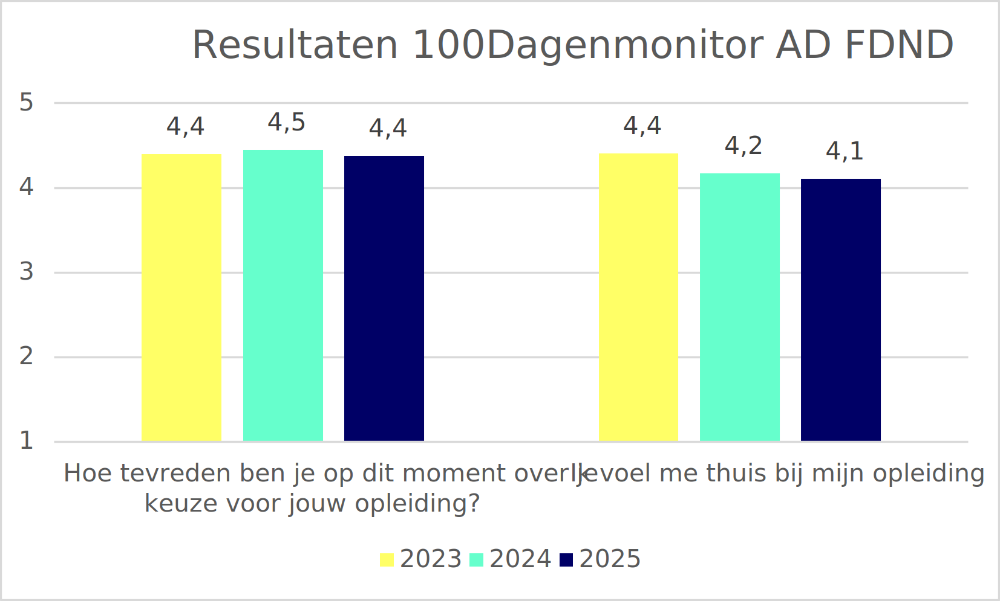
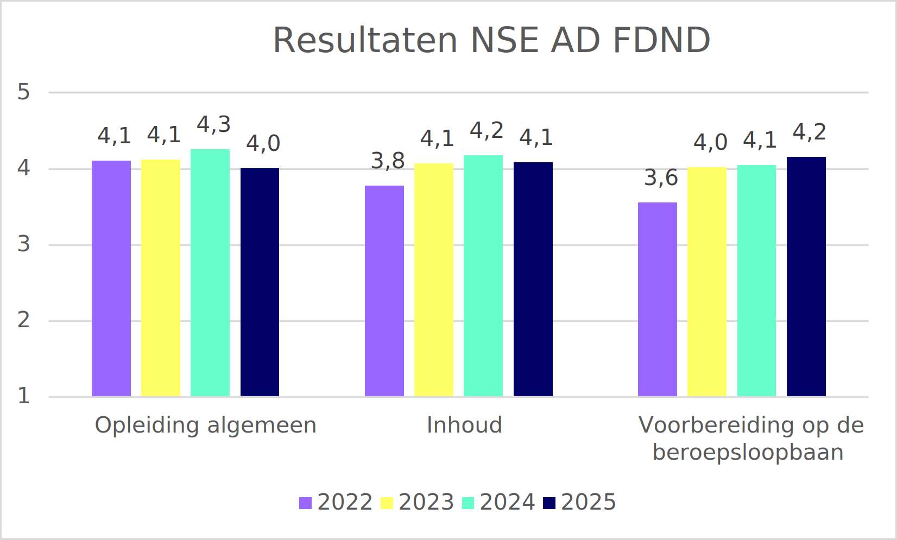

# Organisatie

Dit document beschrijft organisatieinrichting bij FDND en biedt handvatten aan docenten en management.

## Structuur

### Organisatieinrichting

Om dicht bij het beroepenveld te blijven wordt de organisatie van de Ad Frontend Design & Development ingericht volgens de Agile organisatiestructuur (Spotify-model). Dit houdt in dat we studenten en docenten indelen in tribes, squads, chapters en guilds. Nota bene: we spreken bij FDND dus niet over klassen!

Tribes zijn de grootste organisatie-eenheid en kunnen vergeleken worden met een cluster bij andere opleidingen. Een tribe bestaat uit maximaal 100 personen, bestaande uit docenten én studenten. Één docent is tribe leader (0,2 fte) en is verantwoordelijk voor de coördinatie, roostering en evaluatie van onderwijsactiviteiten van de tribe. De tribe leader is de 1e contactpersoon voor docenten binnen de tribe, er is binnen tribes een regelmatige overlegstructuur en docenten weten van elkaar wat er speelt. Een tribe bestaat uit maximaal vier squads.

Squads zijn een kleinere organisatie-eenheid binnen een tribe en kunnen vergeleken worden met een klas bij andere opleidingen. Een squad bestaat uit maximaal 25 personen, docenten én studenten. Één docent is squad-leader (0,45 fte) en eindverantwoordelijk voor het dagelijks onderwijs van een squad. De squad-leader kent alle studenten in de squad en begeleidt deze bij het volbrengen van leertaken. De squad-leader verzorgt workshops, talks en overlegt en stemt af met co-teachers en gastsprekers. Ook neemt de squad-leader deel aan overleg binnen de tribe.

Chapters zijn groepen docenten en professionals met een bepaald expertise (bijvoorbeeld API nerds/ node.js/ design languages etc.) die met regelmaat bijeen komen om ervaring te delen en ontwikkeling bij te houden.

Guilds zijn groepen docenten én studenten met een gedeeld kenmerk, bijvoorbeeld een guild voor studenten die extra aandacht nodig hebben, een guild voor engels, een guild voor hoogvliegers, een guild die het opleidingsmodel itereert, een guild die leertaken bijwerkt, een toetscommissie, opleidingscommissie et cetera.

### Organigram

#### Schooljaar 2024/25 (LWB)

jaar 1: 2 squads, 1 tribe
jaar 2: 2 squads, 1 tribe

#### Schooljaar 2023/24 (SAR)

jaar 1: 3 squads, 1 tribe
jaar 2: 2 squads, 1 tribe

#### Schooljaar 2022/23 (SAR)

jaar 1: 3 squads (80?), 1 tribe
jaar 2: 1 squad (10), 1 tribe

#### Schooljaar 2021/22 (LWB)

jaar 1: 1 squad (14), 1 tribe

### Sociocratie

Omdat we uitsluitend werken met frontend professionals en niemand de volledige waarheid kent is FDND georganiseerd als [sociocratie](https://patterns.sociocracy30.org/). Dit is een bestuurs- en besluitvormingsmodel waarin we als groep sturen op gemeenschappelijke doelen met gelijkwaardigheid als uitgangspunt. In plaats van meerderheidsstemmen draait het bij beslissingen om *consent*: een besluit gaat door als er geen “zwaarwegend bezwaar” is. FDND werkt in cirkels met [duidelijke rollen](#rollen) en transparante processen, zodat samenwerking, wederzijds leren en aanpassingsvermogen centraal staan. Het idee is pragmatisch: we passen kleine, iteratieve verbeteringen toe en groeien naar een wendbare en veerkrachtige organisatie zonder grote, plotselinge reorganisaties.

### Vergaderprogramma

FDND implementeert een aantal [vergaderpraktijken uit de sociocratie](https://patterns.sociocracy30.org/meeting-practices.html). Kernpatronen die we hanteren zijn: werken met rondjes waarbij iedereen beurtelings aan het woord is, gefaciliteerde meetings waarbij iemand focus en flow bewaakt, de vraag om meetings voor te bereiden, het doen van een check in om aanwezigheid en focus te vergroten en het evalueren van meetings om ook van de opzet te leren. Het team bepaalt wie een (type) meeting voorbereid.

#### Standup Meeting

_Wekelijkse ontmoeting om het werk te organiseren, leren te faciliteren en productiviteit en effectiviteit te verbeteren._

Tribe-leaders, squad-leaders en co-teachers treffen elkaar wekelijks op maandag tussen 13.00 - 13.30. We bespreken per persoon het volgende:

- Wat heb je gedaan?
- Waar heb je hulp bij nodig?
- Wat ga je aankomende week doen?
- Wat komt er in de nabije toekomst aan? (aan/afwezigheid)

Belangrijk is dat we tijdens een standup NIET in detail treden of problemen gaan oplossen. Eventuele nieuwe taken worden opgenomen in de Todo kolom en nog niet in de backlog geplaatst!

#### Programmacoördinatie meeting

_Wekelijkse ontmoeting voor coördinatie van het onderwijsprogramma._

Tribe-leaders treffen elkaar wekelijks op donderdag tussen 9.30 - 11.00. Onderwerpen die behandeld worden zijn:

- De planning op programma.fdnd.nl;
- Aanmaken van taken met betrekking tot het programma;
- Bespreken van drivers en ideeën en daar uit volgende taken.

Belangrijk is dat taken worden aangemaakt in de Todo kolom en nog niet in de backlog geplaatst!

#### Planning & Review Meeting

_Wekelijkse ontmoeting om het werk te plannen, taken te verdelen en voortgang te bewaken._

Tribe-leaders, squad-leaders en eventueel co-teachers treffen elkaar wekelijks op vrijdag rond 13.00. Onderwerpen die worden behandeld zijn:

- Planning op programma.fdnd.nl bekijken;
- Planbord gezamenlijk en in overleg bekijken en bijwerken: Todo, Backlog, In progress, Review;
- Taken in de kolom Done gezamenlijk sluiten;
- Nieuwe taken verdelen en claimen (mag met meer personen);
- Aanwezigheid huidige (en aankomende) sprint bespreken.

#### Higher Education Agile Learning (HEAL)

_We besteden elk blok tijd aan het reflecteren op eerdere ervaring, leren hiervan en beslissen hoe we onze werk- en onderwijsprocessen kunnen verbeteren._

Vier keer per jaar treffen tribe-leaders, squad-leaders, co-teachers de opleidingscommissie en andere uitgenodigde studenten elkaar tijdens een Higher Education Agile Learning (HEAL) meeting om te reflecteren op de afgelopen periode. Een HEAL neemt een dagdeel (4 uur) in beslag en is opgenomen in de jaarplanning.

##### 360º feedback

Twee keer, rond de Midterm, staat de HEAL in het teken van een 360º feedback sessie waarin teamleden elkaar in rondes feedback geven op basis van de resultaatgebieden uit de HvA brede [Hay-profielen voor docenten](https://az.hva.nl/binaries/content/assets/serviceplein-a-z-lemmas/ac-hr/documenten/documenten-hr---profielen-nieuw/160106-functieprofiel-docentonderzoeker.pdf). Deze resultaatgebieden zijn:

- **Algemeen**: Algemene indruk van betreffende collega.
- **Onderwijsontwikkeling**: Vernieuwing van de opzet en uitvoering van onderwijsonderdelen.
- **Onderwijsuitvoering**: Voorbereiden en verzorgen van onderwijsonderdelen en het beoordelen van studenten.
- **Onderwijsevaluatie**: Evalueren van de opzet en uitvoering van onderwijs (inclusief toetsing) en voorstellen van mogelijke verbeteringen in didactiek en/of inhoud.
- **Begeleiding van studenten**: Uitvoeren van studentbegeleiding en (studieloopbaan-)coaching.
- **Kennispartner in het vakgebied**: Uitdragen en openbaar maken van kennis van het eigen vakgebied/ onderzoeksgebied/ specialisme/ practice based evidence-methodieken, intern en extern, alsmede onderhouden, uitbouwen en benutten van contacten met het beroepenveld en andere belanghebbenden.
- **Participatie**: Actieve deelname aan het docententeam.
- **Vitaliteit**: De balans tussen werk en privé (voor zover de collega dit publiek wil delen).

##### Retrospect

Twee keer, rond de Endterm, staat de HEAL in het teken van een retrospective. Het doel van de meeting is de organisatie en het onderwijs aan te passen aan de situatie en context waar ze zich in bevind. De retrospective meeting wordt gefaciliteerd en voorbereid door tribe-leaders en kent een vaste structuur. Het resultaat van een retrospective meeting zijn veranderingen in onderwijs- en organisatieprocessen, nieuwe taken, gezamenlijke beslissingen en drivers die een beslissing behoeven. De vijf fasen van een retrospective meeting zijn:

1. Inchecken
2. Informatie verzamelen
3. Inzichten genereren
4. Beslissen wat we gaan doen
5. Sluiting

Een hulpmiddel voor het plannen van activiteiten voor de verschillende fases is [retromat.org](https://retromat.org/).

## Rollen

### Co-teacher (0,1 - 0,4 fte)

De Ad FDND vraagt van docenten dat zij naast inhoudsdeskundige en beoordelaar ook begeleider zijn die samen met de student het leerproces van de student stimuleert en vormgeeft.

Een co-teacher:

- Heeft de expertises Frontend-developer, met ervaring op het gebied van Interaction Design, Visual Design en/of SCRUM;
- Begeleidt studenten bij het volbrengen van deel- en leertaken;
- Verzorgt af en toe een talk of een workshop in afstemming met squad-leader(s);
- Overlegt en stemt af met de squad-leader;
- Neemt deel aan Standup, Plan & Review en Retrospective meetings.
- (In het geval van assessorschap) Heeft deelgenomen aan de assessorentraining of is bereid deze te volgen;

### Squad-leader (0,5 fte)

De Ad FDND vraagt van docenten dat zij naast inhoudsdeskundige en beoordelaar ook begeleider zijn die samen met de student het leerproces van de student stimuleert en vormgeeft.

Een squad-leader:

- Heeft de expertises Frontend-developer, met ervaring op het gebied van Interaction Design, Visual Design en/of SCRUM;
- Heeft de basiskwalificatie didactische bekwaamheid (BDB) en de basiskwalificatie examinator (BKE) of is bezig deze te behalen;
- Heeft deelgenomen aan de assessorentraining of is bereid deze te volgen;
- Is eindverantwoordelijk voor het leerproces binnen de squad;
- Kent de studenten in de squad en begeleidt bij het volbrengen van deel- en leertaken;
- Is op de hoogte van en draagt bij aan de invulling van het onderwijsprogramma;
- Verzorgt regelmatig talks en workshops in afstemming met andere squad-leaders;
- Overlegt en stemt af met co-teachers en gastsprekers;
- Neemt deel aan Standup, Plan & Review en Retrospective meetings.

### Tribe-leader (0,2 fte)

Maximaal vier squads vormen een tribe en deze hebben een tribe-leader. Bij meer tribes worden verantwoordelijkheden gedeeld door meerdere tribe-leaders. Één tribe leader is aanspreektpunt voor het opleidingshoofd.

Een tribe-leader:

- Heeft de expertises Frontend-developer, met ervaring op het gebied van Interaction Design, Visual Design en/of SCRUM;
- Heeft basiskwalificatie didactische bekwaamheid (BDB), basiskwalificatie examinator (BKE) en assessorcertificering of is bezig deze te behalen;
- Is eindverantwoordelijk voor het leerproces binnen een tribe bestaande uit maximaal vier squads;
- Is eindverantwoordelijk en draagt bij aan de invulling van het onderwijsprogramma;
- Is eindverantwoordelijk en neemt deel aan Standup, Plan & Review, Programmacoordinatie en Retrospective meetings.
- Is eindverantwoordelijk en aanspreekpunt voor cijfers (SIS), onderwijs en examenregelement (OER), studiegids, open dagen, studiekeuzecheck, communicatie, facilitair, personeel en cyclus, instroom, mbo/hbo doorstroom en afstemming met FDMCI en HvA.
- Is eindverantwoordelijk voor borging van de PDSA-cyclus.

### Alliance Officer (0,2 fte)

Maximaal drie tribes vormen een alliance en deze hebben een alliance officer. De alliance officer maakt het mogelijk om meerdere tribes samen te laten werken aan grote projecten en organiseert de verbinding tussen FDND en de beroepspraktijk.

Een Alliance Officer:

- Heeft de expertises Frontend-developer, met ervaring op het gebied van Interaction Design, Visual Design en/of SCRUM;
- Is eindverantwoordelijk voor het embedden van projecten en design challenges van echte opdrachtgevers in het onderwijs;
- Is eindverantwoortdelijk voor het verbinden van technische partijen aan het onderwijs (hosting, cms systemen);
- Is mede verantwoordelijk voor het organiseren van FDND evenementen (EXPO's, stagemarkten, afstuderen, werkveldsessies);
- Is mede verantwoordelijk voor stages en het contact leggen met en onderhouden van relevante stagebedrijven;
- Is eindverantwoordelijk voor het managen van alle externe FDND contacten;
- Neemt deel aan Standup, Plan & Review, Programmacoordinatie en Retrospective meetings.

### Assessoren

De examencommissie stelt jaarlijks voor elk blok assessoren (examinatoren) aan op voordracht van de tribe-leader van de Ad Frontend Design & Development (namens het opleidingshoofd). De docent als assessor is aantoonbaar gekwalificeerd voor het beoordelen van opdrachten en beschikt minimaal over een Basis Kwalificatie Examinering (BKE). De basiscriteria die bij het aanwijzen van assessoren worden gehanteerd, zijn:

- voor alle beoordelingen geldt dat de examinator minimaal beschikt over een diploma op bachelorniveau;
- nieuwe docenten die nog niet geschoold zijn in ontwikkelingsgericht begeleiden en/of nog niet aangewezen zijn als examinator, worden begeleid door een ervaren begeleider en/of beoordelaar;
- een beoordelaar volgt regelmatig scholing/ kalibratiesessies om de eigen deskundigheid ten aanzien van toetsen en feedback geven te vergroten;
- kent de beroepspraktijk;
- assessoren zijn gecertificeerd in het beoordelen van beroepsproducten op eindniveau alsmede het afnemen van een portfolio-assessment.

In samenwerking met de HvA Academie is een professionaliseringstraject vormgegeven, gericht op toetsen en beoordelen op niveau 5 en coachend begeleiden, waaronder het geven van feedback. Het docententeam en leden van de examencommissie zullen dit professionaliseringstraject volgen.

### Opleidingscommissie

Bij aanvang van de opleiding in september 2021 zal zo snel mogelijk gestart worden met het formeren van een opleidingscommissie (OC) bestaande uit twee docenten en twee studenten. De rechten en plichten van deze commissie zijn vastgelegd in een HvA breed reglement. In de opstarase van de opleiding is veelvuldig overleg met de OC belangrijk. Daarom overleggen zij naast de eigen vergaderingen eenmaal per zes weken met de tribe leaders en eenmaal per blok met de opleidingsmanager van de bachelor Communicaon and Mulmedia Design over de kwaliteit van de opleiding, de uitkomsten van onderwijsevaluaes en de uitvoering van de Onderwijs- en Examenregeling (OER). De uitkomsten van deze gesprekken worden besproken met het docententeam en zijn sturend voor de onderwijsontwikkeling.

## Kwaliteitsborging

De HvA heeft als missie om studenten op te leiden tot professionals die beschikken over de kennis en competenties die nodig zijn om een vooraanstaande rol te spelen in beroepspraktijk en in de samenleving. Onderwijskwaliteit gaat om het realiseren van deze missie en om hoe we er als instelling voor zorgen dat studenten het onderwijs uitdagend vinden en de opleiding ervaren als een goede voorbereiding op hun professionele toekomst.

Binnen de HvA en de opleiding vinden veel activiteiten plaats om de kwaliteit van onderwijs te evalueren. Deze paragraaf schetst de visie op kwaliteitszorg van FDND. Er wordt ingegaan op kwaliteitscultuur en het systematisch reflecteren op onderwijskwaliteit middels de PDSA-cyclus.

Onderwijskwaliteit is van alle studenten en medewerkers. Voor onderzoek en advies naar onderwijskwaliteit heeft het cluster media en design een kwaliteitsmedewerker die docenten en studenten van informatie voorziet. De kwaliteitsmedewerker werkt samen met de kwaliteitsadviseur en -onderzoeker van afdeling O&O binnen FDMCI voor afstemming, gezamenlijk onderzoek en kennisdeling.

### Kwaliteitscultuur

In het kwaliteitsbeleid van de HvA ‘Reflecteren en leren, samenwerken aan kwaliteit’ worden de uitgangspunten van kwaliteitscultuur benoemd. FDND implementeert deze uitgangspunten als volgt:

- Wij vormen een professionele leergemeenschap binnen het frontend vakgebied. Al onze docenten zijn vakbekwaam en leren van elkaar en met elkaar door: 1) samen voor de klas te staan, 2) actief nieuwe kennis en inzichten te delen, 3) naar interesse deel te nemen aan *guilds*, 4) samen training op gebied van didactiek te volgen en 5) samen frontendconferenties te bezoeken. Ook onze studenten leren van elkaar en met elkaar, (be)geleid door onze docenten.

- Wij hebben zeer betrokken studenten die binnen het programma in toenemende mate eigenaar zijn van hun eigen leerproces. Dit is verankerd in een van de funderende principes van de opleiding: [Student aan het roer](/TNO-dossier.html#studenten-aan-het-roer). Studenten zitten de opleidingscommissie voor en organiseren panelsessies voor het kwalitatief interpreteren van (blok)enquête resultaten. Tweedejaars studenten zijn mentor voor eerstejaars, groeien daarmee in hun frontenderschap en dragen hun opgedane kennis over.

- Wij hebben een *Alliance Officer* welke verantwoording draagt voor het *partners in education* programma. De frontend beroepspraktijk staat centraal in de opleiding, dit is verankerd in een van de funderende principes: [Praktijkvraagstukken in een rijke leeromgeving](/TNO-dossier.html#praktijkvraagstukken-in-een-rijke-leeromgeving). Het beroepenveld draagt bij aan de opleiding in de rol van opdrachtgever, co-teacher, gastspreker of code-design reviewer. Opdrachtgevers dragen projecten aan waar onze studenten in leren. Co-teachers staan met onze squad-leaders voor de klas en helpen studenten op expertise bij hun leergang. Gastsprekers verzorgen inspirerende talks - onze [we♥web](https://weloveweb.fdnd.nl) sessies - over hun frontenderschap. Code-design reviewers geven studenten inhoudelijk feedback op hun werk.

- Onze docenten vormen een resultaatverantwoordelijk team, georganiseerd volgens de sociocratie, en vallen organisatorisch direct onder de onderwijsmanager van het cluster Media & Design. Een overzicht staat in [ons organigram](#organigram). Verschillende opleidingsportefeuilles worden in overleg binnen het team verdeeld. Het team voelt zich gezamenlijk verantwoordelijk voor het gehele curriculum en het leerproces van studenten. Onze manier van werken wordt geconcretiseerd in het [vergaderprogramma](#vergaderprogramma).

- Wij werken iteratief op gebied van onderwijs (operations) en organisatie (governance) in lijn met de PDSA-cyclus. Alle facetten van ons onderwijs en onze organisatie staan beschreven in opleidingsdocumenten, deze hebben een *lifecycle* en worden in overleg en samenwerking met het bedrijfsleven op vier formele momenten geïtereerd tijdens [HEAL-sessies](#higher-education-agile-learning-heal). Opleidingsdocumenten zijn *open source* en kunnen op internet geraadpleegd en becommentarieerd worden door studenten, docenten, beroepenveld en elke andere geïnteresseerde. Itereren op gebied van onderwijs of organisatie betekent een aanpassing van de opleidingsdocumenten.

- FDND is ambitieus, betrokken en betrouwbaar. Docenten geven het beste onderwijs wat ze kunnen geven. De leergemeenschap volgt ontwikkelingen in het frontend vakgebied op de voet. FDND-alumni worden gewaardeerd om hun frontenderschap en kunnen direct meedraaien binnen een professionele organisatie.

### Visie op onderwijskwaliteit

FDND verzorgt hoogwaardig actueel frontend-onderwijs. Dit wordt gewaarborgd door openheid te geven over en kritiek te verwelkomen op alle facetten van onze [organisatie](/organisatie.html) en ons [onderwijs](/onderwijs.html). Alle documenten zonder AVG-impact zijn publiek toegankelijk via [docs.fdnd.nl](https://docs.fdnd.nl) en iedereen met een [GitHub account](https://github.com/) kan bijdragen of deelnemen aan [discussies](https://github.com/fdnd/docs.fdnd.nl/discussions).

FDND hanteert een iteratieve werkwijze met vaste evaluatiemomenten in de vorm van retrospects. Tijdens deze bijeenkomsten worden inzichten uit verschillende kanalen samengebracht en verkend, en worden beslissingen op gebied van organisatie (governance) en onderwijs (operations) genomen.

### Reflectiecyclus

De opleiding reflecteert systematisch op de kwaliteit van het onderwijsprogramma op curriculumniveau middels de Plan-Do-Study-Act-cyclus (PDSA). Wij formuleren plannen met doelen en ambities (Plan), verzamelen feedback tijdens en na uitvoering (Do), onderzoeken tijdens retrospects hoe de uitvoering is verlopen (Study) en formuleren acties voor verbetering (Act).

Voor het borgen van de kwaliteit van het onderwijsprogramma gaat de planvorming uit van:
-	**Plan**: de opleiding formuleert op basis van HvA beleid en de A3 van de faculteit elk kalenderjaar een *One Page Strategy* (OPS). Bij het opstellen zijn opleidingsmanager, (afvaardiging van) het docententeam en de opleidingscommissie betrokken. Daarnaast hanteren wij voor kwaliteitsborging de accreditatiestandaarden van de NVAO. Deze werkwijze is onderdeel van de richtlijn ‘Kwaliteit van de Basis’ welke de HvA hanteert om doorlopend inzicht te hebben en te sturen op kwaliteit.
-	**Do**: Activiteiten op het gebied van ontwikkelen, coördineren en uitvoeren van onderwijs zoals beschreven bij [onderwijs](/onderwijs.html) waar de [HEAL-sessies](/organisatie.html#higher-education-agile-learning-heal) onderdeel van zijn. Hierbij horen deels ook de taken van de examencommissie (zie de borgingsagenda van de Examencommissie).
-	**Study**: Bij het evalueren van de kwaliteit van het onderwijs op curriculumniveau maakt de opleiding gebruik van verschillende kwantitatieve en kwalitatieve instrumenten.  Hier zijn onder andere bij betrokken opleidingsmanager, docententeam, opleidingscommissie, examencommissie en onderwijsadviesraad.
-	**Act**: Elk jaar wordt medio oktober de *One Page Strategy* bijgesteld door het docententeam in samenspraak met de opleidingcommissie.

Docenten in de rol van [tribe-leader](/organisatie.html#tribe-leader-02-fte) zien toe op de borging van de PDSA-cyclus. Zij documenteren informatie op gebied van plannen en evaluaties en houden een actielijst bij in het planboard op MS-Teams.

Er is een aantal vaste momenten waarop de opleiding direct of indirect verantwoording aflegt over kwaliteit:
-	Accreditatie NVAO en midterm review (MTR). Eens in de zes jaar vindt externe accreditatie van de opleiding plaats en ongeveer halverwege dat traject organiseert de HvA een MTR. Hier wordt onderzocht of de opleiding voldoende scoort op de vier accreditatiestandaarden en het panel geeft adviezen mee aan de opleiding over wat er beter kan. De toets nieuwe opleiding (TNO) is uitgevoerd op 15 april 2021 en de MTR was 21 november 2024. De eerstvolgende accreditatie vindt voorjaar 2026 plaats.
-	Periodiek Management Overleg (PMO): tweemaal per jaar vindt een gesprek plaats met de decaan, directeur bedrijfsvoering van de faculteit en opleidingsmanagement. Hierin wordt de voortgang van de OPS besproken en wordt onder andere gekeken naar aandachtspunten die voortkomen uit verschillende informatiebronnen over onderwijskwaliteit. Deze gesprekken vinden plaats medio mei en oktober.
-	Kwartaalrapportages: Periodieke schriftelijke rapportage vanuit de faculteit richting het College van Bestuur waarin gerapporteerd wordt op de voortgang van KPI’s uit ‘Kwaliteit van de Basis’.

### Onderwijsevaluatie

FDND zet een aantal kwantitatieve en kwalitatieve meetinstrumenten in om haar onderwijs te evalueren en [HEAL-sessies](/organisatie.html#higher-education-agile-learning-heal) te informeren. Per instrument wordt beschreven welke doelstellingen en kwaliteitscriteria worden gehanteerd en hoe wordt dat geëvalueerd.

#### Blokenquête

De blokenquête wordt door de kwaliteitsmedewerker van het cluster Media Design opgesteld. Dit gebeurt in navolging van de bij FDMCI ontwikkelde standaard vragenlijst met oog op vergelijkbaarheid met andere opleidingen. De tribe-leaders dragen eindverantwoordelijkheid voor het tijdens een lesmoment uitzetten van de blokenquête rond het eind van ieder blok. De kwaliteitsmedewerker publiceert de resultaten in de map `Organisatie FDND > Metingen` op het MS Teams kanaal van de docenten zodat die voor docenten inzichtelijk zijn. De resultaten worden besproken tijdens [panelgesprekken](#panelgesprekken) en informeren de [HEAL-sessies](/organisatie.html#higher-education-agile-learning-heal).

#### Panelgesprekken

Twee keer per jaar worden rond het eind van een semester panelgesprekken georganiseerd. Deze gesprekken worden door de kwaliteitsmedewerker en de opleidingscommissie panelgesprekken voorbereid en hebben als doel kwalitatief te duiden wat kwantitatief in meetinstrumenten geconstateerd is. Ter voorbereiding stelt de kwaliteitsmedewerker een lijst met opvallende resultaten op en nodigt de opleidingscommissie een representatieve groep studenten uit beide jaargangen uit. Verslaglegging wordt door de kwaliteitsmedewerker geanonimiseerd gedeeld in de map `Organisatie FDND > Metingen` op het MS Teams kanaal van de docenten, en door de opleidingscommissie ter informering meegebracht naar de eerstvolgende [HEAL-sessie](/organisatie.html#higher-education-agile-learning-heal).

#### 100 dagen monitor

De 100 dagen monitor is een door de HvA onder alle 1e jaars uitgezet meetinstrument. De tribe-leader jaar 1 draagt eindverantwoordelijkheid voor het tijdens een lesmoment onder de aandacht brengen van dit instrument. De kwaliteitsmedewerker publiceert de resultaten in de map `Organisatie FDND > Metingen` op het MS Teams kanaal van de docenten zodat die voor docenten inzichtelijk zijn. De resultaten worden besproken tijdens [panelgesprekken](#panelgesprekken) en informeren de [HEAL-sessies](/organisatie.html#higher-education-agile-learning-heal).

#### Nationale Studenten Enquête (NSE)

De NSE is een landelijk uitgezet meetinstrument. De tribe-leaders dragen eindverantwoordelijkheid voor het tijdens een lesmoment uitzetten van de NSE binnen de eerste week na publicatie. De kwaliteitsmedewerker publiceert de resultaten in de map `Organisatie FDND > Metingen` op het MS Teams kanaal van de docenten zodat die voor docenten inzichtelijk zijn. De resultaten worden besproken tijdens [panelgesprekken](#panelgesprekken) en informeren de [HEAL-sessies](/organisatie.html#higher-education-agile-learning-heal).

### Resultaten

#### Blokenquete

De blokenquêtes worden over het algemeen aan het einde van elk blok afgenomen. De vragen die hier in staan gaan dus specifiek over het afgelopen blok, bijvoorbeeld over de duidelijkheid van informatie, de inhoud van de sprints, de begeleiding en de studiedruk. Ook hier zijn de resultaten over het algemeen goed. We zien dat studenten vinden dat ze nuttige kennis opdoen, zich veilig voelen om vragen te stellen en dat de informatie over de sprints goed vindbaar en duidelijk is. De studenten in jaar 1 zijn over het algemeen wat meer tevreden dan de studenten in jaar 2. Ook zien dat we dat jaar 1 studenten de studiedruk en het niveau wat lager inschatten dan in jaar 2.

#### Panelgesprekken

##### Voorjaar 2026

- Actieve mentoren in jaar 1 worden gewaardeerd, dus dat is goed om te behouden.
- De studiedruk is in jaar 1, blok 1 aan de lage kant (2,97). Dit komt mogelijk door de lagere werkdruk onder studenten met voorkennis, deze geven aan zelf op zoek te moeten gaan naar uitdaging. Een mogelijkheid is om meer te differentiëren in de eerste blokken en de studenten met voorkennis meer uitdaging te bieden.
- De opbouw qua zelfstandigheid in jaar 2, met meer zelfstudie, wordt gewaardeerd. Echter zien sommige studenten potentie tot verbetering bij de code reviews. Deze kan wat minder vaak plaatsvinden, met meer diepgaande feedback.
- De wrap-up aan het einde van een sprint kan worden gecombineerd met iets anders, zoals een workshop of een review.

#### 100 dagen monitor

De 100Dagenmonitor wordt onder studenten afgenomen na hun eerste honderd dagen bij de studie. Uit de resultaten blijkt dat eerstejaarsstudenten erg tevreden zijn over hun start bij de opleiding: zo geven ze hun keuze een 4,4 (1=zeer ontevreden, 5=zeer tevreden). Ze hadden van tevoren al een goed beeld van de inhoud van de opleiding (4,1) en ervaarden in de eerste 100 dagen een hoge studiemotivatie (4,3). Ook geven studenten aan dat ze zich thuis voelen bij de opleiding (4,1) en het gevoel hebben dat ze zichzelf kunnen zijn (4,1), hoewel deze scores wel lager zijn dan voorgaande jaren (waarschijnlijk door onze verhuizing naar een ander gebouw). Bij de voorlichtingen zien we dat er verbetering mogelijk is als het gaat om een beeld schetsen van de beroepsmogelijkheden van de opleiding, want deze score is in enkele jaren gedaald van 4,1 naar 3,8. Ook kunnen we aanstaande studenten meer duidelijk maken wat de opleiding van hen verwacht (3,5) en is het gebruik van Brightspace voor studenten soms onduidelijk (3,4).

#### Nationale Studenten Enquête (NSE)

De Nationale Studenten Enquête wordt elk jaar uitgezet onder alle studenten in Nederland. In deze uitgebreide vragenlijst komen vragen aan bod over de tevredenheid van de studenten met allerlei aspecten van de opleiding en de hogeschool. Onze studenten zijn over het algemeen erg tevreden over het onderwijs. Op een schaal van 1 (zeer ontevreden) tot 5 (zeer tevreden) scoort de opleiding in het algemeen een 4, hoger dan de meeste andere opleidingen. 85% zou opnieuw voor de opleiding kiezen en studenten zijn vooral heel tevreden over de voorbereiding op de beroepsloopbaan (4,2) en de inhoud (4,1). Ondanks de in algemene termen hoge scores, zien we op sommige vlakken wel dat de scores licht afnemen. Dit geldt bijvoorbeeld voor de tevredenheid over de toetsing (van 3,9 naar 3,7) en de sfeer (van 4,2 naar 4).

#### Periodieke evaluatie Examencommissie

FDND deelt een examencommisie met de andere Associate degree opleidingen binnen de faculteit. In onderstaande paragraven zijn  de letterlijke passages over onderwijs en organisatie van FDND uit betreffende documenten geciteerd. Volledige documenten kunnen worden opgevraagd via [examencommissie-ad-fdmci@hva.nl](mailto:examencommissie-ad-fdmci@hva.nl).

##### Jaarverslag 2024/25

##### Evaluatie Afstudeerwerken 2024/25

##### Jaarverslag 2023/24

> […]
> **6.3 Toetsing bij Ad Frontend Design & Development (FDND)**
> […]
> **6.3.1 Inleiding toetsing FDND**
> 
> De Ad FDND is een opleiding die voortdurend in beweging is. Vorig jaar werden studenten nog gevraagd om aan het eind van elk blok een ontwikkeldocument op te stellen (in plaats van de STARR’s). Dit jaar is ook dit losgelaten en heeft de opleiding besloten de reflecties te doen en bespreken tijdens de formatieve checkpoints en het summatieve portfolio-assessment aan de hand van het criterium gericht interview. Dit is erg goed bevallen aangezien de studenten nu meer tijd aan de inhoud kunnen besteden en zich tijdens de gesprekken met docenten kunnen richten op het reflecteren.
> 
> Er zijn in schooljaar 2023-2024 68 nieuwe studenten begonnen waarvan er 48 over zijn gegaan naar het tweede jaar en vier studenten het eerste jaar opnieuw doen. Dit is een slagingspercentage van ~ 71% wat FDND voldoende vindt.
> 
> **6.2.2 Procedurele borging toetsing FDND**
> 
> De docenten bij FDND worden getraind in het voeren van de assessment gesprekken. Het idee is dat deze persoonlijke manier van toetsing in dienst staat van het leerproces van studenten. Over het algemeen lijkt dit goed te werken. Nieuwe docenten worden goed begeleid door de docenten met al wat meer ervaring op het gebied van didactiek en toetsing. Bij FDND krijgt elke docent een training om assessments te kunnen afnemen en wordt er, als er genoeg tijd is, aan de start van elke assessmentweek kort gekalibreerd. Docenten bekijken een aantal voorbeelden en stellen gezamenlijk vast wat voldoende is en wat niet. Ook werkt iedere docent aan de hand van een aantal standaardvragen. Die helpen om het assessment scherp te houden en zorgen ervoor dat studenten op dezelfde manier getoetst worden. Bij alle assessments zijn twee assessoren betrokken, de vaste docent (squad-leader) die per semester aan studenten toegewezen wordt én een docent die aan een andere groep verbonden is, daarmee wordt het vier ogen principe omarmd. Docenten vullen tijdens het assessment een online beoordelingsformulier op DLO in. Studenten kunnen dit gemakkelijk bekijken en teruglezen. Uiteindelijk zien ze het cijfer terug in SIS. Studenten worden gestimuleerd om hun beoordeling en feedback goed bij te houden, zowel de checkpoints in Portflow als de eindbeoordeling op DLO. De examencommissie heeft geen verzoeken gehad omtrent goedkeuring een beoordelingsmodel aan te passen na toetsafname.
> 
> **6.2.3 Inhoudelijke borging toetsing FDND**
> 
> De Ad FDND toetst de studenten vier keer per jaar aan de hand van portfolio-assessments. De assessments hebben de vorm van een criteriumgericht interview op basis van de ingediende bewijslast en met vastgestelde kaders. Om deel te nemen aan het assessment moet de bewijslast volledig zijn. Dit houdt in dat het portfolio met daarin de beroepsproducten, de feedback van de squad-leader (de hoofddocent van de betreffende student) en reflecties over de gehele periode ingeleverd is via de digitale leeromgeving.
> 
> Bij het assessment toont de student aan in welke mate het leerresultaat behaald is, aan de hand van de gedragsindicatoren ‘methodisch handelen’, ‘samenwerken’, ‘communiceren’, ‘probleemoplossend vermogen’ en ‘lerend vermogen’. In het beoordelingsformulier wordt het oordeel van twee assessoren vastgelegd en onderbouwd. Dit eindoordeel wordt gebaseerd op het portfolio en het assessmentgesprek. In week tien is een midterm assessment waarin de student aantoont onderweg te zijn naar het behalen van het leerresultaat. In week twintig is het endterm assessment waarin de student aantoont het leerresultaat behaald te hebben.
> 
> Als genoeg bewijs is aangedragen en dit tijdens het assessment onderbouwd is dan wordt een voldoende beoordeling toegekend en krijgt de student 15 studiepunten voor het betreffende blok. Dit houdt in dat er bij voldoende prestatie na het midterm assessment 15 EC zijn behaald en na voldoende endterm assessment ook 15 EC. 
> 
> De afgeronde leer- en deeltaken werden in schooljaar 2023-2024 nog besproken tijdens zogenaamde ‘checkpoints’: studenten tonen hun afgeronde taak en docenten geven daar feedback op. Dit werd vervolgens vastgelegd in Portflow en bekeken door de docenten voorafgaand aan het assessment. Sinds het nieuwe schooljaar (september 2024) zijn ook de checkpoints afgeschaft. De studenten voegen nog wel bewijslast toe in portflow en ook hebben zij regelmatig gesprekken met hun squad-leaders maar het zijn nu minder ‘afvink-momenten’. Studenten zijn zelf verantwoordelijk voor het verzamelen van hun bewijslast en zullen ook zelf moeten inschatten of de bewijslast volstaat voor het summatieve assessment.
> […]

##### Evaluatie Afstudeerwerken 2023/24

##### Jaarverslag 2022/23

> […]
> 
> **Deel II Borgen kwaliteit van tentamens en examens**
> 
> **2 KWALITEIT VAN DE TENTAMENS**
> 
> Zoals al is aangegeven beschikken we in 2022-2023 nog niet over een toetscommissie (TC). Dit neemt niet weg dat de examencommissie, op basis van de inbreng van de verschillende leden, zich een voldoende beeld heeft kunnen vormen over de wijze van toetsing. Onderstaand is per AD-opleiding beschreven hoe de toetsing gedurende het studiejaar 21/22 is verlopen.
> 
> […]
> 
> **2.2 TOETSING BIJ DE AD FRONTEND DESIGN & DEVELOPMENT (FDND)**
> 
> De Ad FDND is in studiejaar 21/22 gestart en toetst de studenten vier keer per jaar aan de hand van portfolio-assessments. Aan studenten is gevraagd om elke drie sprints (van 9 weken) een ontwikkeldocument te schrijven waarin ze reflecteren op hoe ze zich ontwikkeld hebben in de vijf gedragsindicatoren. Dit ontwikkeldocument dienen ze, samen met de voltooide leer- en deeltaken, in als bewijslast voor het portfolio-assessment. De afgeronde leer- en deeltaken worden besproken tijdens zogenaamde ‘checkpoints’: studenten tonen hun afgeronde taak en docenten geven daar feedback op. Dit wordt vervolgens vastgelegd in Feedpulse en bekeken door de docenten voorafgaand aan het assessment.
>
> De docenten bij FDND worden getraind in het voeren van de assessment gesprekken. Het idee is dat deze persoonlijke manier van toetsing in dienst staat van het leerproces van studenten. Over het algemeen lijkt dit goed te werken. In studiejaar 2022-2023 heeft twee derde van de studenten al hun studiepunten gehaald. Waar docenten in het eerste jaar nog moesten wennen aan deze manier van toetsing, ging het dit jaar al makkelijker. Nieuwe docenten worden goed begeleid door de docenten met al wat meer ervaring op dit gebied. Bij FDND wordt, als er genoeg tijd is, aan de start van elke assessmentweek kort gekalibreerd. Docenten bekijken een aantal voorbeelden en stellen gezamenlijk vast wat voldoende is en wat niet. Ook werkt iedere docent aan de hand van een aantal standaardvragen. Die helpen om het assessment scherp te houden en zorgen ervoor dat studenten op dezelfde manier getoetst worden. Bij alle assessments zijn twee assessoren betrokken, de vaste docent (squad-leader) die per semester aan studenten toegewezen wordt én een docent die aan een andere groep verbonden is, daarmee wordt het vier ogen principe omarmd. Docenten vullen tijdens het assessment een (inmiddels online) beoordelingsformulier op DLO in. Studenten kunnen dit gemakkelijk bekijken en teruglezen. Uiteindelijk zien ze het cijfer terug in SIS. Studenten worden gestimuleerd om hun beoordeling en feedback goed bij te houden, zowel de checkpoints op Feedpulse als de eindbeoordeling op DLO. De examencommissie heeft geen verzoeken gehad omtrent goedkeuring een beoordelingsmodel aan te passen na toetsafname.
> […]

##### Jaarverslag 2021/22

> […]
> **Deel II Borgen kwaliteit van tentamens en examens**
> 
> **4. KWALITEIT VAN DE TENTAMENS**
> 
> Zoals al is aangegeven beschikken we nog niet over een toetscommissie TC). Dit neemt niet weg dat de examencommissie, op basis van de inbreng van de verschillende leden, zich een voldoende beeld heeft kunnen vormen over de wijze van toetsing. Onderstaand is per AD-opleiding beschreven hoe de toetsing gedurende het studiejaar 21/22 is verlopen.
> 
> […]
> 
> **4.2 TOETSING BIJ DE AD FRONTEND DESIGN & DEVELOPMENT (FDND)**
> 
> De Ad FDND is in studiejaar 21/22 gestart en toetst de studenten vier keer per jaar aan de hand van portfolio-assessments. Aan studenten is gevraagd na elke sprint (3 weken) een STARR reflectie te schrijven en deze, samen met de voltooide leer- en deeltaken, in te dienen als bewijslast voor het portfolio-assessment. De afgeronde leer- en deeltaken worden besproken tijdens zogenaamde ‘checkpoints’: studenten tonen hun afgeronde taak en docenten geven daar feedback op. Dit wordt vervolgens vastgelegd in Feedpulse en bekeken door de docenten voorafgaand aan het assessment. In verband met corona hebben deze checkpoints op sommige momenten ook online plaatsgevonden. Alle portfolio-assessment gesprekken waren op locatie.
> 
> De docenten bij FDND worden getraind in het voeren van de assessment gesprekken. Het idee is dat deze persoonlijke manier van toetsing in dienst staat van het leerproces van studenten. Over het algemeen lijkt dit goed te werken. In studiejaar 2021-2022 heeft twee derde van de studenten al hun studiepunten gehaald. Docenten moeten nog wennen aan deze manier van toetsing. Het zweet moet op de juiste ruggen staan en docenten moeten niet in de 'reparatiereflex' schieten. Ook is het belangrijk dat er regelmatig gekalibreerd wordt. Bij FDND wordt dit gedaan aan de start van elke assessmentweek. Docenten bekijken een aantal voorbeelden en stellen gezamenlijk vast wat voldoende is en wat niet. Ook werkt iedere docent aan de hand van een aantal standaardvragen. Die helpen om het assessment scherp te houden en zorgen ervoor dat studenten op dezelfde manier getoetst worden. Bij alle assessments zijn twee assessoren betrokken, de vaste docent (squad-leader) die per semester aan studenten toegewezen wordt én een docent die aan een andere groep verbonden is, daarmee wordt het vier ogen principe omarmd.
>
> Docenten vullen tijdens het assessment een beoordelingsformulier in. Studenten kunnen hier achteraf een foto van maken maar zijn dit niet verplicht. Uiteindelijk zien ze het cijfer terug in SIS. Studenten worden wel gestimuleerd om hun beoordeling en feedback goed bij te houden. De eerste paar weken zijn ze vaak nog hard bezig met de feedforward maar later ebt dat weg. Dit wordt aan de studenten zelf gelaten aangezien het aan de studenten zelf is om orde te scheppen. Hierin zoekt de opleiding nog een balans tussen alles 'dichttimmeren' en het belang van de zelfsturing en autonomie van de student.
>
> De examencommissie heeft geen verzoeken gehad omtrent goedkeuring een beoordelingsmodel aan te passen na toetsafname.
>
> […]

#### HEAL: Retrospect

##### Schooljaar 2024/25

Tijdens de HEAL is een hele dag besteed aan een grondige evaluatie van de inhoud en opzet van onze vier semesters. De belangrijkste aandachtspunten staan hieronder beschreven.

###### Algemeen

- Integreer het lesplan in de leertaak en breek de vierde wand.
- Hoe gebruik je LLMs als frontender op verantwoordelijke wijze?
- Veranker CSS sterker en licht een nieuwe CSS feature uit in elke leertaak.
- Bied online hulp op donderdag.
- Verbeter instructies of formats voor sprint review, planning en wrap-up.
- Focus assessments op eigen werk en i-love-web.
- Pak piekbelasting voor en tijdens assessments aan.
- Organiseer guilds beter.
- Maak het beste studentenwerk beter zichtbaar voor de buitenwereld.
- Installeer Teams op telefoons van studenten en zet notificaties aan op het random channel.
- Organiseer vaker standups tussen eerste- en tweedejaars.
- Oefen met het lezen van teksten.
- Neem de opkomst van AI op in S3/2/1 met behulp van backwards design.
- Omarm de vergaderstructuur beter.
- Geef meer persoonlijke coaching aan studenten en pas motiverende gespreksvoering toe.
- Maak duidelijk wat we bij een CDr verwachten en wat studenten moeten voorbereiden.
- Creëer een plek/thuis op de vierde verdieping in het TTH, samen met MDD.
- Betrek meer studenten bij de HEAL.
- Plan sprint reviews ver van tevoren en laat eerste- en tweedejaars samen voorbereiden en uitvoeren.

###### Semester 4

- De werkdruk voor het nakijken van assessments is te hoog. We zoeken een oplossing.
- We willen meer aandacht voor de JS-kennis van studenten.
- De begeleiding van het schakelprogramma bij CMD moet beter.
- Verdeel FDND Agency pull requests.
- Bewijslast voor het eindassessment volledig in Portflow. Geen externe links (wiki/Notion) meer, want die kunnen worden aangepast. Alle code in zip opleveren (regelen in stagecontract).
- Protocol stagebegeleiding opstellen.
- Terugkomdagen strakker organiseren.
- Alle co-teachers Agency feedback via GitHub @mentions.

###### Semester 3

- Werk de mentor rol uit: bewijslast, aanpak organisatie, verantwoordelijkheid, reflectie en overdracht. Laat mentoren ook lessen voorbereiden en openbare planningen maken.
- Omarm wekelijkse code/design reviews op vrijdag.
- Tweedejaars programma op dinsdag en donderdag.
- Atomic Design en Don’t Repeat Yourself aanpakken.
- “Creative coding” term aanpassen, niet in opdrachtgeverscontext.
- Meer sprints voor opdrachtgevers.
- Programma naar GitHub, kortere talks en meer werken in de klas. Beschrijvingen in markdown files in leertaken.
- Artikelen lezen en weekly nerds organiseren. Living standards..
- Meer op whiteboards werken.
- Meer oog voor design.
- Meer aandacht voor projectstructuur en SCRUM.
- Meteen werken op FDND Agency GitHub, niet forken.
- Velocity belangrijk maken.

###### Semester 2

- Introduceer Progressive Enhancement eerder.
- Kalibreer assessments.
- Voeg inhoud van colleges toe aan de instructie werkgroepen (minder praten).
- Geef juiste begeleiding op “externe” APIs.
- Bouw de wiki af en maak professionele documentatie belangrijker, gericht op issues en het project board.
- Introduceer de JS deeltaak eerder, bijvoorbeeld in Sprint 5.
- Vergroot de betrokkenheid bij de opdrachtgever en voorkom dat studenten niet komen.
- Verminder het aantal design challenges.
- Laat meer voorbeelden uit de vorige sprint zien tijdens de sprint planning.
- Bespreek ontwikkelingen in het vakgebied tijdens colleges.
- Maak het switchen van projecten verplicht.
- Verlaag de focus op backend.
- Faciliteer hosting.
- Bied meer hulp met dynamische data.

###### Semester 1

- Schaf de term “Checkpoint” af.
- Besteed 20% van de tijd aan de Web blog deeltaak, eigen website, portfolio en meer leuke code.
- Zet coaches in op projecten.
- Introduceer/herhaal studievaardigheden en canvas visual thinking.
- Maak colleges en talks actionable door ze meer in de squad/als practicum te integreren.
- Bied meer client-side JavaScript aan.
- Introduceer Progressive Enhancement eerder.
- Stimuleer communityvorming en een minder schoolse houding, bijvoorbeeld via WHPH.
- Besteed meer aandacht aan ontwerpen en leg uit wat ontwerpen voor frontenders inhoudt.
- Laat studenten meer ready-made designs namaken en oefenen met grid/flexbox.
- Combineer Figma met Sprint 4 (Living Styleguide).
- Introduceer de PE Piramide eerder en laat deze ook in Sprint 5 zien.
- Introduceer kwaliteitsbesef door bijvoorbeeld oude visitekaartjes te ranken.
- Laat in de sprint planning meer goede/mooie voorbeelden van de vorige sprint zien.
- Maak een Do’s & Don’ts lijst, bespreek het gebruik van AI en maak bronnen eerder duidelijk.
- Leer studenten hoe ze presenteren bij de opdrachtgever.

##### Schooljaar 2023/24

- Plan overlegmomenten (s30 meetings, standup, plan & review) strakker en houd je eraan. We werken met studenten en worden geleefd door het programma. Eerstejaars blijven hangen en tweedejaars komen vroeg, waardoor de groep in jaar 2 groter is en het overleggen verwatert.
- Gebrek aan inspraak/democratie. Sommige docenten besteden meer tijd of hebben meer overzicht. Anderen nemen meer gewicht (geen bug). Creëer een apart kanaal voor ‘ik wil hier aandacht voor’, een backlog-achtig ding met issues. Is dit een HEAL kanaal?
- Werkdruk bij checkpoints! Te veel checkpoints achter elkaar en sturing op het halen van een checkpoint in plaats van feedback, waardoor het quasi summatief wordt.
- Minder checkpoints? Kijk hoe het gaat met indeling op criteria in plaats van indicatoren.
- In S2 moeten checkpoints gebaseerd zijn op feedback, niet op afvinken. Dit is altijd inhoudelijk waardevol voor studenten.
- We moeten feedback checkpoints kalibreren.
- We eisen nu het totaal aantal indicatoren, voorheen was dat een AVV ‘voldoende feedback’ uit alle sprints. Breng AVV’s terug als voorwaarde voor een assessment?
- Meer afwisseling en ‘vreemde ogen’ principe bij assessments door na een semester te wisselen van squad-leader.
- In S3 te weinig structuur voor checkpoints. Zoek naar een manier om structuur te bieden én verantwoording te oefenen, met oog op S4 waarin studenten zelf verantwoordelijk zijn.
- Meer aandacht voor ontwerpvaardigheden. Voeg per sprint 1 ontwerpvaardigheden les toe aan het programma.
- Technische skills van docenten: Het is goed dat docenten niet ‘alle’ skills hebben en frameworks kennen. Het gaat over uitstralen van zelfvertrouwen en ons imposter-syndroom. Laten we over onze *imposter* praten.
- Doorlopend bijleren is nooit af en is een senior ding.  “Ervaren” dat dit zo is, is moeilijk over te brengen.
- Meer kampvuursessies met kritische, nare, confronterende vragen.
- S17 en S18 wisselen. Spikes 2024/25 richten op portfolio. Het droeg niet bij aan het project en de velocity van sprint 15 zakt in. We missen creative coding in Semester 1!
- Bied andere dingen dan alleen frameworks aan, zoals animatie libs.
- Opdrachten van opdrachtgevers kunnen saai zijn.
- We willen coaches per project toewijzen voor begeleiding bij projecten van eerstejaars.
- We moeten de kwaliteit van code verhogen en toonaangevend zijn.
- De stof in colleges moet aansluiten op de leertaak en het werkveld, en actionable zijn.

##### Schooljaar 2022/23

- Geef pas een definitief cijfer na het behalen van een reparatie assessment. Niet eerst een cijfer, repareren en dan ophogen maar écht opnieuw beoordelen.
- Geef studenten vertrouwen en verantwoordelijkheid voor hun resultaten.  Niet te veel aan ze trekken.
- Bespreek en beoordeel werk bij checkpoints op dezelfde manier. Zorg dat studenten er iets van opsteken. Kalibreer checkpoints, formatief evalueren, beschrijf het proces, kies per checkpoint voor proces, taak of beide.
- Focus in feedpulse op volledig opgeleverde dingen (code/design/documenten) en links daarheen, met reflectie.  3 punten per indicator (wat, hoe, waarheen) direct in ontwikkeldocument.
- Kalibreer workshops kort (10 minuten) na de talk voorafgaand aan de workshop.
- Vergaderingen hebben een duidelijk doel, krachtige inhoud en duidelijke actiepunten.
- Geef sessies met de opdrachtgever meer betekenis: sprintplanning en -reviews met een duidelijk doel, rollen, werkvormen, focus per semester en betere voorbereiding.  Embed projecten beter in het onderwijs.
- Leer studenten vanaf sprint 10 goed samenwerken, zowel interpersoonlijk als in GitHub.  Geef ze manieren om projecten gestructureerd aan te pakken (GitHub, MoSCoW, taken uit user stories, teamcanvas, kampvuur, projectboards, conventies).
- Strakkere manier van werken en vergaderstructuur, beschreven op docs.fdnd.nl onder organisatie.
- Verzamel werkvormen, o.a. retrospect en design/code-review, op docs.fdnd.nl.
- 15 minuten pauze na de talk voor Squad-leaders en co-teachers om de werkgroep te bespreken.
- Sessie om verbeterpunten m.b.t. inhoud programma S1 te behandelen.
- Sessie over niveaus, ambitieniveau en manier van aanspreken van studenten.
- Sessie over partners in education, werkwijze en rol van de opdrachtgever.
- Charley onderzoekt de toetsstructuur.

##### Schooljaar 2021/22

- Eerstejaars studenten hadden een chaotische start. We hebben structuur aangebracht in de planning met docenten en programma, en dat werkt.
- Studenten maken een eigen website, dus de component lib was overbodig.
- Studenten nemen soft-skills minder serieus. Ze zijn tech-gericht en willen geen visual thinking opdrachten doen, zoals schetsen en team-lead zijn.
- Studenten denken niet na over hun toekomst omdat ze in een sociale buurtgroep hangen. Sommigen vallen buiten de boot, anderen zijn supergoed en sommigen gebruiken het als sociale dagbesteding.
- We bespreken HBO vaardigheden en S4 Assessment met studenten, en hoe ze omgaan met feedback.
- Na assessment op bepaalde vlakken werken we aan soft-skills, ook tijdens de stage.
- Heel blok 1, inclusief assessment, is een grote onboarding. De opdracht van de opleiding en de styleguide opdracht zijn heftig voor studenten.
- In Sprint 4 leggen we meer uit hoe we willen dat ze hier studeren. We sturen teamsamenstelling (kleiner?) aan en streven naar diverse teams.
- Volgende kampvuursessie met geleide instructie.
- Bewijslast wordt strakker in het ontwikkeldocument.
- Toetsen we het juiste? Code zit er weinig in; we toetsen het ontwikkeldocument (met slimme studenten goede gesprekken). Werkdruk is te hoog, het zweet staat niet op de juiste rug. Het is een gespreksvorm waar we aan moeten wennen.
- Gedragscriteria kunnen beter! Itereren einde van het jaar.
- Communiceren: Feedback, dit criterium gaat over code/design.
- Meer structuur in het ontwikkeldocument, meer regie bij studenten. Uitleg, (unieke) links, korte toelichting wat dit bewijst, ontwikkelpunten, max. 5 pagina’s in PDF (volgens template, geen Indesign) en naamgeving!
- Namen en programma ingevuld in Hygraph. Taakverdeling is resultaat van sprintplanning.
- Sleep voltooide taken naar ‘done’. Sleep taken naar ‘review’ als iemand ze moet bekijken. Vink taken af tijdens de vrijdagse sit-down.
- Studenten weten vaak niet wat ze moeten doen bij leertaken. Bekijk de DOD’s van leertaken tijdens de sprintplanning. Vraag studenten om issues in te dienen op leertaken.

