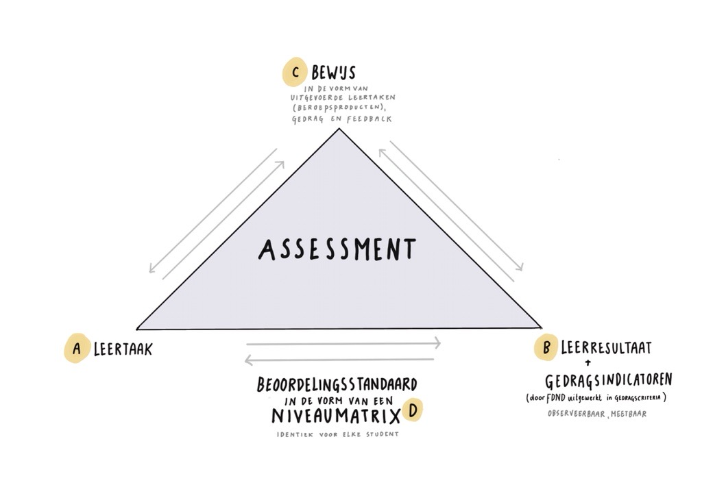

# Standaarden

> **Work in progress tbv. de visitatie voorjaar 2026 welke wordt uitgevoerd aan de hand van:**
> 
> - [Vaste onderdelen van het ABO-visitatierapport](https://www.nvao.net/files/attachments/.12726/Vaste_onderdelen_ABO_rapport.pdf)
> - [Uitvoeringsregels Accreditatiestelsel Hoger Onderwijs Nederland 2025](https://www.nvao.net/files/attachments/.13163/Uitvoeringsregels_Accreditatiestelsel_Hoger_Onderwijs_Nederland_september_2025.pdf)
> - [Beoordelingskader Accreditatiestelsel Hoger Onderwijs Nederland](https://www.nvao.net/files/attachments/.11273/Beoordelingskader_accreditatiestelsel_hoger_onderwijs_Nederland.pdf)

In dit document reflecteert de Associate degree Frontend Design & Development (FDND) ten behoeve van de visitatie op 22 mei 2026 op haar bestaan. Dit gebeurt aan de hand van het [TNO-dossier (2021)](https://tno-apr-2021.docs.fdnd.nl/) en het [MTR-dosier (2024)](https://mtr-nov-2024.docs.fdnd.nl/). In deze documenten staan de beoogde en in 2021 vergunde opleiding en de opzet en resultaten van de eerste midterm review in 2024 beschreven. Om dit zo navolgbaar mogelijk te presenteren staat onderaan het document een [matrix verwerking aanbevelingen](/standaarden.html#matrix-verwerking-aanbevelingen) waarin we de na de TNO en MTR ontvangen feedback koppelen aan ondernomen acties.

FDND loopt met het docententeam, opleidingscommissie, studenten en contacten in het bedrijfsleven dit document na en betrokken personen reageren op die paragrafen waar wij ontwikkelingen in voorzien of gemaakt hebben. Onze kritische reflectie heeft dezelfde structuur als bovengenoemde documenten en volgt qua opbouw de vier standaarden van de NVAO.

## Inleiding

FDND is trots op bereikte resultaten! Er staat een mooie opleiding met een gedegen fundament waar wij als team het volste vertrouwen in hebben. De beroepspraktijk is dit met ons eens en is op allerlei manieren betrokken bij de opleiding. Wij hanteren hetzelfde jargon: _Agility_ zit verweven in ons DNA, wij _itereren_ doorlopend en brengen zo onze kwaliteit naar een steeds hoger niveau. Ook studenten werken doorlopend iteratief aan échte projecten voor échte opdrachtgevers. Het omarmen van _GitHub_, defacto standaard, als publieke _code-repository_ en de bijbehorende projecttools (issues, projectboard, branches, pull-requests) werpt zichtbaar vruchten af. Niet alleen zijn onze interne projecten (bijv. deze docs website) systematisch, georganiseerd en transparant, ook kunnen studenten na hun opleiding naadloos door in de beroepspraktijk.

FDND studenten zijn blij, dit blijkt voor het 3e jaar op rij uit lovende resultaten in de NSE: In 2023, 2024 én 2025 ontving FDND het predicaat Topopleiding. Natuurlijk is de NSE niet leidend, wij merken ook in onze [blokenquêtes](/organisatie.html#blokenquete) en tijdens [panelgesprekken](/organisatie.html#panelgesprekken-1) met studenten dat ze overwegend tevreden zijn.

FDND is ook kritisch, in dit document vind je onze ongefilterde zelfreflectie. Wij zien op veel vlakken mogelijkheden voor verbetering en zijn zodoende ook zeer benieuwd naar inzichten die voortkomen uit deze visitatie.

### Context van de opleiding

Voor we de standaarden induiken en in detail treden willen we even stilstaan bij de context van onze opleiding. FDND staat in de doorlopende lijn van het cluster Mediadesign. Samen met drie andere clusters vormen wij het onderwijs binnen de faculteit Digitale Media en Creatieve Industrie (FDMCI), een van de zeven faculteiten van de Hogeschool van Amsterdam (HvA).

|  | Mediadesign | ICT | Media en Communicatie | Fashion |
| ----- | ----- | ----- | ----- | ----- |
| **Ad** | Frontend Design & Development |	Software Development, Cyber Security	| Smart Media Production | Ad in ontwikkeling |
| **Ba** | Communication & Multimedia Design	 | HBO-ICT | Communicatie + Creative Business | Amsterdam Fashion Institute |
| **Ma** | Digital Design | Applied Artificial Intelligence, Cyber Security | | 

Binnen FDMCI delen de vier Associate degree programma’s een examen- en toetscommissie, en overleggen elke twee weken met elkaar. Tijdens dit overleg worden ervaring, onderwijs- en organisatorische inzichten en expertise met elkaar gedeeld. Daarboven is op HvA niveau een leergemeenschap Associate Degree’s, dit orgaan komt jaarlijks enkele malen bij elkaar voor een thematische bijeenkomst.

[Onderzoekers van FDMCI](https://www.hva.nl/over-de-hva/organisatie/faculteiten/digitale-media-en-creatieve-industrie/onderzoek) doen praktijkgericht onderzoek dat ontstaat vanuit een vraag of probleem uit de praktijk. Resultaten zijn kennis, inzichten, producten en diensten die bijdragen aan innovatie van de beroepspraktijk, het oplossen van maatschappelijke vraagstukken en de vernieuwing van het onderwijs. Het onderzoek wordt uitgevoerd binnen verschillende lectoraten en onderzoeksgroepen, een aantal van deze lectoraten vervullen als [partner in education](https://partners.fdnd.nl/projecten) de rol van opdrachtgever bij FDND projecten.

Ook veel bedrijven uit de metropoolregio Amsterdam zijn [partner in education](https://partners.fdnd.nl) en werken op verschillende manieren met ons samen. Als projectpartner, bij design-challenges, als co-teacher, bij het geven van talks of het aanbieden van een stageplek. Een actueel overzicht van lopende projecten is te zien op [dashboard.fdnd.nl/](https://dashboard.fdnd.nl/).

We hebben contact met verschillende MBO opleidingen en doen een pilot binnen [FDND Agency](/standaarden.html#fdnd-agency): een vernieuwend onderwijsconcept waarin studenten van verschillende niveau’s (4, 5 en 6) en studierichtingen bij elkaar komen en in multidisciplinaire teams aan échte opdrachten voor échte opdrachtgevers werken.

FDND is aangesloten [Fronteers](https://www.fronteers.nl/),  vakvereniging voor front-end developers in Nederland en bezoekt met regelmaat (inter)nationale vakgerelateerde conferenties en bijeenkomsten (vb. [CSSDay](https://cssday.nl/), [performance.now()](https://perfnow.nl/), [Smashing Conference](https://smashingconf.com/amsterdam-2026)). Wij staan in contact met [accessibility.nl](https://www.accessibility.nl/), onderdeel van Bartiméus dat specifiek gericht is op digitale toegankelijkheid. Ook zijn wij aangesloten bij [Chain 5](https://www.chain5.net/), de Europese Community of Practice voor niveau 5 opleidingen waar we op de jaarlijkse conferentie workshops/talks verzorgen.

### Administratieve gegevens

| NAAM INSTELLING | Hogeschool van Amsterdam |
| --------------- | ------------------------- |
| Status instelling | Bekostigd |
| Resultaat instellingstoets kwaliteitszorg | Positief (geldig tot en met 4 november 2031) |
| Adres en website van instelling | Wibauthuis (WBH), Amstelcampus, Wibautstraat 3b, 1091 GH Amsterdam, www.hva.nl  |
| **NAAM OPLEIDING** | **Frontend Design & Development** |
| Adres en website van opleiding | Theo Thijssenhuis (TTH) Amstelcampus, Wibautstraat 2-4, Amsterdam, https://fdnd.nl |
| Registratienummer RIO2 (ISAT) | 80176 |
| RIO-onderdeel | Techniek | 
| BRIN | 28DN |
| Oriëntatie opleiding | Hbo |
| Niveau opleiding | Associate Degree |
| Graad en titel | Associate Degree |
| Aantal studiepunten | 120 |
| Afstudeerrichtingen (incl. varianten) | n.v.t. |
| Locatie(s) | Amsterdam |
| Bijzonderheden | Eerste visitatie na TNO |
| Onderwijstaal | Nederlands |
| Datum locatiebezoek | 22 mei 2026 |
| Inleverdatum visitatierapport | 1 november 2026 |

## Standaard 1: Beoogde leer­resultaten

_De beoogde leerresultaten passen bij het niveau en de oriëntatie van de opleiding en zijn afgestemd op de verwachtingen van het beroepenveld en het vakgebied en op internationale eisen._

De opleiding Frontend Design & Development (FDND) wordt doorlopend en in overleg met het werkveld doorontwikkeld en bij het aanbieden van onderwijs wordt het bedrijfsleven op verschillende vlakken ingezet. Beroepsprofessionals zijn bij FDND [partners in education](https://partners.fdnd.nl) en in die hoedanigheid opdrachtgever bij projecten en challenges, als stagebegeleider, als co-teacher, bij het geven van talks voor onze ‘we♥️web’ sessies, bij expert-reviews en als bezoeker van onze EXPO. Bij standaard 2 wordt dit uitgebreid behandeld. Deze samenwerking draagt bij aan onze visie op het beroep welke ten grondslag ligt aan onze leerresultaten.

### Naamgeving

Frontend is een internationaal gebruikte term. Omdat frontend professionals zowel op het gebied van webdesign als van webdevelopment opereren, hebben wij gekozen voor de naam 'Frontend Design & Development'. Frontend professionals oefenen binnen hun functie verschillende rollen uit. Daarnaast wordt de functie van een frontender door werkgevers op verschillende manieren gekenmerkt. De naam Frontend Design & Development dekt alle mogelijke rollen en functies die een frontend professional kan aannemen. Deze naam wordt wereldwijd (h)erkend in het beroepenveld en veelvuldig gebruikt op internationale conferenties.

### Visie op het beroep

De door ons in 2020 opgestelde [visie op het beroep](https://tno-apr-2021.docs.fdnd.nl/TNO-dossier.html#visie-op-het-beroep) doorstaat de tand des tijds. In het vakgebied zijn een aantal ontwikkelingen waar we op willen reflecteren. Het frontend vakgebied ontwikkelt continu en dit levert best wat uitdagingen. Gebruikelijke uitdagingen als i) de snelle evolutie en vervanging van technologie, frameworks en tools en ii) de blijvende zorg voor compatibiliteit, platform onafhankelijkheid, toegankelijkheid en prestaties welke daardoor steeds complexer wordt. Maar ook nieuwe uitdagingen zoals het ontstaan van iii) een groeiende kloof tussen javascript gerichte full-stack web programmeurs en HTML/CSS gerichte ontwikkelaars en de iv) opkomst van het fenomeen genAI, in het bijzonder _Large Language Model (LLM)_ en de impact op het werk van frontend design & developers.

#### Snelle evolutie

De halfwaardetijd van kennis met betrekking tot libraries, frameworks en tooling is in het frontendvakgebied vrij kort. Daarentegen verandert er in de basis van webtechnologie HTML/ CSS/ JS minder. Natuurlijk zijn er maandelijks uitbreidingen op CSS, echter het selecteren van HTML elementen om stijlregels te koppelen is nog steeds hetzelfde en ook de semantiek van HTML elementen is al jaren gelijk. Die tweeledigheid wordt gereflecteerd in de inhoud van het curriculum, we bieden studenten een stevige basis én de capaciteit verandering te omarmen. De beoogde opzet van de opleiding doet dus recht aan dit facet van het vakgebied.

#### Blijvende zorg

Het vakgebied vraagt nogal wat van docenten, deze hebben een blijvende zorg voor compatibiliteit, platformonafhankelijkheid, toegankelijkheid en prestaties. Met name toegankelijkheid wordt nog belangrijker door de aangekondigde invoering van digitale toegankelijkheidswetgeving in 2025. Gelukkig zijn onze docenten zeer gepassioneerd over het frontend vakgebied, leren we van elkaar en met elkaar en is het bedrijfsleven op allerlei manieren betrokken bij de opleiding. In de paragraaf [aansluiten bij de actualiteit](#aansluiten-bij-de-actualiteit) gaan we dieper in op wat dit precies inhoudt.

#### Groeiende kloof

Er ontstaat een groeiende een kloof tussen javascript gerichte full-stack web programmeurs en HTML/CSS gerichte ontwikkelaars ([Coyier, 2019](https://css-tricks.com/the-great-divide/)). Binnen de HvA bestaat een Ad opleiding Software Development waar ze webtechnieken richten op de backend van websites, daarnaast wordt ook een beetje aandacht besteed aan de frontend. Bij FDND richten wij voornamelijk op de frontend maar leren we studenten in semester 2 en 3 ook wat backend technieken. De gerichtheid bij het aanbod van backend technieken blijft bij ons altijd de _front of the frontend_. Deze keuze heeft impact op de inhoud van het curriculum. In plaats van meer backend zijn 2 sprints in het 2e semester naar de frontend toe bewogen.

#### De opkomst van AI

LLM's, zoals ChatGPT, en andere genAI-tools, zoals Co-Pilot, kunnen een verleidelijk hulpmiddel zijn voor aankomende junior frontenders, vooral in termen van snelheid, ondersteuning en leermogelijkheden. In de praktijk merken we dat studenten er veelvuldig gebruik van maken. Echter zien we terug in de dagelijkse begeleiding van studenten én bij assessments dat studenten die doorschieten in het gebruik van deze technologie juist minder grip krijgen op wat ze doen, gelukkig zijn dat er niet veel. In dergelijke gevallen proberen wij uit te leggen hoe genAI als junior frontender kan bijdragen aan het leerproces, namelijk als sparringspartner om grip te krijgen op moeilijke concepten. Het klakkeloos genereren van code zonder begrip van de inhoud keuren wij af. Overigens levert dit geen gevaar op voor de beoordeling, wij toetsen begrip en inzicht bij het werken aan projecten en geen producten.

Wij herkennen de conclusie van het artikel [Kids who use ChatGPT as a study assistant do worse on tests](https://www.popsci.com/technology/kids-who-use-chatgpt-as-a-study-assistant-do-worse-on-tests/) waarin over het leerrendement met gebruik van AI gesproken wordt maar er zijn ook tegengeluiden, bijvoorbeeld in het artikel [How does generative artificial intelligence impact student creativity?](https://www.sciencedirect.com/science/article/pii/S2713374523000316) (aangereikt door @jayka45). Wat ons betreft ligt een belangrijk onderscheid in het type toepassing.

GenAI kan helpen meerdere oplossingsrichtingen te verkennen maar is geen vervanging voor het doorgronden van o.a. browser-API’s. LLM's zijn wat ons betreft dus geen vervanging voor diepgaand leren, experimenteren, en samenwerking met anderen, maar kunnen daar wel bij helpen. Wij leren studenten een balans te vinden tussen het gebruik van deze technologie en het zelf ontwikkelen van vaardigheden door praktijkervaring en het opdoen van kennis uit betrouwbare bronnen, waarbij de nadruk ligt op het laatste.

### Frontend op Ad niveau

Vooralsnog zijn we de enige Ad Frontend in Nederland en daarom schreven wij tijdens de TNO ons eigen profiel. Er bestaan voor het beroep van frontender geen wettelijke- of domeinvereisten. Voor de fundamentele webtechnologieën HTML en CSS en de [Web Content Accessibility Guidelines (WCAG)](https://www.w3.org/TR/WCAG22/) zijn standaarden welke beheerd worden door het [World Wide Web consortium (W3C)](https://w3.org/). Deze standaarden vormen het richtsnoer voor al het werk wat studenten opleveren. 

Uiteraard in nauwe samenspraak met het werkveld en rekening houdend met wettelijke kaders en verwante opleidingen. Wij beschreven hoe een frontend opleiding er op NLQF niveau’s 4, 5 en 6 uit zou kunnen zien. Deze beschrijving staat in het [beroeps en opleidingsprofiel](/assets/docs/Bijlage03_BeroepsEnOpleidingsprofiel.pdf) dat wij in de TNO fase ontwikkelde, op pagina 15. Ook hebben we onze [leerresultaten](/assets/docs/Bijlage01_Leerresultaten.pdf) en de landelijke gedragscriteria en door ons ontwikkelde bijbehorende gedragsindicatoren getoetst aan het landelijk profiel CMD (p10), HBO-ICT (p13), de kwaliteitsraamwerken NLQF (p16) en EQF (p19), de Dublin Descriptoren (p21) en tenslotte het e-Competence framework (p23). Matrices met de relatie tussen het FDND leerresultaat, de gedragscriteria, -indicatoren en de bovengenoemde frameworks zijn te vinden op betreffende paginanummers.

#### Verhouding 

Aansluiten bij een bestaand Landelijk Associate degree Overleg (LAdO) is lastig omdat geen van de bestaande groepen aansluit op ons profiel. Daarom zoeken wij educatief partnerschap buiten Nederland. Via Chain 5, de Europese community voor niveau 5 of Ad onderwijs, zijn we in contact gekomen met Hogeschool PXL (België). Alhoewel de gerichtheid niet precies hetzelfde is zijn daar 2 practoraten, Web-development en Web-design. Een eerste officieel overleg moet nog plaats vinden.

### Leerresultaten

Onze leerresultaten zijn vastgelegd in de [niveaumatrix](https://niveaumatrix.fdnd.nl), welke worden uitgesplitst aan de hand van de door het Overlegplatform Associate degree vastgestelde vijf Ad gedragscriteria. Hiermee verhoudt ons beoordelingsinstrument zich tot het [landelijk vastgestelde niveau voor Associate degree opleidingen (p6, 11-12)](https://www.deassociatedegree.nl/wp-content/uploads/Beschrijving-van-niveau-5_NL_nov2022-1.pdf). Elk van deze gedragscriteria worden weer beschreven door drie indicatoren waarmee de koppeling naar het frontenderschap wordt gemaakt.

Onze niveaumatrix is prettig in dagelijks gebruik: Docenten en studenten weten waar ze aan toe zijn omdat alles wat ze bij de opleiding doen: sprints, leer- en deeltaken, portfolio en assessments, gericht is op het niveau zoals beschreven in de matrix. Daarnaast geeft de matrix bedrijfsbegeleiders tijdens de stage richting en houvast bij het geven van feedback.

Onze niveaumatrix wordt jaarlijks vastgesteld. We halen inhoudelijk [feedback](https://github.com/fdnd/niveaumatrix.fdnd.nl/issues) op welke éénmaal per jaar wordt verwerkt. Voor vaststelling moeten meerdere docenten het eens zijn met de beoogde verandering. Zie bijvoorbeeld de [aanpassingen voor schooljaar 2023/24](https://github.com/fdnd/niveaumatrix.fdnd.nl/pull/3) of [schooljaar 2024/25](https://github.com/fdnd/niveaumatrix.fdnd.nl/pull/16). Bovendien worden [jaarlijkse releases](https://github.com/fdnd/niveaumatrix.fdnd.nl/releases) als archief bijgehouden zodat men altijd terug kan kijken naar matrices uit het verleden.

### Internationaal perspectief

Het frontend vakgebied is internationaal maar onze voertaal is Nederlands. Veel van het bronmateriaal wat wij studenten aanreiken is Engelstalig. Tijdens talks en workshops proberen we studenten zo goed mogelijk te helpen met het eigen maken van jargon, dit doen we o.a. door ze [op niveau aan te spreken](/onderwijs.html). Scroll voor een indruk even door de [BOKSA](/boksa.html), een document dat door het team bijgesteld wordt op basis van nieuwe ontwikkelingen en inzichten.

Elke tweede week van een sprint nodigen wij een beroepsprofessional uit het vakgebied uit voor een [we♥web](https://github.com/fdnd/weloveweb.fdnd.nl/blob/main/2324.md) lezing. Vaak zijn dit internationale, soms in het vakgebied zeer gerenommeerde sprekers.

### Aansluiten bij de actualiteit

FDND wil _up-to-date_ te blijven met veranderingen in de HTML/CSS/JS standaarden. Dit betekent concreet dat docenten doorlopend met elkaar, van elkaar en van studenten leren. Zo garanderen we actualiteit en leveren we studenten af die direct de beroepspraktijk in kunnen.

Onze docenten hebben naast overlap in frontenderschap elk een eigen expertise, doordat we met meerdere docenten tegelijk in de groep staan leren we tijdens het werken. Daarnaast houden we elkaar voortdurend op de hoogte van ontwikkelingen via onze teamskanalen en bezoeken we regelmatig beroepsspecifieke conferenties.

Vandaag (26 september 2024) is bijvoorbeeld in het Teams kanaal _random_ een [artikel van Alvaro Montoro](https://alvaromontoro.com/blog/68062/new-values-and-functions-in-CSS) gedeeld waarin de volgende _Public Working Draft_ voor _CSS Values and Units Module Level 5_ wordt besproken. Hierin worden updates met betrekking tot CSS besproken die in ontwikkeling zijn en hoogstwaarschijnlijk aankomende maanden door browsers omarmd gaan worden.

Vorig semester werd een talk gegeven over het _responsive_ en _progressive enhanced_ opmaken van een caroussel - een serie plaatjes waar je horizontaal doorheen kunt scrollen - die een paar dagen na het verschijnen van een waardevol artikel bij ons gehouden werd. Deze talk was dermate _actionable_ dat zowel 1e als 2e jaars opgedane inzichten direct konden implementeren in hun werk.

Een aanzienlijk deel van ons docententeam bezoekt jaarlijks de CSSDay conferentie en de daar opgedane inzichten worden verwerkt in ons curriculum. Zo zijn delen uit de talk [How to Teach CSS door Josh Comeau @ CSS Day 2024](https://youtu.be/ZPTVr2pS0XE?si=vE40iCk9HLot-1WO) verwerkt in het curriculum van sprint 2 in semester 1 en leren we studenten nu denken in termen van CSS Layout Modes.

> De docenten blijven goed op de hoogte van internationale ontwikkelingen binnen het vakgebied. Onze docenten stimuleren ons om op allemaal verschillende methodes op de hoogde van het web te blijven. Dit doen ze door goede blogs, website, events enz. te delen. Het is goed dat ze dit ons aan leren zodat wij ook goed op de hoogte blijven van de ontwikkelingen in het vakgebied. <cite>Sascha Davidson</cite>

Het frontend vakgebied ligt binnen de passie van onze docenten en daardoor lukt het ons om bij te blijven. Het blijft ook een aandachtspunt, docenten bij FDND hebben tijd en ruimte nodig voor bestudering van het vakgebied.

## Standaard 2: De onderwijs­leeromgeving

_Het programma, de onderwijsleeromgeving en de kwaliteit van het docententeam maken het voor de instromende studenten mogelijk de beoogde leerresultaten te realiseren._

In dit hoofdstuk bekijken we de onderwijsleeromgeving. Na reflectie op het [didactisch concept](#didactisch-concept) reflecteren we bij [vormgeving van de opleiding](#vormgeving-van-de-opleiding) op de structuur. Het gaat te ver voor deze kritische reflectie om een volledige inleiding in onze onderwijsleeromgeving te geven, hiervoor verwijzen wij naar [standaard 2 in het TNO dossier](https://tno-apr-2021.docs.fdnd.nl/TNO-dossier.html#standaard-2-de-onderwijsleeromgeving). Om toch enige context te bieden bij het lezen van deze kritische reflectie volgt een korte schets van de structuur van de opleiding.

De opleiding Frontend Design & Development (FDND) leidt flexibele, zelfstandige en praktijkgerichte Frontend professionals op die goed functioneren binnen een snel ontwikkelende en veranderlijke beroepspraktijk. Bij FDND staat de beroepspraktijk centraal en het onderwijsprogramma is een vertaling van beroepstaken en daarbij behorende kennis, vaardigheden en gedrag naar leerresultaten.

Het onderwijs is bij FDND ingedeeld in semesters en sprints. Een sprint duurt drie weken en na drie sprints worden studenten beoordeeld bij een assessment. Elk semester heeft een midterm en een endterm assessment. Tijdens sprints werken studenten aan leertaken. In onderstaande afbeelding is ingezoomd op semester 1, sommige sprintnamen zijn inmiddels aangepast.

Voor een actueel overzicht van sprintnamen verwijzen wij naar [programma.fdnd.nl](https://programma.fdnd.nl/). FDND heeft een vaste weekindeling en studenten en docenten gebruiken deze site dan ook als rooster.

Sprints hebben een vaste cadans en volgen onderstaand schema, er is inloop vanaf 9:00, jaar 1 heeft les tussen 09:30 - 13:00 en jaar 2 tussen 13:30 - 17:00 les hebben. Maandag, woensdag en vrijdag zijn studenten allemaal aanwezig en dinsdag en donderdag zijn differentiatiedagen waarop studenten naar eigen inzicht kiezen of ze hier aanwezig willen zijn, op deze dagen bieden we challenges en practica aan, en is er de mogelijkheid om extra uitleg te krijgen. Vrijdagen staan altijd in het teken van feedback en reflectie.

| maandag | dinsdag | woensdag | donderdag | vrijdag | 
| ------- | ------- | ------- | ------- | ------- |
| Talk/ Workshop, Leer-/ deeltaken, (Peer) feedback, Learning journal | Practicum, Leer-/ deeltaken, (Peer) feedback, Learning journal | Talk/ Workshop, Leer-/ deeltaken, (Peer) feedback, Learning journal | Practicum, Leer-/ deeltaken, (Peer) feedback, Learning journal | Design & Code review, feedback, Learning journal |

Met deze beknopte intro duiken we nu snel in onze reflectie.

### Didactisch concept

We zijn over het algemeen best tevreden over de inrichting van onze opleiding, toch blijven we altijd kritisch op door ons geleverde prestaties. Zoals bij elk nieuw te ontwikkelen onderwijsprogramma zijn er weeffoutjes of kinderziektes die pas opvallen als het programma draait. Om hiermee om te gaan hanteren we op alle vlakken een iteratieve aanpak. Aan het eind van elk semester houdt het docententeam een zogenaamde [Higher Education Agile Learning (HEAL)](/organisatie.html#higher-education-agile-learning-heal) sessie waarin wij het onderwijs evalueren middels een [retrospect](/organisatie.html#retrospect). De onderstaande inzichten en verbeterpunten komen bijvoorbeeld uit dit soort sessies:

> Het hele eerste blok is een _onboarding_ periode, we hadden in het ontwerp alleen de eerste sprint aangemerkt maar dit is bij lange na niet het eind van het wennen aan ons onderwijsmodel. Daarnaast is eind semester 1 voor studenten het startpunt in plaats van het eindpunt voor het omarmen van de webtechnieken HTML/CSS/JS. - <cite>inzicht uit retrospect 9 maart 2023</cite>

> S4: Er is piekbelasting in de laatste week voor de assessments. Het beoordelen van portfolia, met name in semester 4, kost te veel tijd. De bewijslast moet volledig in Portflow, nu linken studenten vaak door en staat het bewijs extern en de reflectie/onderbouwing in Portflow. S1-4: De uitvoer van checkpoints voelt als afvinklijst en studenten halen er niet altijd de formatieve waarde uit (zien het als ‘moetje’). We herontwerpen het toetsproces zonder de doelen daarvan uit het oog te verliezen. We willen hierbij meer richten op de vijf gedragscriteria in plaats van de 15 indicatoren. S1-3: We willen talks meer actionable maken. 80% leertaken 20% tijd voor eigen site/portfolio/garden. - <cite>selectie verbeterpunten uit retrospect 1 juli 2024</cite>

Studenten zijn heel tevreden! Dit blijkt uit prachtige NSE resultaten, schooljaar 2023/24 kreeg FDND het predicaat Topopleiding, wij hopen wij dit 2024/25 opnieuw realiseren. Daarnaast hebben wij nog een aantal kwaliteitsinstrumenten zoals de 100-dagen-monitor, blokenquêtes en panelgesprekken, die door onze kwaliteitszorgmedewerker bewaakt worden.

### Praktijkvraagstukken in een rijke leeromgeving

FDND is erg tevreden over de waarde van échte projecten voor échte opdrachtgevers. Wij investeren veel in onze relaties met het bedrijfsleven en andere opleidingen en dat werpt duidelijk vruchten af.

Studenten werken tijdens de opleiding doorlopend aan échte projecten voor échte opdrachtgevers. Projecten draaien in alle semesters en hebben een oplopende moeilijkheidsgraad. Waar studenten in semester 1: Static Web eenvoudigere vraagstukken oppakken, wordt de complexiteit geleidelijk hoger in de opvolgende semesters. Uiteindelijk kan in semester 4 een student zelfstandig de verantwoordelijkheid voor een project en een adviserende rol naar de opdrachtgever op zich nemen.

FDND geeft de voorkeur aan langlopende, meerjarige projecten en daarmee aan een kwalitatieve hoogwaardige samenwerking met projectpartners uit de beroepspraktijk. Het is om die reden dat wij een [_partners in education_ programma](https://partners.fdnd.nl) hebben en [de rol van _Alliance Officer_](/organisatie.html#alliance-officer-02-fte) omarmen om die samenwerking vorm te geven. Projectpartners komen bij FDND op bezoek tijdens briefing en review meetings én bij de EXPO aan het eind van elk semester. In deze samenwerking krijgen projecten steeds meer betekenis en urgentie, voor zowel studenten als projectpartners.

> De samenwerking is waardevol voor zowel studenten als collega's van de Vervoerregio. Beide leren meer over de inhoud en toegankelijkheid van websites, maar ook over opdrachtgeverschap en opdrachtnemerschap. Met de frisse blik van studenten worden wij getoetst op wat we precies uit het product willen halen. Tegelijkertijd leren studenten zo wat er nodig is om de vraag scherp te stellen en de vertaling te maken vanuit hun technische kennis en jargon naar begrijpelijke taal voor de klant zonder technische voorkennis. Toolgankelijk brengt de Vervoerregio echt verder in onze vraag; het toetsen van toegankelijkheid van websites. _- Elise Kamps, Assistent Projectleider bij de [Vervoerregio Amsterdam](https://vervoerregio.nl/)_

> In 2022 kwam ik als opdrachtgever bij de 1ejaars studenten van FDND met de vraag of zij een website wilden maken voor onze stekjeskast die in de OBA Linnaeus (Amsterdam Oost) zou komen staan. In twee jaar tijd heb ik niet alleen de studenten van codeer-rookies zien uitgroeien tot creatieve professionals, maar is ook de stekjeskast dankzij hen uitgegroeid tot een volwassen Bieb in Bloei project met een uitgebreide groenprogrammering in en buiten de OBA. De website die zij in twee jaar tijd hebben gemaakt krijgt een ere-plek op een pc in de Bieb in Bloei hoek die we met onze OBA collega’s en medestudenten gaan inrichten. De studenten hebben niet alleen een website gemaakt, maar zelfs een logo voor het groeiende project, en dachten altijd kritisch en creatief mee over het groeiproces en hoe de website daarin zou kunnen ondersteunen, inspireren en motiveren. Zoals Bieb in Bloei nooit af zal zijn, omdat ze letterlijk en figuurlijk groeit, zal de website ook komende jaren nog bij de studenten in goede handen zijn. _- Mariska Gunsing, projectmedewerker van Buurtcampus Oost_

Om de studenten nóg directer te laten kennismaken met het vakgebied, werken ze in sprint 6 (eind semester 1) en sprint 12 (eind semester 2) aan een _design challenge_ voor een Digital Agency, waarbij studenten zelfstandig, zonder docenten, naar de bedrijven toe gaan. We zien deze sprints als een soort mini-meesterproef en voorproefje voor de meesterproef waarmee studenten afstuderen. Tijdens de _briefing_ en _sprint review_ op locatie krijgen studenten een kijkje in de keuken van een échte Digital Agency, krijgen ze feedback op hun werk van professionals uit het vakgebied én kunnen ze alvast contacten maken voor een mogelijke stageplek.

> Ik zag sprint 4 en 5 als een periode van nieuwe dingen leren en maken voor de opdrachtgever. Sprint 6 zag ik als een periode waarbij je alles mocht inzetten wat je hebt geleerd en dat was erg leuk want je kon nog alles herhalen wat je eerder hebt geleerd en het op een creatieve manier toepassen. _- Student in de blokenquete_

Studenten werken bij FDND veel samen, niet alleen met peers uit het eigen studiejaar maar ook met veel anderen. Zo hebben 2e jaars studenten gedurende het 3e semester een mentorrol waarin ze een dagdeel in de week 1e jaars studenten begeleiden op lesdagen. Een aantal studenten kiest ervoor hun mentorrol binnen de Ba Communication & Multimedia Design (CMD) uit te voeren als studentassistent bij Frontend vakken in jaar 2.

Wij beogen bij projecten nóg meer samen te werken met studenten van andere opleidingen. Er zijn verkennende gesprekken en in sommige gevallen al pilots bij Ba CMD, de Ad’s binnen FDMCI, MBO opleidingen in de richting Software Engineering en de Bachelor HBO-ICT.

### Studenten aan het roer

Zelfstandigheid van studenten is een van de drie funderende principes van FDND. Bij de ontwikkeling van het curriculum is hier rekening mee gehouden in de vorm van afnemende sturing en toenemende complexiteit.

Toenemende complexiteit wordt concreet in de volgorde van leertaken. In semester 1 is de focus op de basis van HTML en CSS en het ontwerpen en realiseren van eenvoudige websites. Eind semester 3 maken studenten zonder aarzeling zelfstandig nieuwe _site generators_ en _headless CMS-en_ eigen om vervolgens met een strak georganiseerd team websites voor een opdrachtgever te produceren.

Bij het aanbieden van het eerste jaar merkten we dat we meer houvast nodig hadden om afnemende sturing, en daarmee toenemende zelfstandigheid, te borgen. Wij hebben op basis van het stuk [Professionele Identiteit ontwikkelen gedurende de hbo-opleiding van Annemiek Grootendorst (2019, HRO](https://hbo-kennisbank.nl/details/sharekit_hr:oai:surfsharekit.nl:1a08e26f-f745-4516-bcae-7d852664c7ee)) en het artikel [Concept to Code van Ryan Betts (2017)](https://uxmag.com/articles/concept-to-code) een manier van [aanspreken van studenten](/onderwijs.html#aanspreken-op-niveau) in de verschillende semesters opgesteld. Deze manier van aanspreken biedt meer houvast bij de concretisering van afnemende sturing maar het blijft een didactisch ingewikkeld proces. We merken de effecten van deze aanpak, studenten nemen meer dan voorheen de verantwoording voor hun eigen studieproces en het is voor docenten duidelijker hoe we in de verschillende semesters met studenten omgaan.

### Toetsing als leermoment

Toetsing staat bij FDND in dienst van het leerproces. Het midterm en endterm assessment geeft docenten en studenten een goed beeld van het gerealiseerde niveau en we besteden veel tijd aan formatieve feedbackmomenten. Naast doorlopende vraaggestuurde feedback en het mentoring programma geven en ontvangen studenten elke vrijdag feedback van docenten en hun peers tijdens de _design/code review_ en _retrospect_ sessies.

De precieze uitvoer van het toetsproces is ten opzichte van de [beoogde werkwijze in in het TNO dossier](https://tno-apr-2021.docs.fdnd.nl/TNO-dossier.html#vormgeving-van-de-toetsing) een aantal keer bijgesteld. Bij [standaard 3](#standaard-3-toetsing) gaan we dieper op deze iteraties in. We hopen met deze aanpassing het doel, toetsing als leermoment, nog beter te bedienen.

### Vormgeving van de opleiding

#### Opbouw Curriculum

Het curriculum werkt in grote lijnen zeer goed. De opbouw in toenemende complexiteit komt vanaf het begin duidelijk naar voren. Wel hebben we op enkele punten de thema's of de volgorde van de sprints aangepast. Zo hebben we op semesterniveau, in iteraties, belangrijke front-endprincipes steeds meer in dezelfde volgorde van sprints aangeboden. Vanuit herhaling van lesstof uit voorgaande semesters wordt de stof geleidelijk steeds complexer in opvolgende semesters. Een voorbeeld hiervan is sprint 10 in semester 2, die we hebben hernoemd van _Performance Matters_ naar _User Experience_, waardoor deze sprint beter aansluit bij sprint 4 uit semester 1, _Look and Feel_.

Elke eerste sprint van elk semester behandelen we de volledige complexiteit en inhoud van het semester. Studenten hebben de ervaring in het diepe gegooid te worden in een nieuwe context. In semester 1, het statische web, bouwen en publiceren studenten in één sprint een eigen en een teamwebsite met core webtechnologie _HTML, CSS en JS_. In semester 2, data driven doen ze dit opnieuw, maar nu met de serverside technieken _Node.js_, _Express_ en _EJS_ op basis van gegevens in een _REST API_. In semester 3, workflow, tooling & frameworks doen ze dit een derde keer, nu op basis van het framework _Sveltekit_ op basis van gegevens uit een _Headless CMS_. Studenten krijgen op deze manier een duidelijk beeld van wat ze dat semester gaan leren.

Ook op sprintniveau bevalt de opbouw van het curriculum vanaf de start van de opleiding uitstekend. Het vaste ritme van drie weken per sprint, met vaste instructiemomenten en differentiatiedagen, biedt duidelijkheid en structuur. Dit werkt niet alleen goed voor de studenten, het is ook een directe spiegeling van de manier van werken in de beroepspraktijk. Ook hier hebben we aanpassingen gedaan om beter in te spelen op de leerbehoeften van de studenten. We hebben bijvoorbeeld de feedbackloop anders ingericht; op de eerste twee vrijdagen van elke sprint voeren studenten (en coaches) design- en codereviews uit op elkaars werk. De feedback uit deze reviews wordt omgezet in issues op GitHub. Tijdens de _Retrospect_ op de laatste vrijdag van de sprint reflecteren studenten op de ontvangen feedback en gebruiken ze deze om hun bewijslast in Portflow te onderbouwen. In de volgende sprint bespreken ze deze reflectie met een coach om de bewijslast te valideren.

#### Werken aan projecten

De opbouw van het programma leent zich ook uitstekend voor het werken aan (langlopende) projecten met echte opdrachtgevers. Door te werken in sprints, zoals gebruikelijk is in het vakgebied, kunnen we agile aan de projecten werken in meerdere iteraties, over meerdere semesters en leerjaren. Hierdoor krijgen de projecten steeds meer betekenis.

Hoewel de thema's over het algemeen goed aansluiten bij de opdrachtomschrijvingen, hebben we in de afgelopen leerjaren enkele aanpassingen doorgevoerd. De leertaak Creative Coding in sprint 17 was heel vrij, deze is nu meer toegespitst op lopende projecten en het creëren van meerwaarde voor de opdrachtgever. De laaste sprint van Semester 3, sprint 18, heette _Let’s JAM_ en is nu hernoemd naar _Release Candidate_. Daarbij staat de sprint meer in het teken van het afronden van de projecten en sluit deze nog beter aan op een mogelijke stage in de vrije ruimte.

#### Leerproces

Uit leertaak https://github.com/fdnd-task/i-love-web/blob/main/docs/INSTRUCTIONS.md

https://docs.fdnd.nl/onderwijs.html#learning-journal

routinematig

learning-journal

i-love-website

#### Mentorrol

Dankzij de opbouw van het curriculum en de agile werkomgeving hebben we vanaf de start van de opleiding een mentorrol kunnen aanbieden. Tweedejaarsstudenten fungeren als mentor voor een aantal eerstejaarsstudenten. Dit biedt een duidelijke meerwaarde voor de eerstejaars: de mentor helpt hen niet alleen bij het begrijpen van complexe vakinhoudelijke stof, maar geeft ook praktische begeleiding binnen de gang van zaken bij FDND. Voor de tweedejaarsstudenten is de mentorrol eveneens waardevol, omdat zij hiermee hun communicatieve vaardigheden verder ontwikkelen. Zo leren ze bijvoorbeeld hoe ze complexe informatie kunnen overbrengen, rekening houdend met verschillende kennisniveaus. Daarnaast worden tweedejaarsstudenten in hun mentorrol gestimuleerd om na te denken over hun eigen studievoortgang, bijvoorbeeld wanneer ze een vraag krijgen van een eerstejaarsstudent waarop ze zelf nog geen volledig antwoord hebben. Met de mentorrol spelen we in op de leerbehoeften van zowel eerstejaars- als tweedejaarsstudenten.

### Vrije ruimte

In het eerste blok van semester 4 in de opleiding, halverwege het 2e jaar, hebben studenten de zogenaamde vrije ruimte. De student staat hier aan het roer en kan 15 EC naar eigen inzicht invullen, lijkend op de minor uit bacheloropleidingen. Verschil met een traditionele minor is dat studenten tijdens hun vrije ruimte ongeacht de keuze hun portfolio vullen met bewijslast, en bij FDND beoordeeld worden op de FDND gedragscriteria middels een assessment. Studenten kunnen hun vrije ruimte op verschillende manieren invullen.

#### Stage

Studenten kunnen stage lopen bij een frontend gerichte onderneming. FDND organiseert een stagemarkt maar studenten kunnen ook zelf een stagebedrijf aandragen. Een belangrijke eis aan potentiële stagebedrijven is dat er binnen de onderneming een senior frontender is die ruimte heeft om de student tijdens de stage te begeleiden.

In het geval van een 10 weken stage loopt de student mee als frontender, na de stage doet de student de meesterproef bij FDND-Agency. Studenten kunnen ook kiezen voor een 20 weken stage. Tijdens de tweede helft voert de student de meesterproef uit bij het stagebedrijf. De student moet in dit geval eindverantwoording krijgen voor een project bij het bedrijf.

Studenten die voor een stage gekozen hebben zijn overwegend enthousiast:

> Ik stel voor de stage verplicht te maken voor minimaal 10 weken. Op stage leer je veel op het gebied van frontend development wat je echt mist op school, technische kennis, (javascript, frameworks), samenwerking en omgaan met deadlines(inschattingen). School zou dan meer opties moeten bieden voor stage bedrijven. <cite>Tim Oosterveer</cite>

#### FDND Agency

Studenten kunnen ook intern bij FDND stage lopen. FDND-Agency is een interne onderneming, gecoördineerd door docenten, waar 2e jaars studenten in teams projecten kunnen draaien. Het verschil met de eerdere drie semesters is dat studenten zelf eindverantwoordelijk zijn voor hun projecten en daarbij geen ondersteunende lessen krijgen. Docenten begeleiden het scrum proces, zijn bereikbaar voor vragen, geven feedback en handelen _pull-requests_ af. Ze stellen zich hierbij op als senior frontender, net als bij de stage. Natuurlijk vragen wij de FDND-Agency studenten ook om feedback:

> Tops: Professionele werksfeer en houding. Variatie aan projecten beschikbaar. Veel zelfstandigheid. Open communicatie tussen teams en docenten. Flexibele planning. Je wordt gemotiveerd om je best te doen door docenten en mede studenten. Moeilijkheidsgraad zelf te kiezen\
> Tips: Meer verbinding leggen met het bedrijfsleven. Meer opties voor vorm van projecten (buiten al bestaande FDND projecten). Meer voorzieningen (schermen, werkplek, vergoeding). <cite>Mohktar Akle</cite>

#### Minor ondernemerschap

Studenten kunnen de minor ondernemerschap, gericht op bachelorstudenten, als Ad student volgen. Onze enige eis is dat ze websites maken, bijvoorbeeld de marketinguitingen van een onderneming. Op deze manier kunnen studenten bij FDND afstuderen binnen hun eigen onderneming.

> De opleiding heeft me veel gebracht, waaronder mijn eigen onderneming! Dat is natuurlijk supergaaf en iets waar ik best wel trots op ben. <cite>Rosa Hoffer</cite>

#### Onderwijs bij een andere FDMCI Ad

Wij hebben in de vrije ruimte ook uitwisseling met de andere Ad’s van FDMCI. FDND studenten kunnen een blok lessen volgen bij Smart Media Production, Cybersecurity of Software Development. Tot nu toe is er één student die in schooljaar 2023/24 onderwijs gevolgd heeft bij Cybersecurity.

#### Schakelprogramma CMD

Tenslotte kunnen studenten het schakelprogramma voor doorstroom naar de CMD Bachelor volgen. Ze krijgen een selectie vakken aangeboden die gericht zijn op theoretische diepgang en onderzoek ten behoeve van het ontwerpproces omdat dat bij FDND onderbelicht blijft. In schooljaar 2022/23 hebben twee, en in schooljaar 2023/24 vijf studenten deelgenomen aan het schakelprogramma.

### Afstudeerprogramma

Studenten hebben de keuze om hun meesterproef bij een bedrijf óf bij FDND-Agency te volbrengen. In beide gevallen heeft de student zelf eindverantwoording over het project. Tijdens de meesterproef verzamelt de student zelfstandig bewijslast die het behalen van het leerresultaat demonstreert. Meer over de behaalde resultaten bij [Standaard 4: Gerealiseerde leerresultaten](#standaard-4-gerealiseerde-leerresultaten).

### Organisatiestructuur

FDND is een zelforganiserende [Agile organisatie](/organisatie.html#agile-organisatie) ingericht volgens het Spotify model waarbij de [sociocratische werkwijze](/organisatie.html#werkwijze) wordt omarmd als vergader- en beslissingsstructuur. Docenten hebben bij FDND verschillende [rollen](/organisatie.html#rollen) die verwijzen naar dit model. Daarom spreken wij niet over klassen maar over squads. In een squad zitten studenten en docenten (squad-leader, co-teachers). Maximaal vier squads vormen een tribe. Wij zijn nog bezig met het inrichten van chapters en guilds, er wordt nagedacht over het opzetten van een _AI-guild_ en een _A11Y-guild_.

Deze organisatie- en vergader structuur bevalt goed. Bij tijd en wijlen verslapt de frequentie van overleggen waarop we gezamenlijk besluiten de regel weer beter na te leven. Dit is een golfbeweging die samenhangt met piekmomenten in het jaar, als het druk is leven we de regel van sociocratisch overleg iets minder netjes na.

### Toelating/instroom

Aankomend studenten zijn toelaatbaar met een MBO-4, HAVO of VWO diploma of met een 21+ toets aangeboden door de instelling. Wij hebben geen vereisten voor een specifiek vakkenpakket.

Na een impuls in 2022 zien we inschrijvingsaantallen een beetje teruglopen. We ondernemen actie om onze naamsbekendheid te vergroten.

| 2021 | 2022 | 2023 | 2024 | 2025 |
| ---- | ---- | ---- | ---- | ---- |
| 16 | 68 | 69 | 59 | 52 |

Onze opleiding is gericht op het aantrekken van MBO afstudeerders. Toch zien we dat een aanzienlijk deel van onze eerstejaars HAVO of VWO achtergrond heeft. Een klein aantal heeft al aan een andere HBO opleiding gestudeerd.

Een grote vraag uit het bedrijfsleven is het tot frontender opleiden van dames omdat bewezen is dat diverse teams beter presteren. Tot onze spijt zien we het aantal vrouwelijke studenten teruglopen.

De gemiddelde Ad student is iets ouder dan de gemiddelde Ba student. Dit is duidelijk terug te zien in de verdeling naar leeftijdscategorie.

### Studentenbegeleiding

- Cijfers uit de NSE en blokenquête, stukje van de studentendecaan
- Evalueren met de opleidingscommissie. Verwijzen naar onderwijs document
- Gezichtsveld vanuit de student

### Studeren met een functiebeperking

- Spagaat tussen persoonlijke begeleiding en de standaarden en niveau.
- Wij kunnen persoonlijke begeleiding bieden tot op zekere hoogte, aanpassingen in doorlooptijd zijn mogelijk.
- De HvA biedt middels studentendecaan en taalloket mogelijkheden, wij faciliteren en verwijzen door.

### Studiekeuzecheck

De verplichting voor aankomend studenten om een studiekeuzecheck te doen is HvA breed afgeschaft. We merkten dat meeloopdagen interessanter zijn dan een georganiseerde middag waarop je praat over je reeds gemaakte keuze.

> Als student heb ik twee keer deelgenomen aan de open dag van mijn opleiding en heb ik geholpen bij het beantwoorden van vragen van andere studenten. Tijdens deze ervaringen viel het me op dat veel studenten soms twijfelen of de opleiding echt bij hen past, zelfs als ze weten dat ze bijvoorbeeld websites gaan bouwen met verschillende frameworks. Ik geloof dat een studiekeuze check (optioneel) een waardevolle manier is om te ontdekken of een opleiding echt bij je past. <cite>Badr Amara</cite>

Inmiddels is de studiekeuzecheck helemaal vervangen voor meeloopdagen omdat we merken dat aankomend studenten meerwaarde halen uit meekijken met huidige studenten. Tijdens een meeloopdag kunnen ze al hun vragen stellen aan huidige studenten en docenten. Meelopen kan elke maandag gedurende het hele jaar.

### Diversiteit en differentiatie

FDND heeft op gebied van culturele- en genderdiversiteit een directe opdracht vanuit het bedrijfsleven. Frontend teams zijn over het algemeen vrij homogeen, dat wil zeggen bestaan uit voornamelijk roze mannen. Daarbovenop is diversiteit als een van de 3 D’s, speerpunt van de Hogeschool van Amsterdam.

Wat instroom, uitval en afstudeerders studenten betreft behalen wij onze diversiteitsdoelen. Bij het uitnodigen van gastsprekers houden we rekening met het tonen van een diverse groep rolmodellen aan studenten. Wat betreft docententeam hebben we een vrij groot percentage kalende roze mannen, dit is een aandachtspunt bij het zoeken naar nieuwe collegae.

### Taal

Bij FDND worden zowel Nederlandse als Engelse bronnen (artikelen, video’s etc.) aan studenten aangeboden. Dit is onvermijdelijk gezien het internationale karakter van het beroep. Studenten worden geacht deze bronnen eigen te kunnen maken. Tijdens voorlichting en op open dagen wordt dit expliciet genoemd zodat studenten weten wat ze kunnen verwachten.

Studenten leveren werk voornamelijk op in het Nederlands, enkele uitzonderingen daargelaten. Wij beoordelen niet op de kwaliteit van het Nederlands en Engels. Soms is die kwaliteit echt heftig ondermaats, wij verwijzen dan door naar de taalwinkel van de HvA of het decanaat.

FDND is bezig met het verkennen van de mogelijkheid tot het aanbieden van een engelstalige variant. Dit zouden we per studiejaar 2027/28 als traject willen aanbieden.

### Opleidingscommissie

_Deze tekst is door de studentgeleding van de OC aangeleverd._

In 2022 werden Suus en Stefan onderdeel van de OC. Samen met de docenten Koop en Suus vormen zij de definitieve OC. Hiermee werd de gewenste balans tussen docenten en studenten behouden. De formatie van de OC verliep soepel.

Omdat de OC nog vrij nieuw was, waren we in het begin zoekende naar onze inspraakmogelijkheden. Gaandeweg kregen we meer duidelijkheid over onze rol, inclusief inspraak op onder andere: de OER, het budget van de opleiding, het deelnemen aan externe OC-vergaderingen en het opzetten van interne vergaderingen.

> We hadden regelmatig meetings met de OC. Vaak liepen we inhoudelijk vast op onderwerpen als budgetten en de OER, waardoor er soms weinig concreets uit de vergaderingen kwam. <cite>Suus van Harsveld, OC-lid 2022/23</cite>

> Over het algemeen hebben we het proces van de OC goed uitgevoerd. Ik heb actief deelgenomen aan externe vergaderingen, trainingen en interne vergaderingen. Ik denk dat ik onze opleiding tijdens deze momenten goed heb vertegenwoordigd. Daarnaast heb ik me ook ingezet voor het werven van een nieuw OC-lid. Over het algemeen ben ik tevreden over de OC, en ik hoop in de toekomst mijn taak over te dragen aan een andere enthousiaste deelnemer. <cite>Stefan Espant, OC-voorzitter 2022/24</cite>

### Personeel

Veel technische en ICT gerichte opleidingen hebben moeite gekwalificeerd personeel te vinden. Wij hebben een groot netwerk binnen de frontend community. Een groot deel van ons docententeam is al jaren actief binnen de minor web bij CMD en veel van de alumni zijn nu senior frontender in de beroepspraktijk. Daarnaast zijn een aantal docenten lid van of in-the-loop bij vakverenigingen waaronder fronteers, okaydev, awwwards. Tot nog toe heeft FDND geen moeite om topdocenten te werven.

De docent/ student-ratio is bij FDND ontworpen op 1 fte/ 25 studenten. Daarvan wordt 0,8 fte direct ingezet voor studenten. Uit de 0,2 fte overhead over blijft bekostigen wij de opleidingsmanager, tribe-leaders en de alliance officer welke indirect ten goede komen aan het onderwijs. Deze uren staan op dit moment, zoals bij elke HBO opleiding in Nederland, onder druk. Huidig studiejaar hanteren wij in het 1e jaar 1 fte / 32 studenten. De verhouding OP/OBP (1 fte / 250 studenten) lijkt voldoende omdat docenten dichtbij studenten staan en veel vragen zelf afhandelen.

> De docenten van FDND hebben veel kennis van front-end development. De opdrachten die wij maken binnen de opleiding worden goed bijgehouden door de docenten. Voor alle vragen en problemen binnen front-end development kunnen wij terecht bij de docenten. <cite>Sascha Davidson</cite>

- Inhoudelijke scholing: Hoe blijf je bij in het vakgebied? leren van elkaar (met 4 voor de klas), actief in teams kanaal, guilds, 
- Didactische scholing: BDB/BKE/SKE/Assessoren (jaarlijks, benoemd door excie, verwijzen naar excie rapportage), jaartraject coaching 3.0, hva academie

## Standaard 3: Toetsing

_‌De opleiding beschikt over een adequaat systeem van toetsing._

De HvA kent een hogeschoolbreed toetsbeleid waarin de kaders geschetst zijn voor de inrichting van het toetsprogramma en voor het proces van toetsing. Ook de kwaliteit van de toetsing wordt in dit toetsbeleid geborgd. In 2025 vond HvA-breed visitatie voor integraal toets en kwaliteitsbeleid plaats tijdens de Instellingstoets Kwaliteitszorg (ITK).

Dit beleid is voor de opleiding Frontend Design & Development (FDND) uitgewerkt in het document [Didactiek en toetsing](/assets/docs/Bijlage06_DidactiekEnToetsing.pdf) en de [Onderwijs- en Examenregeling](https://studiegids.hva.nl/fdnd-advt) van de opleiding. In het document Didactiek en toetsing zijn de twee functies van toetsen: stimuleren van het leerproces (formatief) en beoordelen (summatief), onlosmakelijk met elkaar verbonden en worden de validiteit, betrouwbaarheid, transparantie en kwaliteit van toetsen geborgd.

Wij zijn van mening dat ons toetsmodel best solide is en dicht bij de wijze van beoordelen in de beroepspraktijk blijft. Wij werken met grote eenheden (15 EC), hebben een kraakhelder [beoordelingsmodel](https://niveaumatrix.fdnd.nl/), toetsing is geïntegreerd in het onderwijs, de formatieve cyclus wordt vastgelegd in een onderwijsportfolio d.m.v. Portflow, toetsing staat daadwerkelijk in dienst van het leerproces en de [rol van docenten](/onderwijs.html) is duidelijk beschreven.

Die soliditeit blijkt uit waardering van onze examencommissie en het feit dat andere opleidingen binnen en buiten de faculteit bij FDND kijken om te leren hoe wij met toetsing omgaan. Ook hebben wij ons toetsmodel gepresenteerd tijdens een HvA brede Ad sessie. In november presenteren wij ons toetsmodel nogmaals op de Chain 5 conferentie in een sessie genaamd _Assessing without pain: Our journey towards a feasible, learnable and didactically sound model for examination using a programmatic approach_. Op 21 oktober wordt door onze toetscommissie een steekproef op onze afstudeerwerken uitgevoerd, wij zijn vanzelfsprekend vol vertrouwen maar ook benieuwd naar de uitkomsten/ inzichten.

Desondanks denken wij dat het beter kan. Toetsen kostte voorheen te veel tijd en wij zijn liever bezig met inhoudelijke feedback dan het invullen van checkpoints. Het is om die reden dat we de werkwijze al een aantal keer herzien hebben. We zoeken hierbij naar een juiste balans tussen nakijktijd - ofwel systemen - en aandacht voor studenten. Natuurlijk doen wij dit met de grootste zorg maar door de aanpassingen kan de validiteit, transparantie en kwaliteit van onze toetsing aangetast zijn. Daarom is toetsing expliciet aandachtspunt bij onze midterm review.

### Vormgeving van de toetsing

Wij beogen toetsing in dienst van het leerproces te plaatsen maar de werkelijkheid is weerbarstig. We beginnen met een stukje historie: De opbouw van het toetsprogramma voldeed initieel aan de programmatisch toetsen theorie. Meerdere low-stake formatieve beoordelingsmomenten (checkpoints) en elk blok een high-stake summatief beoordelingsmoment (assessment). Het assessment is een criterium gericht interview ([niveaumatrix](https://niveaumatrix.fdnd.nl)) op basis van een portfolio (Portflow).

Toch voelde de afgelopen jaren de formatieve checkpoints als curse-life voor docenten en afvinklijstje voor studenten (onder docenten ook wel _checkpoint-hell_ genoemd). Ook de voorbereiding op het assessment wordt ervaren als erg veel werk, zie de aandachtspunten uit de zogenoemde [Higher Education Agile Learning (HEAL)](/organisatie.html#higher-education-agile-learning-heal) sessies
, bijvoorbeeld [Schooljaar 2021/22](/organisatie.html#schooljaar-202122), [Schooljaar 2023/24](/organisatie.html#schooljaar-202324) of [Schooljaar 2024/25 Semester 4](/organisatie.html#semester-4)). Daarnaast ook voor studenten omdat we ze vroegen op basis van onze 15 gedragsindicatoren, aan de hand van de STARR methode een ontwikkeldocument op te stellen. Later voor docenten omdat we per student voor alle 15 gedragsindicatoren bewijslast naliepen om het assessment voor te bereiden. Ook was er twijfel of wij het assessment wel voldoende als feed-back/ feed-up/ feed-forward moment in het leertraject van studenten plaatsten.

Het is goed hierbij te benoemen dat wij als docententeam veel kritischer zijn dan onze studenten, alhoewel ze ervaren dat docenten gedurende de sprints erg druk zijn met het geven van feedback:

> Binnen de assements en één op één momenten [checkpoints] wordt aandacht gegeven aan onze persoonlijke groei en wij krijgen opbouwende feedback gebaseerd op onze persoonlijke leerdoelen. Ook is er binnen de studie een fijne leeromgeving gecreëerd waar je als student ook van andere studenten leert. Er zijn soms bepaalde momenten tijdens leertaken waarin wij naar medestudenten worden gestuurd over onze vragen, terwijl het juist handiger is dat die momenten worden opgepakt door leraren. _- Daan, Rick en Youssra, alumni_

Dit jaar is de toetsmethodiek bijgesteld. We vragen studenten een _learning-journal_ bij te houden. We verzamelen bewijslast in Portflow tijdens de retrospect (elke 3e / = laatste vrijdag in een sprint) aan de hand van de [niveaumatrix](https://niveaumatrix.fdnd.nl). De bewijslast in Portflow wordt in de weken na de retrospect persoonlijk besproken tijdens een coachgesprek met de squad-leader. We delen Portflow nu in op de vijf gedragscriteria (ipv. 15 gedragsindicatoren). We hopen met deze aanpassing het doel, toetsing als leermoment, beter te bedienen en zowel bij de retrospect (formatief) als bij assessments (summatief) meer aandacht te hebben voor feed-back/ feed-forward en feed-up. We gebruiken sinds het advies tijdens de MTR de term ‘ontwikkelingsgericht toetsen’.

### De twee functies van toetsing

Zoals eerder genoemd is FDND op zoek naar de juiste balans tussen formatieve en summatieve beoordeling. De mid- en endterm momenten zijn duidelijk summatief. Retrospect en reviews zijn formatief. In de uitvoer van ons toetsplan neigen formatieve momenten soms naar het summatieve en we zijn ons vorig jaar verloren in het ‘afvinken’ van bewijslast voor gedragscriteria. Dit terwijl dit nou juist niet is wat we willen. We zoeken naar een juiste vorm van formatieve feedback waarbij het zweet op de juiste ruggen staat én resultaten valide, betrouwbaar en transparant zijn.

### Onze toetsen zijn valide

FDND implementeert constructive alignment aan de hand van de assessmentdriehoek ([A. van Berkel, 2020](https://husite.nl/toetsing-nieuw/wp-content/uploads/sites/299/2020/07/2017-Van-Berkel-Assessmentdriehoek-voor-leerwegonafhankelijk-toetsen-en-begeleiden.pdf)) welke hieronder schematisch is weergegeven.

Bij het ontwerpen en (door)ontwikkelen van leer- en deeltaken (A), het geven van formatieve feedback op bewijslast (C) en bij summatieve beoordeling (assessment) zijn wij altijd gericht op de [FDND niveaumatrix](https://niveaumatrix.fdnd.nl/) (B, D). Toenemende complexiteit is ingebouwd in het curriculum en dit is duidelijk te zien het overzicht van sprints op [programma.fdnd.nl](https://programma.fdnd.nl/) en bij sprints behorende aan leer- en deeltaken.

### Onze toetsen zijn betrouwbaar

Wij hanteren een vaste structuur voor [het assessment](/onderwijs.html#assessments) en het gesprek en beoordelingsformulier zijn ingericht aan de hand van de [niveaumatrix](https://niveaumatrix.fdnd.nl/).

Zoals overeengekomen met onze examencommissie is voorwaarde voor assessorschap het volgen van een intern aangeboden assessmenttraining, in lijn met het door de HvA Academie aangeboden assessorcertificeringstraject. Daarnaast wordt een beginnend assessor altijd ingedeeld met een ervaren assessor. We hebben een handleiding/handreiking voor de flow van het gesprek. Na een aantal keer oefenen als 2e assessor mag een beginnend assessor het gesprek leiden. Daarnaast kalibreren squad-leaders voorafgaand aan assessments zodat gesprekken op eenduidige wijze worden voorbereid.

Tijdens de retrospect en bij coachgesprekken wordt feedback gegeven aan de hand van de niveaumatrix. Studenten oefenen dus gedurende het hele semester met de gedragscriteria en -indicatoren waarop ze beoordeeld worden. Ditzelfde instrument wordt ook bij summatieve beoordeling gebruikt. Studenten weten zodoende goed waar ze aan toe zijn.

FDND hanteert een BAS-norm (Bindend, Afwijzend Studieadvies) op 45 EC. Dit betekent dat studenten één assessment na reparatie met onvoldoende kunnen afsluiten en toch kunnen doorstuderen. Als een student meer dan een assessment na reparatie onvoldoende afsluit wordt een BAS toegekend. Bij bijzondere omstandigheden maakt de examencommissie op basis van advies van het studentendecanaat uitzondering. In de OER is opgenomen dat hernieuwde toelating, zelfs bij een BAS, bij de examencommissie aangevraagd kan worden mits de studieomstandigheden veranderd zijn. De praktijk leert dat studenten die een BAS ontvangen weinig tot geen inzet tonen.

Studenten vinden het lastig dat onze gedragscriteria en bijbehorende indicatoren breed zijn en dat hun volle functioneren als frontender meeweegt. In hun optiek is code, wat zij noemen _hard-skills_, het meest ingewikkelde onderdeel en zou dit zwaarder moeten wegen:

> Wij twijfelen hier soms aan, omdat je niet specifiek wordt getoetst op de code. Soms hebben wij het idee dat de softs kills zwaarder wegen dan de hard skills. We hebben wel vertrouwen in het oordeel van de docenten. <cite>Sanne van Seeventer, Ralph Kocken en Thomas Scheepers, Alumni</cite>

### Onze toetsen zijn transparant

Bij de kickoff van een semster en bij elke sprintplanning (de eerste maandag van een sprint) wordt de gerichtheid van respectievelijk semester en sprint besproken. Daarbij worden onder andere het leerresultaat en de bijbehorende vijf criteria en vijftien indicatoren besproken. Omdat deze manier van beoordelen gedurende 2 jaar hetzelfde blijft leren studenten de [niveaumatrix](https://niveaumatrix.fdnd.nl/) steeds beter zelf te raadplegen en te interpreteren.

Ook in het toetsproces is sprake van afnemende sturing (de student aan het roer). In semester 1 worden studenten bij de hand genomen en wordt het proces meerdere malen stap voor stap uitgelegd en geoefend, in semester vier zijn studenten in staat zelfstandig hun bewijslast te verzorgen.

Bij FDND is zowel formatieve als summatieve feedback gericht op de jaarlijks vastgestelde niveaumatrix. Formatieve feedback wordt vastgelegd in Portflow, summatieve feedback in de digitale leeromgeving waar studenten voorafgaand aan hun assessment een _snapshot_ - d.w.z. momentopname - van hun Portflow inleveren. Zowel Portflow als het beoordelingsformulier in onze digitale leeromgeving (Brightspace) zijn ingericht op basis van de vijf gedragscriteria. Het beoordelingsformulier werd voorheen op papier ingevuld maar is tegenwoordig digitaal. Deze digitaliseringsslag heeft goede archivering en snelheid als voordeel. Studenten zijn na hun assessment direct op de hoogte van de totstandkoming van hun beoordeling, de behandelde vragen en hun antwoorden en de ontvangen feedback. Daarnaast worden courses op onze digitale leeromgeving goed gearchiveerd en zeven jaar bewaard.

### Organisatie en kwaliteitsborging van het toetsprogramma

Wij stellen de manier van werken jaarlijks vast in een onderwijs en examenreglement (OER). Dit document wordt organisatiebreed ingericht en FDND vult details in in het programma _oerwrite_. Wij hebben onze OER naast een paar inhoudelijke details nauwelijks hoeven aanpassen ten opzichte van de OER die bij de TNO is ingediend.

Wij borgen de kwaliteit van toetsing op de volgende wijze:

- Resultaten worden besproken in de [HEAL Retrospect](/organisatie.html#retrospect) die docenten aan het eind van elk semester uitvoeren. Inzichten worden meegenomen bij onderwijs(door)ontwikkeling.
- De niveaumatrix kent net als de OER een jaarlijkse cyclus en wordt door het docententeam geevalueerd en bijgesteld waar nodig ([zie historie op GitHub](https://github.com/fdnd/niveaumatrix.fdnd.nl/releases)).
- Bedrijven zijn nauw betrokken bij het onderwijsproces, als opdrachtgever, co-teacher of gastspreker. Wij praten doorlopend met bedrijven en nemen inzichten mee naar de opleiding.
- Validering, actualisering en borging van het eindniveau wordt gedaan door gesprekken met stagebedrijven. 2024 is de 1e échte brede ronde stages (38 studenten), in 2023 ging dit om een handjevol studenten (4 studenten).
- Borgingsagenda examencommissie, inmiddels ook voorzien van toetscommissie.

### Kwaliteitsborging door examencommissie

#### Gezamenlijke examencommissie

De Ad Frontend Design & Development (FDND) is één van de vier Associate degrees van de faculteit Digitale Media en Creatieve Industrie (FDMCI). Deze vier Ad-opleidingen zijn zelfstandig en kennen een eigen opzet en cultuur. Tegelijkertijd hebben ze overeenkomsten, onder andere de didactische uitgangspunten: praktijkopdrachten in een rijke leeromgeving, student aan het roer en toetsing als leermoment. Dat uit zich bijvoorbeeld in het werken met portfolio’s, veel (praktijk) opdrachten en projecten, formatieve evaluatie en programmatisch toetsen. Vanwege die overeenkomsten en de schaal van de opleidingen, is besloten tot een gezamenlijke examencommissie die sinds september 2021 in functie is.

In deze examencommissie is elke Ad gelijkelijk vertegenwoordigd: de Ad Cyber Security (CS), de Ad Software Development (SD), de Ad Frontend Design & Development (FDND) en de Ad Smart Media Production (SMP). De examencommissie telt in totaal vijf leden: vier docenten die elk verbonden zijn aan een van de vier Ad-opleidingen en een voorzitter die tevens extern lid is. De examencommissie wordt ondersteund door een ambtelijk secretaris. De examencommissie vergadert twee-wekelijks (indien nodig frequenter) over zowel beleidsmatige zaken als verzoeken en bezwaren van studenten. De voorzitter van de examencommissie neemt deel aan het overleg van voorzitters examencommissies binnen de faculteit en het zogenoemde voorzittersberaad, waaraan alle voorzitters van examencommissies binnen de HvA deelnemen.

#### Taken examencommissie

De examencommissie is verantwoordelijk voor de afhandeling van verzoekschriften en beoordeelt aanvragen voor vrijstellingen. Ook kent de examencommissie het Bindend Studieadvies toe aan het einde van het eerste studiejaar. Het uitgangspunt bij de besluitvorming is de Onderwijs- en Examenregeling van de Ad-FDND. De examencommissie stelt jaarlijks examinatoren en assessoren aan op voordracht van de opleidingscoördinator van de Ad Frontend Design & Development (namens de opleidingsmanager).

#### Borging toetsing

De examencommissie borgt de kwaliteit van de organisatie en de procedures rondom tentamens en examens. De examencommissie heeft daartoe een borgingsagenda opgesteld. Bij de borging van de kwaliteit van de toetsing werkt de examencommissie samen met de gezamenlijke toetscommissie die met ingang van het studiejaar 2023-2024 is ingesteld. Ook hier is de meerwaarde van de gezamenlijkheid dat er kruisbestuiving plaatsvindt. De toetscommissie heeft een werkplan opgesteld waarin is aangegeven hoe de toetsing per Ad-opleiding wordt geborgd. De focus lag in studiejaar 2023- 2024 op het doorvoeren van verbeteringen in toetsing van de afstudeerfase en het onderzoeken van knelpunten in het onderliggende toetsproces. Door afwezigheid van een TC_lid van de Ad FDND is de aandacht echter naar de andere Ad’s gegaan. Vanaf studiejaar 2024-2025 is er weer een TC-lid van FDND toegevoegd aan de toetscommissie.

- Doorlinken naar organisatie!

#### Borging eindniveau

Bij de borging van het eindniveau werkt de examencommissie samen met de toetscommissie. Jaarlijks worden uit de eindwerken per opleiding twee tot drie werken geselecteerd waarvan de inhoud en de beoordeling door zowel de examencommissie as de toetscommissie wordt bekeken aan de hand van vooraf opgestelde aandachtspunten (zie evaluatie eindwerken 2023-2024). Verder is de hoofdassessor altijd bevoegd examinator en wordt het vier-ogen principe gehanteerd.

### Steekproef eindwerken okt 2024

[Bevindingen zullen t.z.t. op deze plaats gedeeld worden. Het Midterm panel krijgt bericht als deze gepubliceerd zijn.]

## Standaard 4: Gerealiseerde leerresultaten

_De opleiding toont aan dat de beoogde leerresultaten zijn gerealiseerd. Het realiseren van de beoogde leerresultaten blijkt uit de uitkomsten van toetsen, de eindwerken en de wijze waarop afgestudeerden in de praktijk of in een vervolgopleiding functioneren._

Op dit moment, drie maanden na het afstuderen, heeft 60% van onze ex-studenten uit cohort 2023/24 een baan als frontender. Uit cohort 2022/23 heeft 60% een baan als frontender en is 30% doorgestroomd naar de CMD Bachelor. Hier zijn wij als opleiding trots op. Aangezien we net na de zomer meten ligt het in de lijn der verwachting dat dit aantal de komende tijd nog zal oplopen.

> Wij werken graag samen met FDND en CMD om in persoon inzicht te krijgen in de nieuwe generatie web developers. De curricula van FDND (in zijn geheel) en CMD (delen van) sluiten naadloos aan op onze werkzaamheden, werkwijze en visie op het vakgebied. Het is fijn om te zien dat de opleidingen de focus op juiste zaken hebben. Daarbij komen wij direct met een groot deel van de studenten in contact. Studenten weten ons daardoor zonder moeite te vinden als ze op zoek zijn naar een stage plek later in hun studie en na hun studie als potentiële werkgever. Onze samenwerking heeft geleid tot dat een groot deel van onze werknemers oud studenten zijn van FDND en CMD. _- Declan Rek, Lead Developer bij [De Voorhoede](https://www.voorhoede.nl/)_

### Uitkomsten van toetsen

Toetsstatistiek en slagingspercentages.

### Eindwerken

Zoals eerder beschreven staan alle eindwerken in onze digitale leeromgeving (Brightspace). Panelleden ontvangen t.z.t. een account waarmee ze de dossiers, de totstandkoming van de beoordeling, de beoordeling en het advies kunnen inzien. Hiertoe krijgen zij toegang tot twee courses.

### Alumni aan het woord

Hoe kijken alumni terug op hun opleiding bij FDND? We stelde deze vraag eind 2025 in een persoonlijk bericht op LinkedIn.

> FDND gaf me een solide web-basis en de ruimte om uit te zoeken wat ik daarbinnen leuk vond. Na mijn stage kon ik daardoor zo met genoeg kennis aan het werk, en dat in 2 jaar. <cite>Rutger Kock - Label Vier, Amersfoort</cite>

> Mede dankzij de betrokken docenten, praktijkgerichte opdrachten en fijne sfeer bij FDND verliep mijn overstap naar het werkveld erg soepel. Mijn baan nu is tof en uitdagend, en ik kon vanuit mijn opleiding direct lekker aan de slag. <cite>Tessa Viergever - Frameless, Amersfoort</cite>

> De opleiding Front-end Design & Development heeft mijn enthousiasme voor front-end development en webdesign echt aangewakkerd en richting gegeven. Dankzij de begeleiding van de docenten vond ik een stageplek waar ik na mijn studie ben blijven hangen en waar ik tot op de dag van vandaag met plezier werk en me inzet voor een beter en toegankelijker web voor iedereen. <cite>Luuk Brauckmann - De Voorhoede, Amsterdam</cite>

> Ik had een klein beetje voorkennis in development en zocht een snelle hbo-opleiding om snel het werkveld in te gaan. FDND was voor mij perfect: kort, straight to the point en bijna volledig gericht op praktische skills. Ik leerde de frontend basisvaardigheden, samenwerken in teams, werken met frameworks, onderzoek doen en zelfstandig projecten opzetten. Voor mijn gevoel is dit de ideale opleiding als je snel resultaat wilt en snel aan het werk wilt. Ik werk nu als developer en gebruik nog steeds de vaardigheden die ik bij FDND heb geleerd. <cite>Marwa Hello - Frameless, Amersfoort</cite>

> Ik werk sinds kort als front-end developer en designer bij SIYOU. De kennis en mindset die ik bij FDND heb opgedaan, vooral rond front-end, design en accessibility, helpen mij dagelijks om onze websites naar een hoger niveau te tillen. <cite>Remy Duivesteijn - SIYOU, Purmerend</cite>

> Ik werk nu als junior frontend developer bij iO Digital. Bij FDND heb ik geleerd hoe belangrijk toegankelijkheid is, iets wat in de praktijk nog vaak wordt vergeten. Daardoor kan ik collega’s nu beter wijzen op het belang ervan. <cite>Ellenoor Bok - iO Digital, Amsterdam </cite>

> Na FDND ben ik als freelance frontend developer aan de slag gegaan bij KMSimpel, waar ik dagelijks werk met React, TypeScript en Firebase. De praktijkgerichte aanpak van FDND (vooral samenwerken, itereren en bouwen) heeft me geholpen om direct zelfstandig klantprojecten te draaien. <cite>Mohamed Taissate - KMSimpel </cite>

> Ondanks dat ik nu in een ander werkveld zit, heeft FDND wel mijn liefde voor programmeren aangewakkerd. Het was een gezellige leerplek met veel ruimte voor creativiteit. <cite>Eva Haller - Antoni van Leeuwenhoek Ziekenhuis</cite>

> De combinatie van samenwerken, feedback krijgen en bouwen aan echte opdrachten heeft me enorm geholpen. In mijn huidige baan merk ik hoe natuurlijk die werkwijze is geworden. <cite>Ralph Kocken - Triple, Alkmaar </cite>

> Ik heb FDND leuk ervaren. De werkwijze van de opleiding is aangenaam en heeft mij erg geholpen. De leuke sfeer in de groep werkte erg motiverend. De docenten geven les met veel passie en alle kennis en skills die ik heb opgedaan neem ik mee in mijn werk en in de toekomst. <cite>Rukiya Tossou </cite>

> Tijdens FDND leerde ik niet alleen over code maar vooral hoe je samenwerkt en écht voor de gebruiker ontwerpt. We werkten met echte opdrachtgevers, waardoor je goed meekrijgt hoe het in de praktijk gaat. Dankzij die ervaring kon ik samen met twee medestudenten ons bedrijf, Sumix Studio starten. Inmiddels hebben we al meerdere mooie websites mogen realiseren. <cite>Jesse Kramer - Sumix Studio </cite>

> Dankzij FDND ben ik terecht gekomen in een werkveld waarin ik nooit uitgeleerd raak en mezelf oneindig geïnspireerd kan voelen. <cite>Roelie Jansen - Goedemiddag!, Delft </cite>

> De opleiding heeft me geholpen met probleem oplossend vermogen, en rekening houden met minderheden op het web. Na de opleiding heb je een ander beeld van het web, doe daar wat mee. Maar buig niet voor 1 mening, denk zelf eens na en voer het gesprek. Zo kan je het juiste balans vinden in het werkveld. <cite>Tom Deeterink - Werktijden.nl, Amsterdam </cite>

> Bij FDND leerde ik kritisch nadenken over functionaliteiten. Die manier van denken gebruik ik nu nog steeds. <cite>Latoya Nijmeijer - Merkle Nederland, Rotterdam </cite>

> Terugkijkend op mijn tijd bij FDND, zie ik een opleiding die er alles aan doet om jou zo snel mogelijk klaar te stomen voor het werkveld. In twee jaar tijd heb ik op hoog tempo geleerd hoe ik mijzelf flexibel kan inzetten om nieuwe technologieën eigen te maken. Deze manier van leren helpt mij nog iedere dag om mee te bewegen met de ontwikkelingen binnen het vak. <cite>Tygo Wolven - Wizzo, Heemskerk </cite>

> FDND heeft mij een sterke basis gegeven waarin nieuwe ontwikkelingen, standaarden en toegankelijkheid centraal staan, wat ik nu bij mijn werk direct kan toepassen. Het zijn kwaliteiten waar de industrie soms nog op achterloopt, waardoor je als afgestudeerde unieke kennis meebrengt waar ook ervaren teams in het bedrijfsleven nog van kunnen leren. <cite>Anne van Dijk - Norday, Amsterdam </cite>

> FDND heeft me in twee jaar opgeleid tot full-service frontender. Ik begon zonder codekennis, maar door de praktijkgerichte aanpak bouw ik nu via mijn eigen onderneming professionele websites voor bedrijven. De opleiding gaf me precies de technische en visuele vaardigheden die ik dagelijks inzet voor mijn klanten. <cite>Ryan Korver - Brix Studio, Amsterdam </cite>

> FDND Heeft me de juiste handvaten gegeven om aan de slag te kunnen als Front-ender. Niet alleen verschillende technieken en standaarden, maar ook hoe je je weg uiteindelijk kunt vinden op de werkvloer. <cite>Maaike Verplancke - Raadhuis, Oudorp </cite>

> Bij FDND kreeg ik echt een voorproefje van het werkveld: nieuwe skills, echte projecten en samenwerken zoals in een professioneel team. Die kennis neem ik nu dagelijks mee in mijn fulltime job. Het blijft een solide basis voor hoe ik verder groei. <cite>Siem Postmus - Fivespark, Amstelveen </cite>

> Wat me het meest is bijgebleven van FDND is hoe warm en persoonlijk de sfeer binnen de opleiding was. Je kent elkaar écht: studenten en docenten werken nauw samen en met iedere vraag kun je ergens terecht; er is altijd wel iemand die met je wil meedenken. Die open en toegankelijke cultuur maakte de opleiding voor mij bijzonder waardevol en gaf me het vertrouwen om door te groeien naar mijn huidige functie bij VodafoneZiggo, waar ik met veel trots werk. <cite>Suus Harsveld - VodafoneZiggo, Utrecht </cite>

> FDND is een innovatieve 2 jarige studie waar de docenten met volle passie je alle kennis over het front-end web gaan vertellen en doorgeven. Mij heeft het een mooie kans gegeven om mezelf te verdiepen in coderen en dit ook te gebruiken in mijn skillset. <cite>Seijno van Nieuwkoop - TrackBacked </cite>

> Ik was op zoek naar een snelle opleiding waarna ik snel het werkveld in kon. Dit en meer heb ik bij FDND zeker gevonden. Met de connecties die er vanuit de opleiding meegegeven worden, is het instappen in het werkveld erg makkelijk. De opleiding leert je niet alleen coderen, maar ook hoe je zelf code kan blijven leren. Hierdoor zijn je doorgroeimogelijkheden erg groot. Zo werk ik zelf zonder problemen nu met Magento, een PHP gebaseerd framework, ondanks dat we daar nooit mee gewerkt hebben op de opleiding. <cite>Cathelijne Visser - Cream, Berkel & Rodenrijs </cite>

> De opleiding was leuk en leerzaam. Ik heb er veel kennis opgedaan over het bouwen van websites, en dat heeft een stevige basis gelegd voor het webdevelopmentwerk dat ik nu met veel plezier doe. <cite>Sascha Davidson - Debitan, Hoorn </cite>

> De ervaring met toegankelijkheid, API/CMS-integraties en webdesign heeft mijn zelfvertrouwen versterkt. Mijn baas is vooral positief over mijn pagina-ontwerpen en mijn werk met Blazor-componenten, HTML, CSS en Radzen. <cite>Daphne Zwuup - Innovative365, Purmerend </cite>

> Bij FDND kon ik meteen doen in plaats van alleen leren, waardoor het voelde alsof ik al in het werkveld stond. Die ervaring heeft mijn groei versneld en het instromen in mijn huidige baan enorm soepel gemaakt. <cite>Thomas Scheepers - Triple, Alkmaar </cite>

> FDND gaf me een sterke basis in Frontend Development. Die kennis gebruik ik nu bij het bouwen van professionele e-commerce websites. <cite>Lisa van Mansom - DutchDrops, Haarlem </cite>

> De opleiding heeft mij veel zekerheid en richting gegeven in mijn groei als ontwikkelaar. De ervaring en kennis die de docenten meebrengen zijn van uitzonderlijk niveau en nergens anders te vinden. Daarnaast biedt FDND mogelijkheden om te netwerken met bedrijven, wat mij persoonlijk heeft geholpen bij de start van mijn carrière. <cite>Tolga Doğaner - Funda, Amsterdam </cite>

> Bij FDND voelde ik mij snel thuis dankzij de persoonlijke benadering en de open sfeer. Na mijn studie kon ik direct aan de slag bij Kendew Agency, waar ik nu met veel plezier werk en mijn design- en code skills samenbreng. <cite>Sanne van Seeventer - Kendew Agency, Amsterdam </cite>

> Wat deze studie voor mij bijzonder maakte, was de combinatie van vrijheid en goede begeleiding. Ik kreeg de ruimte om mijn eigen manier van werken te ontwikkelen, terwijl ik tegelijkertijd leerde hoe je op een professionele en gestructureerde manier websites en systemen bouwt. De warme sfeer en de nauwe samenwerking met medestudenten en docenten maakten het leerproces extra waardevol. Door al vroeg samen te werken met echte bedrijven ontdekte ik hoe je digitale producten ontwikkelt voor échte klanten en gebruikers, en juist in die praktijkervaring groeide mijn aandacht voor toegankelijkheid en semantiek. Die focus heeft mijn blik voorgoed veranderd en vormt nu de kern van mijn werk als developer. <cite>Christopher Willems - Monytri, freelance </cite>

> Ik was net afgestudeerd vormgever toen ik bij FDND begon. Het was een hele andere manier van werken, met een leermethode die erg modern en up-to-date is. De oefeningen die ik kreeg, leerden mij de stof beter te begrijpen en in te zien hoe het web in elkaar zit. Daarnaast zijn er veel betrokken medestudenten en docenten die je willen helpen de stof beter te begrijpen en te groeien. Terugkijkend ben ik erg tevreden met mijn keuze en had het niet anders willen doen. <cite>Sammy Bensink - sammm.my, Arnhem </cite>

> Door de FDND opleiding leerde ik hoe belangrijk toegankelijkheid en de eindgebruiker zijn binnen het vak. Ik ontdekte hoe een sterke basis en gerichte enhancements zorgen voor een betere ervaring. Dankzij deze kennis kan ik bij Sumix Studio websites maken die voor iedereen toegankelijk zijn. <cite>Patrick Hordijk - Sumix Studio </cite>

> De opleiding FDND heeft mij geleerd hoe ontwerp en front-end development elkaar kunnen versterken voor het bouwen van robuuste websites. Hierdoor heb ik mijn vaardigheden verbreed en ben ik goed inzetbaar op de arbeidsmarkt. De nadruk op samenwerken, communicatie en het blijven leren van nieuwe technieken heeft mij geholpen om met vertrouwen de stap naar het werkveld te zetten. <cite>Stefan van der Kort - Esens Design</cite>

> Ik vond het prettig dat je op de opleiding geen 'nummertje' bent. Je wordt serieus genomen, ze kennen je bij naam, en je voelt je echt gezien. De opleiding heeft me veel gebracht, waaronder mijn eigen onderneming! Dat is natuurlijk supergaaf en iets waar ik best wel trots op ben. <cite>Rosa Hoffer, eigen onderneming</cite>

## Studenten aan het woord

Dit hoofdstuk is van studenten en het is om die reden dat wij de letterlijke feedback, hieronder presenteren. Om feedback te kunnen zien dient het schuifje rechtsboven met het onderschrift ‘Discussies’ aan gezet te worden. Deze open manier van werken demonstreert onze transparante werkwijze. Studenten, docenten en vakgebied worden doorlopend uitgenodigd iets te vinden van onze documenten.

Onderstaande feedback is gegeven tijdens een door medewerkers van de facultaire onderwijs en onderzoek (O&O) afdeling georganiseerde sessie. Studenten hebben in groepjes overlegd en hun inzichten gedeeld, sommige studenten hebben allemaal hetzelfde gedeeld en er is dus sprake van enige dubbeling. De feedback geeft een goed beeld van de mening van studenten en is direct herleidbaar naar echte personen.

[deze sessie moet nog plaats vinden!]

Vragen tijdens de MTR 2024:
- Noem 5 kernwoorden die volgens jou typerend zijn voor de opleiding.
- Hoe zou je de sfeer op de opleiding omschrijven?
- Hoe ziet voor jou een typische dag of week eruit?
- Hoe en waar kom je tijdens jouw studie in aanraking met het beroepenveld?
- Waar heb je tot nu het meeste van geleerd?
- Wat kan er volgens jou nog verbeterd worden bij de opleiding?

## Matrix verwerking aanbevelingen

### Aandachtspunten MTR-panel 2024

| Feedback panel 2024 | NVAO std | Follow up |
|---------------------|----------|------------|
| Het panel raadt aan om de samenwerking met vergelijkbare opleidingen, in binnen- en buitenland en binnen de HvA, verder uit te bouwen, zodat de opleiding inzichtelijk kan maken hoe zij zich verhoudt tot andere opleidingen. | 1 | De vier Ad opleidingen van FDMCI hebben twee wekelijks overleg. De Ad opleidingen uit andere HvA faculteiten spreken wij regelmatig, vaak in een adviserende rol over hoe wij ons onderwijs inrichten (toetsing, organisatie, opdrachtgevers). Tevens is er een Leergemeenschap voor Ad opleidingen binnen de HvA. FDND presenteert zich ook op Chain 5, de Europese niveau 5 gemeenschap, waar wij al drie jaar presentaties verzorgen. Wij zoeken toenadering bij vergelijkbare opleidingen bij PXL Antwerpen: web-design en web-development. Opleidingen met precies hetzelfde profiel hebben wij nog niet gevonden. |
| Het panel raadt aan om studenten een duidelijkere en actievere rol te geven in het iteratieve proces van verbeteren van het onderwijs. | 2 | We verbeteren onze jaarlijkse [reflectiecyclus](/organisatie.html#reflectiecyclus) en [onderwijsevaluatie](/organisatie.html#onderwijsevaluatie) en betrekken de [opleidingscommissie](/standaarden.html#opleidingscommissie) actiever bij deze processen. |
| Het panel raadt aan om ervoor te zorgen dat veranderingen in het onderwijs navolgbaar zijn in de documentatie. Leg daarvoor veranderingen en evaluaties van iteraties (HEAL-Sessies) op een samenhangende en toegankelijke manier vast. Zowel voor studenten als voor het docententeam is goede vastlegging essentieel voor navolgbaarheid. | 2 | Wij hebben inmiddels een sectie ingericht voor de resultaten van de [reflectiecyclus en onderwijsevaluatie](/organisatie.html#resultaten). Hier staan AVG toelaatbare inzichten. |
| De communicatietaal in het werkveld is Engels. In de opleiding wordt aan de beheersing van het Engels niet direct aandacht gegeven. Studenten, docenten en werkveld zien hier niet direct een aandachtspunt in. Het panel geeft echter mee om te overwegen om meer expliciet aandacht te besteden aan de Engelse taal, bijvoorbeeld door het geven van een (extra curriculaire) workshop Engels en het verzorgen van een retrospect in het Engels, zodat de studenten zich bewust zijn dat dit de communicatietaal is als ze straks de praktijk ingaan. | 2 | Bijna alle vakgerelateerde artikelen die we studenten aanbieden zijn in het engels. Een aantal van onze we <3 web sessies zijn in het engels. Ook hebben we een code/design-review in semester drie ingebouwd waarin engelstalige beroepsprofessionals in het engels feedback geven op de projecten van studenten. Dit moment  past heel goed in de oriëntatie richting stage. In de open-dag presentatie is ook expliciet opgenomen dat veel materiaal en voertaal in het vakgebied engels zijn. Bij [FDND-Agency](/standaarden.html#fdnd-agency) zijn engelstalige deelnemers onderdeel van multi-disciplinaire teams. |
| In de beoordeling is het onduidelijk wanneer 0, 1 of 2 punten worden toegekend aan een criterium. Om de navolgbaarheid te vergroten adviseert het panel om verder door te pakken met kalibreren over wanneer 0 ,1 dan wel 2 punten in beoordeling passend is en dit nog transparanter te maken voor studenten en docenten. | 3 | In het beoordelingsformulier maken wij gebruik van een single-point rubric. Bij een tekort aan bewijslast worden 0 punten toegekend. Bij constatering van cesuur (dus voldoen aan het criterium) wordt 1 punt toegekend. Bij hele goede bewijslast (dus voorbij gaan aan het criterium) worden 2 punten toegekend. Wij kalibreren hier op met het docententeam op en hanteren het vreemde ogen principe bij assessments. Op onze documentatiewebsite is onder het kopje onderwijs na te lezen hoe we de [portfoliotoets/ assessments](/onderwijs.html#portfoliotoets) uitvoeren (operationaliseren). |
| Onderdeel van de bewijslast voor het aantonen van een leerresultaat is feedback van belanghebbenden. Studenten halen feedback op van docenten, medestudenten en de opdrachtgever. De student bepaalt zelf welke feedback wordt meegenomen als bewijslast. Het panel adviseert om studenten te stimuleren om feedback van de opdrachtgever als bewijslast standaard mee te nemen. Het panel ziet dat er sprake is van een lerende gemeenschap van werkveld, studenten en docenten. Maak dit zichtbaar in de bewijslast. | 3 | In semester 4 is er grote stimulans om de feedback van de bedrijfsbegeleider op te nemen als bewijs in het portfolio voor stagiairs. In de andere semesters is de samenwerking met de opdrachtgever (briefing/sprint review) navolgbaar in issues in het projectboard. Er is veel aandacht voor de voorbereiding van contactmomenten met de opdrachtgever. De onderlinge samenwerking wordt geëvalueerd tijdens retrospects aan het eind van elke sprint. |
| Gaandeweg is de Ad FDND haar ontwikkelingsgerichte toetsing Programmatisch toetsen gaan noemen. Het panel adviseert deze term alleen te gebruiken als het volledig wordt toegepast. Omdat dit niet het geval is raadt het panel aan om de term Programmatisch toetsen niet te gebruiken. | 3 | We omarmen de term ‘ontwikkelingsgericht’ in relatie met toetsen en gebruiken ‘programmatisch’ alleen nog om over zaken in het verleden te spreken. |
| Het panel adviseert om in de verantwoording van de eindbeoordeling mee te nemen in hoeverre de bewijslast ondersteunend is bij het aantonen van het gedragscriterium. Zorg er daarnaast voor dat de toelichting bij de beoordeling bij elk gedragscriterium zelfstandig leesbaar is. Dit vergroot de navolgbaarheid van het oordeel. | 4 | Wij hebben de manier van noteren van gespreksverslag en het geven van feedback in het assessmentformulier aangepast. Daarnaast is er aandacht voor de  invloed van bewijslast bij de voorbereiding op het assessment in de eerdere semesters. Het werk van studenten staat nu centraal in de voorbereiding en tijdens het assessment. |
| De rol van het Criterium Gericht Interview is wat zwaarder dan in de zelfevaluatie wordt gepresenteerd (daar staat “Er kunnen nog vragen gesteld worden”), maar in praktijk worden er altijd vragen gesteld. Het panel adviseert om hier helder over te communiceren. | 4 | De voorbereiding van studenten was altijd al gericht op het ontvangen van vragen per gedragscriterium, de beschrijving is nu ook aangepast. |

### Aandachtspunten TNO-panel 2021

| Feedback panel 2021 | NVAO std | Follow up |
|---------------------|----------|------------|
| **Naam van de opleiding**: Communiceer helder op de website en op open dagen over de verhouding tussen ontwerp (design) en ontwikkeling (development) in het programma, zodat toekomstige studenten en werkgevers de juiste verwachtingen bij FDND hebben. (p7,10) | 1 (2) | Op [onze eigen website](https://fdnd.nl/#frontender-worden), op de [campagne pagina van de HvA](https://www.hva.nl/studeren/ontdek-je-opleiding), bij open dag presentaties, bij het geven van workshops op het MBO en in communicatie, [advertorials](https://www.studiekeuzelab.nl/ontdek/ik-wilde-meer-dan-design-echt-leren-websites-bouwen-hva), en [promotiecampagnes](https://www.youtube.com/@FDND-HvA) refereren wij altijd aan design én techniek. |
| **Stage**: Overweeg om alle studenten tijdens het curriculum in een echte bedrijfsomgeving buiten de opleiding te laten functioneren om het beroepenbeeld en de ervaring volledig te maken. Aangezien de meerderheid van de FDND’ers direct na het afstuderen een plek op de arbeidsmarkt zoekt, is het goed om al tijdens de opleiding de ‘veilige’ schoolomgeving tijdelijk in te ruilen voor het ‘harde’ werkveld. (p2) | 2 | Het merendeel van onze studenten loopt in semester 4 stage en rond de meesterproef binnen het stagebedrijf af. We organiseren stagemarkten en hebben goed contact met het bedrijfsleven. In sprint 6 en 12 voeren studenten een pressure-cooker opdracht uit voor een frontend bedrijf. |
| **Personeel**: Het panel dringt er bij de opleiding op aan om zeker voldoende co-teachers uit het werkveld in te zetten. (p14) | 2 | De helft van ons docententeam staat met een been in de beroepspraktijk. Door de nieuwe wet DBA zijn co-teachers inmiddels wél onder contract bij de HvA. |
| **Examencommissie**: Maak werk van de ontwikkeling van een clusterexamencommissie voor Ad’s die opereert voor alle Ad-opleidingen. De examencommissieleden opereerden op het moment van de visitatie nog niet optimaal als een team dat zich specifiek richt op de Ad-opleiding FDND. Het panel adviseert de opleiding om de expertise binnen het ontwikkelteam te gebruiken om de examen-commissie te helpen bij het internaliseren van de toetsvisie van de opleiding en bij het borgen van de toetskwaliteit op niveau 5. (p7, 17) | 3 | Er bestaat sinds 2022 een gedeelde FDMCI Ad Examencommissie, [FDND passages van de verslagen zijn openbaar](/organisatie.html#periodieke-evaluatie-examencommissie). |
| **Assessment as learning**: Overweeg een meer holistische blik op toetsing die wellicht nog beter aansluit bij het profiel van de opleiding, de diversiteit van studenten en de verwachtingen van het werkveld. Het panel geeft ter overweging om assessment as learning sterker te verankeren door nog meer in te zetten op programmatisch toetsen. Wanneer het onderscheid tussen formatief en summatief toetsen wordt losgelaten, kan de opleiding zich richten op low-stake, mid-stake en high-stake toetsmomenten (volledige toetsaanpak belicht vanuit programmatisch toetsen) (p7, 16) | 3 | FDND is jaarlijks bezig met de doorontwikkeling van het toetsprogramma. Zie [aandachtspunten uit de retrospect sessies](/organisatie.html#heal-retrospect) en de beschrijving bij [vormgeving van de toetsing](/standaarden.html#vormgeving-van-de-toetsing). We zijn, mede [op advies van het MTR panel](/standaarden.html#aandachtspunten-mtr-panel-2024), afgestapt van de term ‘programmatisch toetsen’ en spreken nu over ontwikkelingsgerichte toetsing. |

## Externe links

[hier komt een overzicht van alle externe links in het document op alfabetische volgorde]