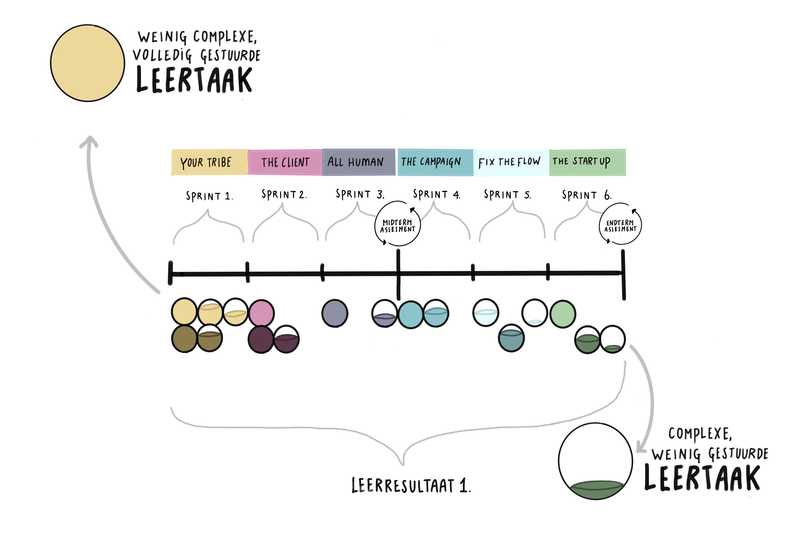
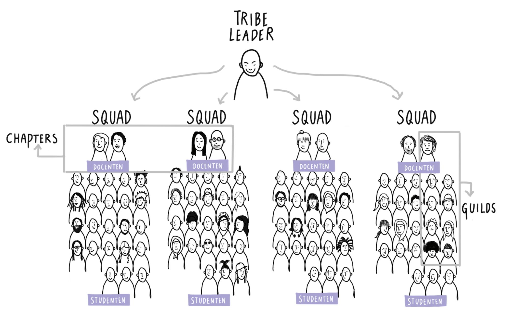
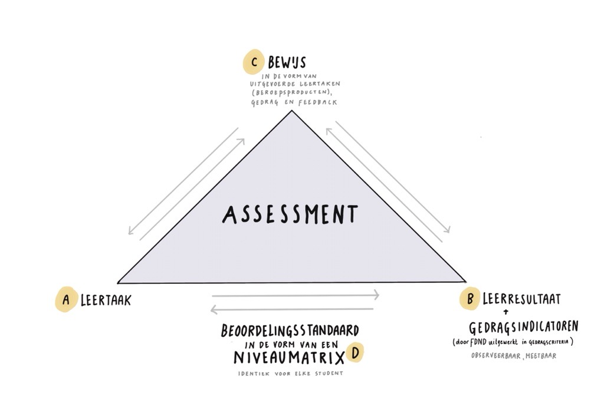
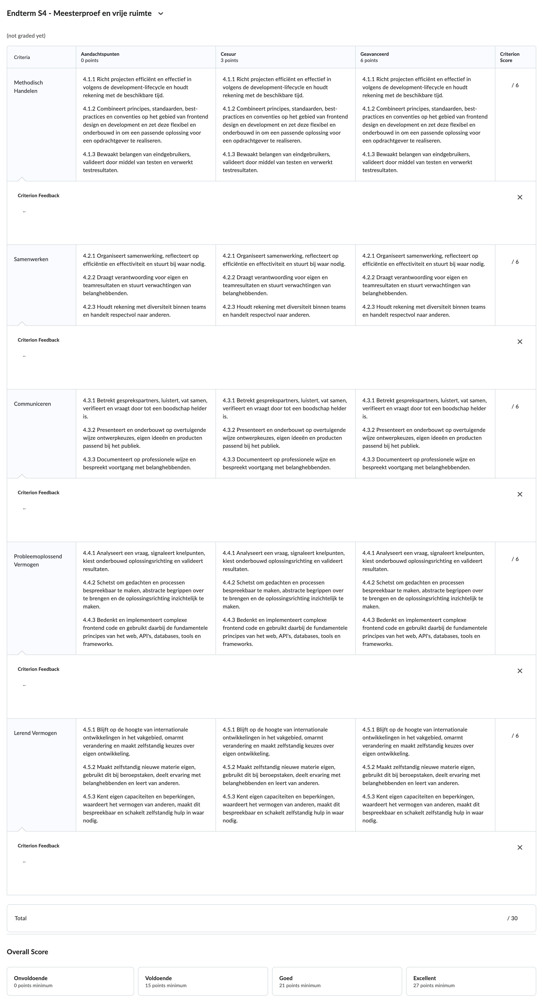

# Standaarden

In dit document reflecteert de Associate degree Frontend Design & Development (FDND) ten behoeve van de visitatie op 22 mei 2026 op haar bestaan. Dit gebeurt aan de hand van het [TNO-dossier (2021)](https://tno-apr-2021.docs.fdnd.nl/) en het [MTR-dosier (2024)](https://mtr-nov-2024.docs.fdnd.nl/). In deze documenten staan de beoogde en in 2021 vergunde opleiding en de opzet en resultaten van de eerste midterm review in 2024 beschreven. Om dit zo navolgbaar mogelijk te presenteren staat onderaan het document een [matrix verwerking aanbevelingen](/standaarden.html#matrix-verwerking-aanbevelingen) waarin we de na de TNO en MTR ontvangen feedback koppelen aan ondernomen acties.

FDND loopt met het docententeam, opleidingscommissie, studenten en contacten in het bedrijfsleven dit document na en betrokken personen reageren op die paragrafen waar wij ontwikkelingen in voorzien of gemaakt hebben. Onze kritische reflectie heeft dezelfde structuur als bovengenoemde documenten en volgt qua opbouw de vier standaarden van de NVAO.

## Inleiding

FDND is trots op bereikte resultaten! Er staat een mooie opleiding met een gedegen fundament waar wij als team het volste vertrouwen in hebben. De beroepspraktijk is dit met ons eens en is op allerlei manieren betrokken bij de opleiding. Wij hanteren hetzelfde jargon als in de praktijk: _Agility_ zit verweven in ons DNA, wij _itereren_ doorlopend en brengen zo onze kwaliteit naar een steeds hoger niveau. Ook studenten werken doorlopend iteratief aan [échte projecten voor échte opdrachtgevers](https://github.com/fdnd-agency/). Het omarmen van _GitHub_, defacto standaard, als publieke _code-repository_ en de bijbehorende projecttools (issues, projectboard, branches, pull-requests) werpt zichtbaar vruchten af. Niet alleen zijn onze interne projecten (bijv. deze docs website) systematisch, georganiseerd en transparant, ook stromen studenten na hun opleiding naadloos door naar de beroepspraktijk.

FDND studenten zijn tevreden over hun opleiding, dit blijkt voor het 3e jaar op rij uit lovende resultaten in de NSE: In 2023, 2024 én 2025 ontving FDND het predicaat Topopleiding, ook in de Keuzegids. Natuurlijk is de NSE niet leidend, wij merken ook in onze [blokenquêtes](/organisatie.html#blokenquete) en tijdens [panelgesprekken](/organisatie.html#panelgesprekken-1) met studenten dat ze overwegend tevreden zijn.

FDND is ook kritisch, in dit document vind je onze ongefilterde zelfreflectie. Wij zien op veel vlakken mogelijkheden voor verbetering en zijn zodoende ook zeer benieuwd naar inzichten die voortkomen uit deze visitatie.

### Context van de opleiding

Voor we de standaarden induiken en in detail treden willen we even stilstaan bij de context van onze opleiding. FDND staat in de doorlopende lijn van het cluster Mediadesign. Samen met drie andere clusters vormen wij het onderwijs binnen de faculteit Digitale Media en Creatieve Industrie (FDMCI), een van de zes faculteiten van de Hogeschool van Amsterdam (HvA).

|  | Mediadesign | ICT | Media en Communicatie | Fashion |
| ----- | ----- | ----- | ----- | ----- |
| **Ad** | Frontend Design & Development |	Software Development, Cyber Security	| Smart Media Production | Fashion Design New Archetypes &#42; |
| **Ba** | Communication & Multimedia Design	 | HBO-ICT | Communicatie + Creative Business | Fashion & Textile Technologies |
| **Ma** | Digital Design | Applied Artificial Intelligence, Cyber Security | | Fashion Track bij Digital Design |

&#42; nog niet goedgekeurd, in ontwikkeling

Binnen FDMCI delen de vier Associate degree programma’s een examen- en toetscommissie. Ook overleggen coördinatoren van deze vier Ad’s elke twee weken met elkaar. Tijdens dit overleg worden ervaring, onderwijs- en organisatorische inzichten en expertise met elkaar gedeeld. Daarboven is op HvA niveau een leergemeenschap Associate Degree’s, dit orgaan komt jaarlijks enkele malen bij elkaar voor een thematische bijeenkomst.

[Onderzoekers van FDMCI](https://www.hva.nl/over-de-hva/organisatie/faculteiten/digitale-media-en-creatieve-industrie/onderzoek) doen praktijkgericht onderzoek dat ontstaat vanuit een vraag of probleem uit de praktijk. Resultaten zijn kennis, inzichten, producten en diensten die bijdragen aan innovatie van de beroepspraktijk, het oplossen van maatschappelijke vraagstukken en de vernieuwing van het onderwijs. Het onderzoek wordt uitgevoerd binnen verschillende lectoraten en onderzoeksgroepen, een aantal van deze lectoraten vervullen als [partner in education](https://partners.fdnd.nl/projecten) de rol van opdrachtgever bij FDND projecten.

Ook veel bedrijven uit de metropoolregio Amsterdam zijn [partner in education](https://partners.fdnd.nl) en werken op verschillende manieren met ons samen. Als projectpartner, bij design-challenges, als co-teacher, bij het geven van talks of het aanbieden van een stageplek. Een actueel overzicht van lopende projecten is te zien op [dashboard.fdnd.nl/](https://dashboard.fdnd.nl/).

We hebben contact met verschillende MBO opleidingen en doen een pilot binnen [FDND Agency](/standaarden.html#fdnd-agency): een vernieuwend onderwijsconcept waarin studenten van verschillende niveau’s (4, 5 en 6) en studierichtingen bij elkaar komen en in multidisciplinaire teams aan échte opdrachten voor échte opdrachtgevers werken.

FDND is aangesloten bij de vakvereniging [Fronteers](https://www.fronteers.nl/) voor front-end developers in Nederland en België en bezoekt met regelmaat (inter)nationale vakgerelateerde conferenties en bijeenkomsten (vb. [CSSDay](https://cssday.nl/), [performance.now()](https://perfnow.nl/), [Smashing Conference](https://smashingconf.com/amsterdam-2026)). Wij staan in contact met [stichting accessibility.nl](https://www.accessibility.nl/), een onderdeel van Bartiméus dat specifiek gericht is op digitale toegankelijkheid. Ook zijn wij aangesloten bij het [Overlegplatform Associate degree](https://www.deassociatedegree.nl/) en [Chain 5](https://www.chain5.net/), de Europese Community of Practice voor niveau 5 opleidingen waar we op de jaarlijkse conferentie workshops/talks verzorgen.

### Administratieve gegevens

| NAAM INSTELLING | Hogeschool van Amsterdam |
| --------------- | ------------------------- |
| Status instelling | Bekostigd |
| Resultaat instellingstoets kwaliteitszorg | Positief (geldig tot en met 4 november 2031) |
| Adres en website van instelling | Wibauthuis (WBH), Amstelcampus, Wibautstraat 3b, 1091 GH Amsterdam, www.hva.nl  |
| **NAAM OPLEIDING** | **Frontend Design & Development** |
| Adres en website van opleiding | Theo Thijssenhuis (TTH) Amstelcampus, Wibautstraat 2-4, Amsterdam, https://fdnd.nl |
| Registratienummer RIO (ISAT) | 80176 |
| RIO-onderdeel | Techniek | 
| BRIN | 28DN |
| Oriëntatie opleiding | Hbo |
| Niveau opleiding | Associate Degree |
| Graad en titel | Associate Degree |
| Aantal studiepunten | 120 |
| Afstudeerrichtingen (incl. varianten) | n.v.t. |
| Locatie(s) | Amsterdam |
| Bijzonderheden | Eerste visitatie na TNO |
| Onderwijstaal | Nederlands |
| Datum locatiebezoek | 22 mei 2026 |
| Inleverdatum visitatierapport | 1 november 2026 |

## Standaard 1: Beoogde leer­resultaten

_De beoogde leerresultaten passen bij het niveau en de oriëntatie van de opleiding en zijn afgestemd op de verwachtingen van het beroepenveld en het vakgebied en op internationale eisen._

De opleiding Frontend Design & Development (FDND) wordt doorlopend en in overleg met het werkveld doorontwikkeld en bij het aanbieden van onderwijs wordt het bedrijfsleven op verschillende vlakken ingezet. Beroepsprofessionals zijn bij FDND [partners in education](https://partners.fdnd.nl) en in die hoedanigheid opdrachtgever bij projecten en challenges, als stagebegeleider, als co-teacher, bij het geven van talks voor onze ‘we♥web’ sessies, bij expert-reviews en als bezoeker van onze EXPO. Bij standaard 2 wordt dit uitgebreid behandeld. Deze samenwerking draagt bij aan het niveau van de opleiding en onze leerresultaten.

### Naamgeving

Frontend is een internationaal gebruikte term. Omdat frontend professionals zowel op het gebied van webdesign als van webdevelopment opereren, hebben wij gekozen voor de naam 'Frontend Design & Development'. Wat dit betekent wordt toegelicht in ons voorlichtingsmateriaal en tijdens open dagen: Frontend professionals ontwerpen en maken websites, ze opereren binnen hun functie vaak in verschillende rollen. De functie van frontender wordt door werkgevers op uiteenlopende manieren gekenmerkt. Zo zijn er:
- *HTML/CSS Developers* die door designers gemaakte ontwerpen uitwerken op of vertalen naar het web maar een beetje weg blijven bij javascript, 
- *Frontend Developers* die naast kennis van HTML en CSS ook veel kennis hebben van javascript en interactie in de browser programmeren,
- *Frontend Web Designers* die grafischer georiënteerd zijn, zelf ontwerpen maken en deze vervolgens uitwerken,
- *User Interface Developers* die gespecialiseerd zijn in het maken van interfaces en gebruikersinteractie,
- *Frontend Engineers* die technischer georiënteerd zijn en naast frontend ook een liefde ontwikkelen voor de backend en
- *Creative Developers* die met webtechnologie interactieve animaties of 3D interfaces ontwikkelen.
De naam Frontend Design & Development dekt alle rollen en functies die een frontend professional kan aannemen. Onze naam wordt wereldwijd (h)erkend in het beroepenveld en veelvuldig gebruikt op internationale conferenties.

### Visie op het beroep

Al veranderd de inhoud van de door ons gebruikte technologie met een rap tempo, de door ons in 2020 opgestelde [visie op het beroep](https://tno-apr-2021.docs.fdnd.nl/TNO-dossier.html#visie-op-het-beroep) behoudt na vijf jaar nog steeds haar waarde. Er is geen landelijk beroepsprofiel omdat we nog steeds de enige specialistische frontend opleiding zijn die ontwerp en ontwikkeling met elkaar combineren. Binnen het vakgebied is een aantal ontwikkelingen waar we op willen reflecteren. Het frontend vakgebied ontwikkelt continu en dit levert best wat uitdagingen. Gebruikelijke uitdagingen als i) de snelle evolutie en vervanging van technologie, frameworks en tools en ii) de blijvende zorg voor compatibiliteit, platform onafhankelijkheid, toegankelijkheid en prestaties welke daardoor steeds complexer wordt. Maar ook nieuwe uitdagingen zoals het ontstaan van iii) een groeiende kloof tussen javascript gerichte full-stack web programmeurs en HTML/CSS gerichte ontwikkelaars en de iv) opkomst van het fenomeen genAI, in het bijzonder _Large Language Model (LLM)_ en de impact op het werk van frontend design & developers.

#### Snelle evolutie

De halfwaardetijd van kennis met betrekking tot libraries, frameworks en tooling is in het frontendvakgebied vrij kort. Daarentegen verandert er in de basis van webtechnologie HTML/ CSS/ JS minder. Natuurlijk zijn er maandelijks uitbreidingen op CSS, echter het selecteren van HTML elementen om stijlregels te koppelen is nog steeds hetzelfde en ook de semantiek van HTML elementen is al jaren gelijk. Die tweeledigheid wordt gereflecteerd in de inhoud van het curriculum, we bieden studenten een stevige basis én de capaciteit verandering te omarmen. In de inhoud van het curriculum houden spelen we dus in op deze tweeledigheid.

#### Voortdurend aandacht

Het vakgebied vraagt nogal wat van docenten, deze hebben voortdurend aandacht voor ontwikkelingen op gebied van compatibiliteit, platformonafhankelijkheid, toegankelijkheid en prestaties. Wij noemen dit met een acroniem de RAPPE principes wat staat voor: Responsive, Accessible, Performant en Progressive Enhanced. Met name toegankelijkheid wordt nóg belangrijker door de invoering van de Europese Toegankelijkheidsrichtlijn (European Accessibility Act - EAA) welke sinds 28 juni 2025 in Nederland én de gehele EU van kracht is. Deze wet verplicht bedrijven om digitale producten en diensten (zoals webshops, banken, apps en e-books) toegankelijk te maken voor mensen met een beperking. De RAPPE principes zijn structureel verankerd in alle onderdelen van het curriculum en studenten raken hier gedurende de opleiding van doordrongen. 90% van het web voldoet nog helemaal niet aan de toegankelijkheidsrichtlijn, op dit gebied brengen onze studenten écht vernieuwende inzichten en helpen bedrijven zich beter aan de wet te houden. Omdat ontwikkelingen razendsnel gaat leren docenten van elkaar en met elkaar en betrekken het bedrijfsleven op allerlei manieren bij de opleiding. In de paragraaf [aansluiten bij de actualiteit](#aansluiten-bij-de-actualiteit) gaan we nog iets dieper in op wat dit precies inhoudt.

#### Bewuste keuze voor de front-of-the-frontend

Binnen het ICT vakgebied is op allerlei manieren sprake van arbeidsdeling. Er ontstaat een kloof tussen javascript gerichte full-stack web programmeurs en HTML/CSS gerichte ontwikkelaars ([Coyier, 2019](https://css-tricks.com/the-great-divide/)). Binnen FDMCI bestaat naast onze Frontend opleiding een Ad Software Development (SD) waar webtechnieken gericht zijn op de backend van websites, er wordt bij SD nagenoeg geen aandacht besteed aan de frontend. FDND is voornamelijk op de frontend gericht maar we leren studenten in semester 2 en 3 ook wat backend technieken. De gerichtheid bij het aanbod van backend technieken blijft altijd de *front-of-the-frontend*. Deze keuze heeft impact op de inhoud van het curriculum, 2 sprints in het 2e semester: *S16: Don’t Repeat Yourself* en *S17: User Needs* (voorheen Back to Static) zijn de afgelopen jaren meer naar de frontend toe bewogen. Binnen FDND Agency komen meerdere disciplines bij elkaar. Het is heel mooi om te zien hoe o.a. Frontend (FDND) en Backend (SD) geschoolde studenten elkaar versterken bij het werken aan opdrachten.

#### De opkomst van AI

LLM's, zoals ChatGPT, Claude, Co-Pilot en andere genAI-tools, vormen een verleidelijk hulpmiddel voor aankomende junior frontenders. Vooral in termen van snelheid, ondersteuning en leermogelijkheden. In de praktijk merken we dat studenten er bij aanvang van de opleiding veelvuldig gebruik van willen maken. We merken echter in de dagelijkse begeleiding van studenten dat studenten die doorschieten in het gebruik van deze technologie juist minder grip krijgen op wat ze doen. Het gebruik van genAI levert geen gevaar op voor de betrouwbaarheid en validiteit van beoordelingen, dat komt door onze toetsvorm. Tijdens assessments toetsen wij begrip en inzicht bij het werken aan projecten, als dat achter blijft haalt de student het assessment niet. Meer over toetsing bij Standaard 3.

Wij herkennen de conclusie van het artikel [Kids who use ChatGPT as a study assistant do worse on tests](https://www.popsci.com/technology/kids-who-use-chatgpt-as-a-study-assistant-do-worse-on-tests/) waarin over het leerrendement met gebruik van AI gesproken wordt. Er zijn ook tegengeluiden, bijvoorbeeld in het artikel [How does generative artificial intelligence impact student creativity?](https://www.sciencedirect.com/science/article/pii/S2713374523000316) wat beschrijft hoe het creatief vermogen vergroot kan worden mits AI op een juiste manier gebruikt wordt. In lijn hiermee ligt wat ons betreft een belangrijk onderscheid in het type toepassing. GenAI kan helpen meerdere oplossingsrichtingen te verkennen maar is geen vervanging voor het doorgronden van de RAPPE principes en bijvoorbeeld browser-API’s. LLM's zijn wat ons betreft geen vervanging voor diepgaand leren, experimenteren en samenwerking met anderen, maar kunnen daar wel bij helpen. Wij leren studenten een balans te vinden tussen het gebruik van deze technologie en het zelf ontwikkelen van vaardigheden door praktijkervaring en het opdoen van kennis uit betrouwbare bronnen, waarbij de nadruk ligt op het laatste.

De opkomst van AI heeft impact gehad op ons curriculum, wij hebben een richtlijn opgenomen voor gebruik van genAI in de verschillende fases van de opleiding. In semester 1 leggen we uit hoe genAI als junior frontender kan bijdragen aan het leerproces, namelijk als sparringspartner om grip te krijgen op moeilijke concepten. Het klakkeloos genereren van code zonder begrip van de inhoud keuren wij af omdat dit de kans op een leerervaring verkleint. In semester 2 zetten studenten genAI gericht in om meer backend-gerichte vraagstukken te adresseren. Onze focus en expertise is en blijft de *front-of-the-frontend* en frontend-code wordt dus ook in semester 2 met de hand geschreven. In semester 3 willen we studenten leren hoe ze *AI assisted development* kunnen omarmen zonder door te schieten in *vibe-coding*. We trekken hierbij op met het bedrijfsleven en onderzoeken welke AI skills van junior frontenders verwacht worden. Deze aanpak helpt studenten om zelfstandig te beoordelen of code van goede kwaliteit is. Met deze vaardigheden zijn studenten een waardevolle aanwinst voor bedrijven. Ze kunnen niet alleen code schrijven, maar ook begrijpen en evalueren.

### Frontend op Ad niveau

Vooralsnog zijn we de enige Ad Frontend in Nederland en daarom schreven wij tijdens de TNO ons eigen profiel. Er bestaan voor het beroep van frontender geen wettelijke- of domeinvereisten. Voor de fundamentele webtechnologieën HTML en CSS en de [Web Content Accessibility Guidelines (WCAG)](https://www.w3.org/TR/WCAG22/) zijn standaarden welke beheerd worden door het [World Wide Web consortium (W3C)](https://w3.org/). Deze standaarden vormen het richtsnoer voor al het werk wat studenten opleveren. 

Wij beschreven hoe een frontend opleiding er op NLQF niveau’s 4, 5 en 6 uit zou kunnen zien. Uiteraard in nauwe samenspraak met het werkveld en rekening houdend met wettelijke kaders, landelijke en Europese richtlijnen en verwante opleidingen. Deze beschrijving staat op pagina 15 van het [beroeps en opleidingsprofiel](/assets/docs/Bijlage03_BeroepsEnOpleidingsprofiel.pdf) dat wij in de TNO fase ontwikkelde. Onze [leerresultaten](/assets/docs/Bijlage01_Leerresultaten.pdf), verankerd in de landelijke gedragscriteria en door ons ontwikkelde bijbehorende gedragsindicatoren, zijn getoetst aan het landelijk profiel CMD (p10), HBO-ICT (p13), de kwaliteitsraamwerken NLQF (p16) en EQF (p19), de Dublin Descriptoren (p21) en tenslotte het e-Competence framework (p23). Matrices met de relatie tussen het FDND leerresultaat, de gedragscriteria, -indicatoren en de bovengenoemde frameworks zijn te vinden op betreffende paginanummers.

Aansluiten bij een bestaand Landelijk Associate degree Overleg (LAdO) is lastig omdat geen van de bestaande groepen aansluit op ons profiel. De Ad SMP en SD zijn wel aangesloten bij een LAdO en we zien absoluut meerwaarde van kennisdeling en afstemming op inhoud. De gerichtheid van deze opleidingen is alleen zo anders dat deze niet aansluiten bij de doelen en het curriculum van FDND. Daarom zoeken wij educatief partnerschap buiten Nederland. Via Chain 5, de Europese community voor niveau 5 of Ad onderwijs, zijn we in contact gekomen met Hogeschool PXL (België). Alhoewel de gerichtheid niet exact hetzelfde is zijn daar 2 graduaatsopleidingen, Web-development en Web-design waar na vergelijking van curricula duidelijk overlap aanwezig is en waar we mee in contact zijn getreden. We hebben een afvaardiging van PXL in Amsterdam uitgenodigd voor een workshop met accessibility.nl over de verankering van toegankelijkheid in FDND, CMD en ICT curricula.

### Leerresultaten

Onze leerresultaten zijn vastgelegd in een [niveaumatrix](https://niveaumatrix.fdnd.nl), welke worden uitgesplitst aan de hand van de door het Overlegplatform Associate degree vastgestelde vijf Ad gedragscriteria. Hiermee verhoudt ons beoordelingsinstrument zich tot het [landelijk vastgestelde niveau voor Associate degree opleidingen (p6, 11-12)](https://www.deassociatedegree.nl/wp-content/uploads/Beschrijving-van-niveau-5_NL_nov2022-1.pdf). Elk van deze landelijk vastgestelde gedragscriteria worden weer beschreven door drie indicatoren waarmee wij de koppeling naar het frontenderschap maken. Dit beoordelingsinstrument bestaat dus uit 15 FDND-specifieke indicatoren die met elkaar de gedragscriteria dragen. De volledige matrix kan bekeken worden [op de website](https://niveaumatrix.fdnd.nl), voor de volledigheid hier de vier leerresultaten op volgorde van semester:

1. De student gebruikt fundamentele principes van het web voor het ontwerpen en ontwikkelen van eenvoudige gebruiksvriendelijke interactieve toepassingen voor het web.
2. De student gebruikt API's en databases voor het ontwerpen en ontwikkelen van gebruiksvriendelijke interactieve toepassingen voor het web.
3. De student werkt volgens gangbare ontwikkelmethoden, en gebruikt tools en frameworks voor het ontwerpen en ontwikkelen van complexe gebruiksvriendelijke interactieve toepassingen voor het web.
4. De student ontwerpt en ontwikkelt zelfstandig complexe gebruiksvriendelijke interactieve toepassingen voor het web. De student beheerst de principes van het web, kan API’s en databases gebruiken, kan tools en frameworks inzetten, en werken volgens gangbare ontwikkelmethoden.

Onze niveaumatrix is prettig in dagelijks gebruik: Docenten en studenten weten waar ze aan toe zijn omdat alles wat ze bij de opleiding doen: sprints, leer- en deeltaken, portfolio en assessments, gericht is op het niveau zoals beschreven in de matrix. Daarnaast geeft de matrix bedrijfsbegeleiders tijdens de stage richting en houvast bij het geven van feedback.

Onze niveaumatrix wordt jaarlijks vastgesteld. Studenten en docenten kunnen inhoudelijke [feedback](https://github.com/fdnd/niveaumatrix.fdnd.nl/issues) als issue inschieten via GitHub en deze wordt éénmaal per schooljaar verwerkt in samenhang met ons OER. Voor vaststelling moeten meerdere docenten het eens zijn met een beoogde verandering. Zie bijvoorbeeld de [aanpassingen voor schooljaar 2023/24](https://github.com/fdnd/niveaumatrix.fdnd.nl/pull/3) of [schooljaar 2024/25](https://github.com/fdnd/niveaumatrix.fdnd.nl/pull/16). Bovendien worden [jaarlijkse releases](https://github.com/fdnd/niveaumatrix.fdnd.nl/releases) als archief bijgehouden zodat men altijd terug kan kijken of verwijzen naar matrices uit het verleden.

### Internationaal perspectief

Het frontend vakgebied is internationaal maar onze voertaal is Nederlands. Veel van het bronmateriaal wat wij studenten aanreiken is Engelstalig. Tijdens talks en workshops proberen we studenten zo goed mogelijk te helpen met het eigen maken van jargon, dit doen we o.a. door ze [op niveau aan te spreken](/onderwijs.html#aanspreken-op-niveau) aan de hand van het artikel ‘Concept to Code’ van Ryan Betts (2017). 

Scroll voor een indruk van het jargon even door onze [BOKSA](/boksa.html), een document waar alles wat we studenten willen aanleren in verwerkt staat, en dat door het team bijgesteld wordt op basis van nieuwe ontwikkelingen en inzichten. Studenten leren dit voornamelijk engelstalige jargon van het frontenderschap aan door het taalgebruik van docenten, engagement met de materie en samenwerken met engelstalige professionals. Wij dragen als docententeam natuurlijk veel materie aan maar gaandeweg de opleiding worden studenten geacht zelf op de hoogte te blijven van ontwikkelingen in het vakgebied waarbij de artikelen en documentatie van technologie bijna altijd engels zijn. Dit wordt zelfs expliciet beoordeeld door de gedragsindicatoren onder lerend vermogen. 

We organiseren ook events waarbij engelstalige sprekers worden uitgenodigd. In semester 3, vlak voor het begin van de stage, verzorgen we een code- en designreview door voornamelijk engelstalige frontend professionals. Week twee van elke sprint nodigen wij een beroepsprofessional uit het vakgebied uit voor een [we♥web](https://github.com/fdnd/weloveweb.fdnd.nl/blob/main/2324.md) lezing. Vaak zijn dit nationale of internationale, soms in het vakgebied zeer gerenommeerde sprekers waaronder:
[Brian Bors](https://www.accessibility.nl/),
[Cassie Evans](https://www.cassie.codes/),
[Gwen Bogaert](https://www.antinomy.studio/),
[Hidde de Vries](https://hidde.blog/),
[Jad Joubran](https://learnjavascript.online/),
[Julia Miocene](https://miocene.io/),
[Manuel Matuzović](https://www.matuzo.at/),
[Mikey Casalaina](https://mikey.casa/laina),
[Nicolas Garnier](https://nico.computer/),
[Sanne ’t hooft](https://sinds1971.nl/),
[Simon Riisnæs Dagfinrud](https://xn--smon-vpa.com/),
[Vasilis van Gemert](https://vasilis.nl/clocks/) en
[Yolijn van de Kolk](https://nldesignsystem.nl/)

## Standaard 2: De onderwijs­leeromgeving

_Het programma, de onderwijsleeromgeving en de kwaliteit van het docententeam maken het voor de instromende studenten mogelijk de beoogde leerresultaten te realiseren._

In dit hoofdstuk bekijken we de onderwijsleeromgeving. Na reflectie op het [didactisch concept](#didactisch-concept) reflecteren we bij [vormgeving van de opleiding](#vormgeving-van-de-opleiding) op de structuur. Het gaat te ver voor deze kritische reflectie om een volledige inleiding in onze onderwijsleeromgeving te geven, hiervoor verwijzen wij naar [standaard 2 in het TNO dossier](https://tno-apr-2021.docs.fdnd.nl/TNO-dossier.html#standaard-2-de-onderwijsleeromgeving). Om toch enige context te bieden bij het lezen van deze kritische reflectie volgt een korte schets van de structuur van de opleiding.

De opleiding Frontend Design & Development (FDND) leidt flexibele, zelfstandige en praktijkgerichte Frontend professionals op die goed functioneren binnen een snel ontwikkelende en veranderlijke beroepspraktijk. Bij FDND staat de beroepspraktijk centraal en het onderwijsprogramma is een vertaling van beroepstaken en daarbij behorende kennis, vaardigheden en gedrag naar leerresultaten.

Het onderwijsprogramma bestaat uit semesters en sprints. Een sprint duurt drie weken en na drie sprints worden studenten beoordeeld bij een summatief assessment. Elk semester heeft een midterm en een endterm assessment. In onderstaande afbeelding is ingezoomd op semester 1, sommige sprintnamen zijn inmiddels aangepast.

Studenten werken gedurende de sprint aan leertaken, in de afbeelding weergegeven met bolletjes, die toenemen in complexiteit, afnemen in sturing. Voor een actueel overzicht van sprintnamen verwijzen wij naar [programma.fdnd.nl](https://programma.fdnd.nl/). FDND heeft een vaste weekindeling en studenten en docenten gebruiken deze site dan ook als rooster.

Sprints hebben een vaste cadans en volgen onderstaand schema, er is inloop vanaf 9:00, jaar 1 heeft les tussen 09:30 - 13:00 en jaar 2 tussen 13:30 - 17:00 les. Maandag, woensdag en vrijdag zijn studenten allemaal aanwezig. Dinsdag en donderdag - de dagen met een D - zijn differentiatiedagen waarop studenten naar eigen inzicht kiezen of ze hier aanwezig willen zijn, op deze dagen bieden we challenges en practica aan, en is er de mogelijkheid om extra uitleg te krijgen. Vrijdagen staan altijd in het teken van feedback en reflectie. Buiten de geplande lesuren verwachten wij dat studenten zelf doorwerken aan hun project.

| maandag | dinsdag | woensdag | donderdag | vrijdag | 
| ------- | ------- | ------- | ------- | ------- |
| Talk/ Workshop, Leer-/ deeltaken, (Peer) feedback, Learning journal | Practicum, Leer-/ deeltaken, (Peer) feedback, Learning journal | Talk/ Workshop, Leer-/ deeltaken, (Peer) feedback, Learning journal | Practicum, Leer-/ deeltaken, (Peer) feedback, Learning journal | Design & Code review, feedback, Learning journal |

Met deze beknopte intro duiken we nu snel in onze reflectie.

### Didactisch concept

Het didactisch concept voor FDND rust op drie pijlers welke ten tijden van ontwikkelen van de opleiding door de HvA Academy zijn ingegeven. De drie pijlers vormen het uitgangspunt voor de inrichting van de opleiding en worden in wat volgt nader toegelicht.

#### Praktijkvraagstukken in een rijke leeromgeving

Studenten werken bij FDND doorlopend aan échte projecten voor échte opdrachtgevers. Projecten draaien in alle semesters en hebben een oplopende moeilijkheidsgraad. Waar studenten in semester 1: Static Web eenvoudigere vraagstukken oppakken, wordt de complexiteit geleidelijk hoger in de opvolgende semesters. Uiteindelijk kan in semester 4 een student zelfstandig de verantwoordelijkheid voor een project en een adviserende rol naar de opdrachtgever op zich nemen. 

FDND is erg tevreden over deze aanpak. Wij investeren veel in relaties met het bedrijfsleven en andere opleidingen en dat werpt duidelijk vruchten af. Wij geven de voorkeur aan langlopende, meerjarige projecten en daarmee aan een kwalitatieve hoogwaardige samenwerking met projectpartners uit de beroepspraktijk. Het is om die reden dat wij een [_partners in education_ programma](https://partners.fdnd.nl) hebben en [de rol van _Alliance Officer_](/organisatie.html#alliance-officer-02-fte) omarmen om die samenwerking vorm te geven. Projectpartners komen bij FDND op bezoek tijdens briefing en review meetings én bij de EXPO aan het eind van elk semester. In deze samenwerking krijgen projecten steeds meer betekenis en urgentie, voor zowel studenten als projectpartners. Voorbeelden van projectpartners zijn onder anderen: 
4 mei comité Oosterparkbuurt, 
Antoni van Leeuwenhoek Ziekenhuis,
Embassy of the Free Mind, 
Funda, 
Openbare Bibliotheek Amsterdam, 
Space Research Organisation Netherlands,
The Ocean Cleanup en 
Vervoerregio Amsterdam

> De samenwerking is waardevol voor zowel studenten als collega's van de Vervoerregio. Beide leren meer over de inhoud en toegankelijkheid van websites, maar ook over opdrachtgeverschap en opdrachtnemerschap. Met de frisse blik van studenten worden wij getoetst op wat we precies uit het product willen halen. Tegelijkertijd leren studenten zo wat er nodig is om de vraag scherp te stellen en de vertaling te maken vanuit hun technische kennis en jargon naar begrijpelijke taal voor de klant zonder technische voorkennis. Toolgankelijk brengt de Vervoerregio echt verder in onze vraag; het toetsen van toegankelijkheid van websites. _- Elise Kamps, Assistent Projectleider bij de [Vervoerregio Amsterdam](https://vervoerregio.nl/)_

Om de studenten nóg directer te laten kennismaken met het vakgebied, werken ze in sprint 6 (eind semester 1) en sprint 12 (eind semester 2) aan een _design challenge_ voor een frontend bedrijf, waarbij studenten zelfstandig, zonder docenten, naar de bedrijven toe gaan. We zien deze sprints als een soort mini-meesterproef en voorproefje voor de meesterproef waarmee studenten afstuderen. Tijdens de _briefing_ en _sprint review_ op locatie krijgen studenten een kijkje in de keuken van een échte Digital Agency, krijgen ze feedback op hun werk van professionals uit het vakgebied én kunnen ze alvast contacten leggen voor een mogelijke stageplek.

Wij beogen bij projecten in de laatste fase van de opleiding nóg meer samen te werken met studenten van andere opleidingen. We draaien onder de noemer FDND-Agency momenteel een pilot met deelnemers uit meerdere opleidingen. We zijn erkend MBO leerbedrijf en in die hoedanigheid zijn er vier MBO Software Development studenten aan boord. Vanuit de HvA nemen de Ad opleidingen Software Development, Smart Media Production en Cybersecurity en de Bachelor Communication & Multimedia Design deel. Daarnaast zijn er natuurlijk Frontenders van onze opleiding. Deze studenten werken in multidisciplinaire teams aan beroepsvraagstukken. In onze optiek is dit hét toonaangevende voorbeeld van vernieuwend onderwijs.

#### Studenten aan het roer

Zelfstandigheid van studenten is een van de drie funderende principes van FDND. Bij de ontwikkeling van het curriculum is hier rekening mee gehouden in de vorm van afnemende sturing en toenemende complexiteit.

Toenemende complexiteit wordt concreet in de volgorde van leertaken. In semester 1 is de focus op de basis van HTML en CSS en het ontwerpen en realiseren van eenvoudige websites. Eind semester 3 maken studenten zonder aarzeling zelfstandig nieuwe _site generators_ en _headless CMS-en_ eigen om vervolgens met een strak georganiseerd team websites voor een opdrachtgever te produceren.

Bij het aanbieden van het eerste jaar merkten we dat we meer houvast nodig hadden om afnemende sturing, en daarmee toenemende zelfstandigheid, te borgen. Docenten hebben op basis van het stuk [Professionele Identiteit ontwikkelen gedurende de hbo-opleiding van Annemiek Grootendorst (2019, HRO](https://hbo-kennisbank.nl/details/sharekit_hr:oai:surfsharekit.nl:1a08e26f-f745-4516-bcae-7d852664c7ee)) en het artikel [Concept to Code van Ryan Betts (2017)](https://uxmag.com/articles/concept-to-code) een manier van [aanspreken van studenten](/onderwijs.html#aanspreken-op-niveau) in de verschillende semesters opgesteld waar docenten zich aan houden. Deze manier van aanspreken biedt meer houvast bij de concretisering van afnemende sturing maar het blijft een didactisch ingewikkeld proces. Docenten merken de effecten van deze aanpak, studenten nemen in de latere fase van hun studie meer dan voorheen verantwoording voor hun eigen studieproces en het is voor docenten duidelijker in de verschillende semesters met studenten om te gaan.

#### Toetsing als leermoment

Toetsing staat bij FDND in dienst van het leerproces. Het midterm en endterm assessment geeft docenten en studenten een goed beeld van het gerealiseerde niveau en we besteden veel tijd aan formatieve feedbackmomenten. Naast doorlopende vraaggestuurde feedback en het mentoring programma geven en ontvangen studenten elke vrijdag feedback van docenten en hun peers tijdens de _design/code review_ en _retrospect_ sessies.

De precieze uitvoer van het toetsproces is ten opzichte van de [beoogde werkwijze in in het TNO dossier](https://tno-apr-2021.docs.fdnd.nl/TNO-dossier.html#vormgeving-van-de-toetsing) een aantal keer bijgesteld. Bij [standaard 3](#standaard-3-toetsing) gaan we dieper op deze iteraties in. We hopen met deze aanpassing het doel, toetsing als leermoment, nog beter te bedienen.

### Vormgeving van de opleiding

We beschrijven hoe het curriculum van FDND is ontwikkeld tot een samenhangend, iteratief geheel. We laten zien hoe de sprints logisch op elkaar aansluiten, hoe studenten stap voor stap in toenemende complexiteit worden uitgedaagd en hoe echte projecten, het Learning Journal en de mentorrol elkaar versterken. Zo wordt zichtbaar hoe de vormgeving van de opleiding niet alleen de inhoud structureert, maar ook het leerproces, de samenwerking en de professionele houding van studenten vormgeeft. Tenslotte beschrijven we hoe wij als docententeam itereren op basis van ervaring en kwaliteitsinstrumenten.

#### Opbouw Curriculum

Het curriculum werkt in grote lijnen zeer goed, de opbouw met afnemende sturing en toenemende complexiteit bevalt uitstekend. Wel hebben we op enkele punten de thema's of de volgorde van de sprints aangepast. Zo hebben we op semesterniveau, in iteraties, belangrijke front-endprincipes steeds meer in dezelfde volgorde van sprints aangeboden. Vanuit herhaling van lesstof uit voorgaande semesters wordt de stof geleidelijk steeds complexer in opvolgende semesters. Een voorbeeld hiervan is sprint 10 in semester 2, die we hebben hernoemd van _Performance Matters_ naar _User Experience_, waardoor deze sprint beter aansluit bij sprint 4 uit semester 1, _Look and Feel_.

Elke eerste sprint van elk semester behandelen we de volledige complexiteit en inhoud van het semester. Studenten hebben daarmee de ervaring in het diepe gegooid te worden in een nieuwe context. Dit gaan studenten in de beroepspraktijk, telkens met het uitkomen van vernieuwende technologie opnieuw ervaren en het overkomen van angst voor het onbekende is een belangrijke grondhouding. In semester 1, het statische web, bouwen en publiceren studenten in één sprint een eigen en een teamwebsite met core webtechnologie _HTML, CSS en JS_. In semester 2, data driven doen ze dit opnieuw, maar nu met de serverside technieken _Node.js_, _Express_ en _Liquid_ op basis van gegevens in een _REST API_. In semester 3, workflow, tooling & frameworks doen ze dit een derde keer, nu op basis van het framework _Sveltekit_ op basis van gegevens uit een _Headless CMS_. Studenten worden hierbij ondersteund door hulpmiddelen als geleide instructie en begeleidende artikelen of YouTube filmpjes. Ze krijgen in elke eerste sprint een duidelijk beeld van wat ze dat semester gaan leren, natuurlijk is het beheersingsniveau na deze eerste sprint heel anders dan aan het eind van een semester.

Ook op sprintniveau bevalt de opbouw van het curriculum uitstekend. Het vaste ritme van drie weken per sprint, met vaste instructiemomenten en differentiatie-, feedback- en reflectiedagen biedt duidelijkheid en structuur. Dit werkt niet alleen goed voor onze studenten, het is ook een directe afspiegeling van de manier van werken in de beroepspraktijk. Ook hier hebben we aanpassingen gedaan om beter in te spelen op de leerbehoeften van studenten. Zo hebben we de feedbackloop anders ingericht; op de eerste twee vrijdagen van elke sprint voeren studenten (en coaches) code- en designreviews uit op elkaars werk. De feedback uit deze reviews wordt door studenten vertaald naar issues op GitHub, taken die studenten tijdens een volgende sprint oppakken. Tijdens de _Retrospect_ op de laatste vrijdag van de sprint reflecteren studenten op de ontvangen feedback en gebruiken ze deze om hun bewijslast in Portflow te onderbouwen. In de volgende sprint bespreken ze deze reflectie met een coach om de bewijslast te valideren.

#### Werken aan projecten

De opbouw van het programma leent zich uitstekend voor het werken aan langlopende projecten met echte opdrachtgevers. Door te werken in sprints kunnen we agile aan de projecten werken in meerdere iteraties over meerdere semesters en leerjaren. Hierdoor krijgen de projecten gaandeweg steeds meer betekenis. 

Omdat we doorlopend aan échte projecten werken is er een spanningsveld tussen de materie die we over willen brengen en waardecreatie binnen projecten. Hoewel de thema's uit de sprints over het algemeen goed aansluiten bij de opdrachtomschrijvingen, hebben we in de afgelopen jaren steeds aanpassingen doorgevoerd om het programma, de beoogde BOKSA en waardecreatie voor projectpartners dichter naar elkaar te brengen. In semester 3 is dit heel duidelijk te zien in de gerichtheid van sprint 17 en 18. Deze sprints staan nu meer in het teken van het afronden van de projecten en sluiten nog beter aan op de manier van werken die we verwachten in de vrije ruimte en meesterproef.

#### Vrije ruimte

In het eerste blok van semester 4 in de opleiding, halverwege het 2e jaar, hebben studenten de zogenaamde vrije ruimte. De student staat hier aan het roer en kan 15 EC naar eigen inzicht invullen, lijkend op de minorruimte bij bacheloropleidingen. Verschil met een traditionele minor is dat studenten tijdens hun vrije ruimte ongeacht de keuze hun portfolio vullen met bewijslast, en bij FDND op de gebruikelijke wijze beoordeeld worden op de FDND gedragscriteria middels een assessment. Studenten kunnen hun vrije ruimte op verschillende manieren invullen.

Studenten kunnen stage lopen bij een frontend bedrijf, digital agency, platform of web-afdeling. FDND organiseert een stagemarkt maar studenten kunnen ook zelf een stagebedrijf aandragen. Voor potentiële stagebedrijven is het belangrijk voor de ontwikkeling van de student dat er een senior frontender is die ruimte heeft om tijdens de stage te begeleiden. Studenten kunnen 10 weken meelopen als frontender en de meesterproef bij FDND-Agency doen of 20 weken stage lopen en de meesterproef uitvoeren bij het stagebedrijf. De student moet in dit geval eindverantwoording krijgen voor een project bij het bedrijf.

Studenten kunnen deelnemen aan FDND-Agency, een interne onderneming, gecoördineerd door docenten, waar 2e jaars studenten in teams projecten kunnen draaien, vanzelfsprekend voor échte opdrachtgevers. Studenten zijn meer dan in voorgaande semesters zelf eindverantwoordelijk voor projecten en krijgen daarbij geen ondersteunende lessen. Docenten begeleiden het scrum proces, zijn bereikbaar voor vragen en geven feedback op inhoud en proces. Ze stellen zich hierbij op als senior frontender, net als bij de stage.

Studenten kunnen ook de HvA brede minor ondernemerschap gericht op bachelorstudenten volgen of een blok lessen volgen bij de andere FDMCI Associate degree programma’s.

#### Meesterproef

Het afstudeerprogramma heet bij FDND meesterproef. Studenten hebben de keuze om hun meesterproef bij een bedrijf, binnen hun eigen onderneming óf bij FDND-Agency te volbrengen. De stage is de makkelijkste en meest gebruikelijke route omdat de stagiair terecht komt in een bestaande organisatie met bestaande processen. Bovendien krijgen veel studenten na hun stage een baan aangeboden bij hun stagebedrijf. FDND-Agency vraagt meer verantwoordelijkheid van studenten en is daarmee expliciet niet ‘de gemakkelijke optie’. Docenten zijn dichtbij en bewaken het proces maar studenten die deze route volgen dragen meer verantwoordelijkheid voor overzicht, organisatie en kwaliteit van projecten. De minor ondernemerschap is verreweg de moeilijkste richting. Studenten dragen niet alleen verantwoording voor het aantonen van hun afstudeerniveau voor FDND maar ook alle verantwoording voor alle facetten van hun startende onderneming. In alle gevallen draagt de student zelf eindverantwoording over diens werk. Tijdens terugkomdagen is ruimte om te werken aan het portfolio maar de student verzamelt zelfstandig bewijslast die het behalen van het leerresultaat demonstreert. Meer over de behaalde resultaten bij [Standaard 4: Gerealiseerde leerresultaten](#standaard-4-gerealiseerde-leerresultaten).

Tijdens de toets nieuwe opleiding (TNO) adviseerde het panel om te overwegen om alle studenten stage te laten lopen om studenten in voldoende mate bloot te stellen aan de ‘échte wereld’. Wij behouden keuzevrijheid en zijn overtuigd dat studenten tijdens hun opleiding al heel veel in contact komen met het bedrijfsleven én werken op exact dezelfde manier. Een verschil is dat studenten die FDND Agency volgen allemaal moeten solliciteren na hun opleiding waar sommige stagairs blijven hangen bij hun stagebedrijf. Wij zijn ook heel blij met de mogelijkheid om af te studeren in een eigen onderneming.

#### Leerproces

Studenten documenteren hun leerproces in een Learning Journal waar ze code en design experimenten in verwerken en bijhouden wat ze hebben geleerd. Het Learning Journal kent een routinematig deel waarin ze leren aantekeningen bijhouden en gestructureerd studeren. Tijdens de retrospects kijken studenten regelmatig terug naar wat ze hebben gedaan en geleerd. Het Journal ondersteunt studenten bij de reflectie op hun proces. Daarnaast werken studenten aan een eigen website, een etalage die meegroeit, zodat ze aan het eind van de opleiding portfolio-website hebben om zich als frontender te presenteren aan het vakgebied.

#### Mentorrol

Tweedejaarsstudenten fungeren als mentor voor een aantal eerstejaarsstudenten, een select aantal studenten kiest ervoor dit de Ba Communication & Multimedia Design (CMD) in te vullen als studentassistent bij Frontend vakken in het 2e jaar. Dit biedt een duidelijke meerwaarde voor de mentees: de mentor helpt hen bij het begrijpen van complexe vakinhoudelijke stof en maar geeft praktische begeleiding bij het omarmen van de attitude die van de Frontender verwacht wordt, vanzelfsprekend onder het toeziend oog van docenten. 

Voor de mentoren is de exercitie eveneens waardevol omdat zij hiermee hun communicatieve vaardigheden verder ontwikkelen. Zo leren ze bijvoorbeeld hoe ze complexe informatie kunnen overbrengen, rekening houdend met verschillende kennisniveaus. Daarnaast worden mentoren gestimuleerd na te denken over hun eigen studievoortgang, bijvoorbeeld wanneer ze een vraag krijgen van een eerstejaarsstudent waarop ze nog geen volledig antwoord hebben. Met de mentorrol spelen we dus in op de leerbehoeften van zowel eerstejaars- als tweedejaarsstudenten.

#### Taal

Bij FDND worden zowel Nederlandse als Engelse bronnen (artikelen, video’s etc.) aan studenten aangeboden. Dit is onvermijdelijk gezien het internationale karakter van het beroep. Studenten worden geacht deze bronnen eigen te kunnen maken. Tijdens voorlichting en op open dagen wordt dit expliciet genoemd zodat studenten weten wat ze kunnen verwachten.

Studenten leveren werk voornamelijk op in het Nederlands, enkele uitzonderingen daargelaten. Wij beoordelen niet op de kwaliteit van het Nederlands en Engels. Soms is die kwaliteit echt heftig ondermaats, wij verwijzen dan door naar de taalwinkel van de HvA of het decanaat.

FDND is bezig met het verkennen van de mogelijkheid tot het aanbieden van een engelstalige variant. Dit zouden we per studiejaar 2027/28 als traject willen aanbieden.

#### Iteratieve doorontwikkeling

Naast een aantal kwaliteitsinstrumenten zoals de 100-dagen-monitor, blokenquêtes en panelgesprekken, die door onze kwaliteitsmedewerker bewaakt en vanuit de HvA brede kwaliteitsorganisatie ondersteund worden evalueert het docententeam zelf regelmatig het curriculum. We zijn over het algemeen best tevreden over de inrichting van onze opleiding, toch blijven we altijd kritisch op door ons geleverde prestaties. Zoals bij elk ontwikkelend onderwijsprogramma zijn er weeffoutjes die pas opvallen als het programma draait. Om hiermee om te gaan hanteren we op alle vlakken een iteratieve aanpak. Aan het eind van elk semester houdt het docententeam een zogenaamde [Higher Education Agile Learning (HEAL)](/organisatie.html#higher-education-agile-learning-heal) sessie waarin wij het onderwijs evalueren middels een [retrospect](/organisatie.html#retrospect). De [resultaten van deze HEALs](/organisatie.html#heal-retrospect) staan ook op onze documentatiesite. We leren dus niet alleen aan studenten hoe ze iteratief werken, we passen dit zelf ook toe. *Practice what you preach!*

### Studenten

We staan kort stil bij de toelating en instroom, studentenbegeleiding, diversiteit en studeren met een ondersteuningsbehoefte.

#### Toelating en instroom

Aankomend studenten zijn toelaatbaar met een MBO-4, HAVO of VWO diploma of met een 21+ toets aangeboden door de instelling. Wij hebben geen vereisten voor een specifiek vakkenpakket. Na een impuls in 2022 zien we inschrijvingsaantallen een beetje teruglopen. We ondernemen actie om onze naamsbekendheid te vergroten.

| 2021 | 2022 | 2023 | 2024 | 2025 |
| ---- | ---- | ---- | ---- | ---- |
| 16 | 68 | 69 | 59 | 52 |

Onze opleiding is gericht op het aantrekken van MBO afstudeerders, specifieker op de profielen Software Developer en Mediavormgeving. Toch zien we dat een aanzienlijk deel van onze eerstejaars HAVO of VWO achtergrond heeft. Een klein aantal heeft al aan een andere HBO opleiding gestudeerd. Studenten komen dus met verschillende achtergrond binnen, wij hebben een gelaagd curriculum en veel persoonlijke aandacht en bieden studenten uitdaging op hun eigen niveau.

#### Studentenbegeleiding

Naast persoonlijke coaching op het leerproces die studenten van hun squad-leader ontvangen hebben we duidelijke richtlijnen voor afnemende sturing en toenemende complexiteit. Daarin verandert ook de manier van aanspreken van studenten en de houding die docenten innemen.

In het eerste semester gaan we er van uit dat studenten enthousiast zijn. We spreken ze aan op enthousiasme en uitproberen, durven en fouten maken is oké. We laten ze zien hoe het moet, we geven voorbeelden en verwijzen daarbij naar de bronnen die bij die voorbeelden horen. We houden ons voornamelijk aan de materie die bij de lessen behandeld is tenzij we merken dat studenten meer aan kunnen. Dit is het semester van nadoen en spiegelen.

In het tweede semester spreken we studenten meer en meer aan op nieuwsgierigheid. We verwijzen naar bronnen die in lessen genoemd worden, vragen of ze al zelf bronnen consumeren (mailinglists). We geven geen voorgekauwde voorbeelden meer bij zelfwerkzaamheid en doen geen keyboard-takeovers maar maken samen een breakdown schets maken om inzicht te verkrijgen. We helpen studenten die in paniek slaan op S1 niveau maar benoemen dit wel.

In het derde semester beheersen studenten de principes van het web en voelen zich comfortabel in het omarmen van nieuwe technieken. We spreken ze aan op vindingrijkheid. Bij het leren van een tool of framework worden studenten gestimuleerd zelfstandig de documentatie door te lezen. Tijdens de lessen worden voorbeelden gegeven maar vooral de abstractere principes uitgelegd. Studenten volgen de documentatie van de frameworks zelf en krijgen in leertaken geen stapsgewijze instructie meer.  Als studenten een probleem ervaren zoeken ze eerst zelf naar oplossingen of bespreken ze dit met teamleden voor ze naar de docent stappen.

Tenslotte bewijzen studenten in semester vier zelfstandig dat ze het leerresultaat beheersen. Docenten praten over het gemaakte werk en de bijbehorende gedragscriteria en -indicatoren. Inhoudelijke hulp halen ze bij jaargenoten, op het internet of bij professionals. Als ze oplossingen vinden die het delen waard zijn brengen ze dat in de groep. Docenten verwijzen naar de groep.

#### Diversiteit en differentiatie

FDND heeft op gebied van culturele- en genderdiversiteit een duidelijke gerichtheid welke is meegegeven door het bedrijfsleven tijdens het ontwikkelen van de opleiding. Frontend teams zijn over het algemeen vrij homogeen, dat wil zeggen bestaan uit voornamelijk roze mannen. Daarbovenop is diversiteit als een van de 3 D’s, speerpunt van de Hogeschool van Amsterdam. De genderverdeling van onze instroom was een aantal jaren perfect maar tot onze spijt zien we het laatste jaar het aantal vrouwelijke studenten teruglopen. We proberen te achterhalen waar dit aan ligt en besteden bij voorlichting aandacht aan het in de schijnwerpers zetten van vrouwelijke frontend rolmodellen. Ook willen we mee doen aan Girls Day 2026, een tech dag voor jonge meiden van de middelbare school van VHTO.

Bij het uitnodigen van gastsprekers houden we rekening met het tonen van een diverse groep rolmodellen aan studenten. In het docententeam proberen we de diversiteit van de studentenpopulatie te reflecteren maar dit blijft een aandachtspunt, we hebben een vrij groot percentage kalende roze mannen.

#### Studeren met ondersteuningsbehoefte

Docenten bij FDND doen hun best studeren mogelijk te maken voor een diverse groep studenten. Daarbij ontstaat, net als bij alle andere onderwijsprogramma’s, een spagaat tussen persoonlijke begeleiding en de gerichtheid op het beoogde niveau. Omdat wij persoonlijk en individueel onderwijs verzorgen kunnen we veel extra ondersteuning bieden bij het doorlopen van ons lesprogramma. Aanpassingen in doorlooptijd zijn in overleg mogelijk, wij ontwierpen in overleg met collega’s en studenten al een aantal persoonlijke studieloopbaan plannen afgestemd op de situatie van studenten.

Ondersteuning en begeleiding door docenten kent echter ook grenzen. Wij zijn in de eerste plaats docent en didactisch coach maar niet uitgerust om complexe bagage op te vangen. Gelukkig beschikt de Hogeschool van Amsterdam over een ruime selectie studieondersteunende faciliteiten waaronder een adequaat studentdecanaat en een goed taalloket. FDND docenten faciliteren en verwijzen door waar dat passend is.

### Organisatie

Om dicht bij het beroepenveld te blijven wordt de organisatie van de Ad Frontend Design & Development ingericht volgens de Agile organisatiestructuur (Spotify-model). Dit houdt in dat we studenten en docenten indelen in tribes, squads, chapters en guilds. Nota bene: we spreken bij FDND dus niet over klassen!

#### Organisatiestructuur

FDND is een zelforganiserende [Agile organisatie](/organisatie.html#agile-organisatie) waarbij de [sociocratische werkwijze](/organisatie.html#werkwijze) wordt omarmd als vergader- en beslissingsstructuur. Docenten hebben bij FDND verschillende [rollen](/organisatie.html#rollen) die verwijzen naar dit model. Daarom spreken wij niet over klassen maar over squads. In een squad zitten studenten en docenten (squad-leader, co-teachers). Maximaal vier squads vormen een tribe. Wij zijn bezig bezig met het inrichten van chapters en er zijn drie guilds: een _AI-guild_, een _Accessibility-guild_ en een _Sustainability-guild_.

Deze organisatie- en vergader structuur bevalt goed. Bij tijd en wijlen verslapt de frequentie van overleggen waarop we gezamenlijk besluiten de regel weer beter na te leven. Dit is een golfbeweging die samenhangt met piekmomenten in het jaar, als het druk is leven we de regel van sociocratisch overleg iets minder netjes na.

#### Opleidingscommissie

Elke HBO opleiding heeft een Opleidingscommissie (OC) die de kwaliteit van de opleiding bewaakt. De OC bestaat uit studenten en docenten en is officieel een medezeggenschapsorgaan. Onze OC bestaat uit Suus (docent), Yassine (student j1), Kayleigh (student j1)  en tot voorkort Clarice (student j2). Hieronder hun ervaring en jaarverslagen van de afgelopen jaren.

> Sinds kort ben ik lid van de OC. In het begin was het even wennen, omdat er veel nieuwe informatie en termen op mij afkwamen. Gelukkig kon ik met vragen terecht bij een ervaren team, waardoor ik goed werd begeleid en snel een duidelijker beeld kreeg van de werkwijze en onderwerpen binnen de OC. Hierdoor voelde ik mij steeds zekerder in mijn rol en kon ik actiever deelnemen aan de overleggen. <cite>Yassine Akka, OC-lid 2025/26</cite>

> Als OC-lid heb ik actief deelgenomen aan externe vergaderingen. Omdat ik de eerste periode het enige OC lid was, vond ik het lastig om alles op te pakken en aan de slag te kunnen. De externe meetings waren soms lastig te volgen, ook omdat niet alles relevant was voor onze opleiding. Toen de OC ging uitbreiden doordat er een docent bijkwam en ik twee nieuwe OC-leden had gevonden, werd het allemaal een stuk duidelijker en waren de vergaderingen makkelijker te volgen. Ook plande wij sindsdien regelmatig interne meetings in dus is het binnen de OC in mijn ervaring verbeterd in vergelijking van toen ik er begon en hoe het nu gaat. <cite>Clarice Boerlijst, OC-voorzitter 2025/2026</cite>

- [Jaarverslag 2023-2024](https://oc.fdnd.nl/download/Jaarverslag-2324-FDND.pdf)
- [Jaarverslag 2022-2023](https://oc.fdnd.nl/download/Jaarverslag-2223-FDND.pdf)
- [Jaarverslag 2021-2022](https://oc.fdnd.nl/download/Jaarverslag-2122-FDND.pdf)

#### Docenten

Veel technische en ICT gerichte opleidingen hebben moeite gekwalificeerd personeel te vinden. Wij hebben een groot netwerk binnen de frontend community. Een groot deel van ons docententeam is al jaren actief binnen de minor web bij CMD en veel van de alumni zijn nu senior frontender in de beroepspraktijk. Daarnaast zijn een aantal docenten lid van of in-the-loop bij vakverenigingen waaronder fronteers, okaydev, awwwards. Tot nog toe heeft FDND geen moeite om topdocenten te werven. Onze docenten hebben naast het frontenderschap elk een eigen expertise en doordat we met meerdere docenten tegelijk in de groep staan leren we van elkaar en met elkaar tijdens het werken. Co-teachers zijn naast hun aanstelling bij de HvA actief als frontender in het vakgebied, we staan dus met beroepsprofessionals voor de klas. 

Net als de rest van het hoger onderwijs in Nederland maken wij ons grote zorgen om de continuïteit van het huidige team. Tot voor kort waren onze co-teachers ZZPer, en dus flexibel inzetbaar maar sinds vorig jaar was dit door overheidsrichtlijnen niet meer mogelijk. Door transitieplannen binnen de HvA staan de vorig jaar ingezette tijdelijke contracten van al onze co-teachers nu onder druk. Natuurlijk kunnen we op zoek gaan naar nieuwe co-teachers maar daarmee verliezen we de ervaring en kwaliteit van onze huidige co’s en is het vasthouden van niveau in het geding.

##### Aansluiten bij de actualiteit

FDND wil _up-to-date_ blijven met veranderingen in de HTML/CSS/JS standaarden. Dit betekent concreet dat docenten doorlopend met elkaar, van elkaar en van studenten leren. Zo garanderen we actualiteit en leveren we studenten af die direct de beroepspraktijk in kunnen.

We doen actief aan kennisdeling, regelmatig delen docenten in het Teams kanaal _random_ of in specifieke guild kanalen voor docenten - A11Y (accessibility), S12Y (sustainability) en AI (artificial intelligence) -  relevante artikelen, bijvoorbeeld over nieuwe CSS-features die in ontwikkeling zijn en aankomende maanden door browsers omarmd gaan worden.

Een aanzienlijk deel van ons docententeam bezoekt jaarlijks, vaak met een groep studenten in hun kielzog, vakgerichte bijeenkomsten en conferenties als [Fronteers Meetups](https://www.fronteers.nl/nl/activiteiten/), [CSS-Day](https://cssday.nl/), [performance.now()](https://perfnow.nl/) en [SmashingConf](https://smashingconf.com/amsterdam-2026) (hier gaan we met het hele team heen) en de daar opgedane inzichten worden altijd verwerkt in ons curriculum.

> De docenten blijven goed op de hoogte van internationale ontwikkelingen binnen het vakgebied. Onze docenten stimuleren ons om op allemaal verschillende methodes op de hoogde van het web te blijven. Dit doen ze door goede blogs, website, events enz. te delen. Het is goed dat ze dit ons aan leren zodat wij ook goed op de hoogte blijven van de ontwikkelingen in het vakgebied. <cite>Sascha Davidson</cite>

##### Aandacht voor didactische vaardigheden

Er is ook aandacht voor didactische scholing van docenten. Squad-leaders hebben het BDB programma gevolgd of zijn dat aan het doen. Docenten behoren hun basis kwalificatie examinator (BKE) te behalen en leden van de examencommissie behalen ook de senior kwalificatie examinator (SKE). Ook is er een assessorentraining en worden alle assessoren jaarlijks benoemd door de examencommissie. Een aantal van onze docenten volgden in het verleden een jaartraject coaching 3.0. Alle docenten hebben de mogelijkheid een uitgebreid scholingsprogramma bij de HvA Academie te volgen. Hieronder een overzicht van onze docenten en hun scholing.

| Naam | Functie | BDB | Assessor training | Niveau 5 | SKE | Coaching |
| --- | --- | --- | --- | --- | --- | --- |
| Cyd | Co-teacher |  | v |  |  |  |
| Charley | Excie | v | v+ | v | v | v |
| Dorien | Squad-leader J2 | bezig | v+ |  |  | v |
| Joost | Alliance Officer / Co-teacher | v | v+ | v |  |  |
| Justus | Tribe-leader J2 / Squad-leader J2 | v | v+ | v |  | v |
| Koop | Tribe-leader J1 / Squad-leader J1 | v | v+ | v |  |  |
| Krijn | Squad-leader J1 | bezig | v |  |  |  |
| Sanne | Co-teacher | v |  |  |  |  |
| Suus | Co-teacher |  | v+ | v |  | v |

## Standaard 3: Toetsing

_‌De opleiding beschikt over een adequaat systeem van toetsing._

Het HvA Onderwijs- en toetsbeleid is voor de opleiding Frontend Design & Development (FDND) uitgewerkt in het document [Didactiek en toetsing](/assets/docs/Bijlage06_DidactiekEnToetsing.pdf) en de [Onderwijs- en Examenregeling](https://studiegids.hva.nl/fdnd-advt) van de opleiding. In 2025 vond HvA-breed visitatie voor integraal toets en kwaliteitsbeleid plaats tijdens de Instellingstoets Kwaliteitszorg (ITK) waarbij FDND een van de vier opleidingen was die werd bevraagd door het panel. In het document Didactiek en toetsing zijn voor FDND de twee functies van toetsen: stimuleren van het leerproces (formatief) en beoordelen (summatief), onlosmakelijk met elkaar verbonden en worden de validiteit, betrouwbaarheid, transparantie en kwaliteit van toetsen geborgd.

Wij zijn van mening dat ons toetsmodel best solide is en dicht bij de wijze van beoordelen in de beroepspraktijk blijft. Wij werken met grote eenheden (15 EC), hebben een duidelijk [beoordelingsmodel](https://niveaumatrix.fdnd.nl/), toetsing is geïntegreerd in het onderwijs, de formatieve cyclus wordt vastgelegd in een onderwijsportfolio d.m.v. Portflow, toetsing staat daadwerkelijk in dienst van het leerproces en de [rol van docenten](/onderwijs.html) is duidelijk beschreven.

Die soliditeit blijkt uit waardering van onze examencommissie en het feit dat andere opleidingen binnen en buiten de faculteit bij FDND komen kijken om te leren hoe wij met toetsing omgaan. Wij hebben ons toetsmodel gepresenteerd tijdens een bijeenkomst van de leergemeenschap Associate degrees binnen de HvA. November 2024 presenteerden wij ons toetsmodel op de Chain 5 conferentie in een sessie genaamd _Assessing without pain: Our journey towards a feasible, learnable and didactically sound model for examination using a programmatic approach_. Bovendien zijn wij heel trots dat ons toetsmodel is opgenomen als toonaangevend voorbeeld van toetsen in dienst van het curriculum in het op 17 maart verschenen werk van Antoinette van Berkel en Dominique Sluijsmans (red): Toetsen in verbinding, perspectieven en praktijkvoorbeelden voor het hoger onderwijs.

Desondanks denken wij dat het beter kan. Toetsen kostte voorheen te veel tijd en wij zijn liever bezig met inhoudelijke feedback dan het invullen van checkpoints. Het is om die reden dat we de werkwijze al een aantal keer herzien hebben. We zoeken hierbij naar een juiste balans tussen nakijktijd - ofwel systemen - en aandacht voor studenten. Natuurlijk doen wij dit met de grootste zorg want aanpassingen kunnen invloed hebben op de validiteit, transparantie en kwaliteit van onze toetsing aangetast zijn. Daarom was toetsing expliciet aandachtspunt bij onze midterm review.

### Vormgeving van de toetsing

FDND beoogt toetsing in dienst van het leerproces te plaatsen maar de werkelijkheid is weerbarstig. We zijn op zoek naar een juiste balans tussen formatieve en summatieve beoordeling. De mid- en endterm momenten zijn duidelijk summatief. Retrospect en code- en designreviews zijn formatief. In de uitvoer van ons toetsplan neigden formatieve momenten soms naar het summatieve en we zijn ons in het verleden verloren in het ‘afvinken’ van bewijslast voor gedragscriteria. Dit terwijl dit nou juist niet is wat we willen. We zoeken naar een juiste vorm van formatieve feedback waarbij het zweet op de juiste ruggen staat én resultaten valide, betrouwbaar en transparant zijn. We beginnen met een stukje historie:

2021/22: De opbouw van het toetsprogramma voldeed initieel aan de programmatisch toetsen theorie. Meerdere low-stake formatieve beoordelingsmomenten waarvoor studenten uitgebreide STARR-reflecties schreven per indicator. Deze werden ingediend in Feedpulse, een programma voor het over tijd bijhouden van reflectie en feedback. Docenten gaven tijdens een ‘checkpoint’ feedback en indicatie van de vorderingen van de student door een smiley systeem. Daarnaast was er elk blok een high-stake summatief beoordelingsmoment in de vorm van een een criterium gericht interview ([niveaumatrix](https://niveaumatrix.fdnd.nl)) op basis van de STARR-reflecties en het gemaakte werk. Het doorlezen van reflecties en voorbereiden van vragen voor het assessment kostte veel voorbereidingstijd en het assessment voelde als een zware gespreksvorm voor docenten en studenten. We waren tevreden over de kwaliteit van toetsing maar het kostte simpelweg te veel werk. Assessments zijn 40 minuten.

2022/23: STARR-Reflecties en referenties naar gemaakt werk zijn samengevoegd in een zogenaamd ontwikkeldocument waarin studenten gedurende het blok systematisch reflecteren op hun leerervaring. Dit ontwikkeldocument werd ingeleverd in de digitale leeromgeving. Dit scheelde nakijktijd omdat alles bij elkaar stond. Samen met de checkpoints uit Feedpulse ontstond een beeld van de vorderingen van studenten. De systematiek van checkpoints geeft goed inzicht in de ontwikkeling maar schaalt moeilijk naar ~70 studenten en we ervaren wachtrijen aan het eind van de dag. 15 indicatoren * 5 minuten * 70 studenten ~= 213 uur checkpoints per blok. Docenten noemen dit keurslijf de *checkpoint hell* en studenten ervaren het proces als afvinklijstje. Daarnaast was er de voorbereiding voor het assessment, docenten bereiden vragen voor uitgaande van de voorbeelden tijdens kalibratiesessies, ook dit kostte veel tijd. Assessments zijn 30 minuten.

2023/24: We omarmen Portflow, een ontwikkelingsgerichte onderwijsportfoliotool van de makers van Feedpulse. In Portflow kan bewijslast ingericht op semester gekoppeld worden aan de indicatoren, dit vervangt het ontwikkeldocument. Studenten schrijven bij het ingediende werk nog steeds uitgebreide STARR-Reflecties. Door deze stap worden assessments iets meer gericht op het gemaakte werk en minder op de reflectiecapaciteit van studenten. De nakijkdruk in voorbereiding op asssessments is nog hoog, docenten rapporteren tussen de 30 en 90 minuten aan voorbereiding per student omdat vragen die in het assessment gesteld werden persoonlijk en op basis van het portfolio opgesteld worden. De navolgbaarheid en archivering van Portflow is veel beter dan voorheen. Er is sprake van afnemende sturing in de mate van zelfstandigheid voor het naar Portflow brengen van gemaakt werk. In semester 1 is er geleide instructie, in semester 2 gedeelde verantwoordelijkheid, in semester 3 facilitering voor stellen van vragen en organisatie van peer-feedback sessies op het portfolio en in semester 4 zijn studenten zelf verantwoordelijk. Assessments zijn 30 minuten.

2024/25: Portflow bevalt maar de resolutie mag lager, zodat we meer holistisch kunnen beoordelen. In plaats van inrichting op indicator (15 mapjes met gemaakt werk en reflecties) besluiten we in te richten op criteria (5 mapjes met gemaakt werk en reflecties). Dit maakt Portflow overzichtelijker. We vragen studenten daarnaast een *Learning Journal* bij te houden. Nakijktijd en voorbereiding blijven, bij kalibratie en uit ervaring afgelopen jaren wordt duidelijker welk type vragen bij de criteria/indicatoren op het assessment uitgevraagd worden dus er ontstaat routine bij het docententeam. De afnemende sturing blijft gehandhaafd, studenten in semester 4 weten goed waar ze voor opgeleid worden en hoe ze dit inzichtelijk kunnen maken. Assessments zijn 30 minuten.

2025/26: Dit schooljaar stellen de resolutie in Portflow opnieuw bij. Nu richten we dit in op semester. Dus een mapje met gemaakt werk in voorbereiding op het assessment. Daarmee is het koppelen aan indicatoren belangrijker en worden gedragscriteria en -indicatoren als raamwerk toegevoegd. Tijdens de retrospect (aan het einde van elke sprint) is aandacht voor het *mappen* van verzamelde bewijslast op indicatoren waarbij afnemende sturing gehandhaafd blijft. Voor het eerst proberen we zonder vooraf nakijken tijdens het assessment het gemaakte werk te beoordelen. Daartoe hanteren we een serie standaard vragen die naar gelang de kwaliteit van het gemaakte werk gesteld kunnen worden. We roosteren assessments in een ruimte met scherm zodat de student ter plekke diens portfolio kan demonstreren. Omdat dit meer tijd kost zijn assessments 45 minuten met 5 minuten uitloop.

Deze geschiedenis is navolgbaar in de aandachtspunten uit onze [Higher Education Agile Learning (HEAL)](/organisatie.html#higher-education-agile-learning-heal) sessies
, bijvoorbeeld [Schooljaar 2021/22](/organisatie.html#schooljaar-202122), [Schooljaar 2023/24](/organisatie.html#schooljaar-202324) of [Schooljaar 2024/25 Semester 4](/organisatie.html#semester-4)).

Het is goed hierbij te benoemen dat wij als docententeam veel kritischer zijn dan onze studenten, alhoewel ze ervaren dat docenten gedurende de sprints erg druk zijn met het geven van feedback zoals blijkt uit onderstaand citaat:

> Binnen de assements en één op één momenten [checkpoints] wordt aandacht gegeven aan onze persoonlijke groei en wij krijgen opbouwende feedback gebaseerd op onze persoonlijke leerdoelen. Ook is er binnen de studie een fijne leeromgeving gecreëerd waar je als student ook van andere studenten leert. Er zijn soms bepaalde momenten tijdens leertaken waarin wij naar medestudenten worden gestuurd over onze vragen, terwijl het juist handiger is dat die momenten worden opgepakt door leraren. <cite>Daan, Rick en Youssra - Studenten 2023/24</cite>

De huidige toetsmethodiek ziet er als volgt uit: We vragen studenten een _learning-journal_ bij te houden en ze verzamelen bewijslast in Portflow tijdens de retrospect (elke laatste vrijdag in een sprint) aan de hand van de [niveaumatrix](https://niveaumatrix.fdnd.nl). De bewijslast in Portflow wordt in de weken na de retrospect persoonlijk besproken tijdens een coachgesprek met de squad-leader. We delen Portflow in op semester en we labelen het gemaakte werk aan de hand van de gedragsindicatoren. Met deze aanpassing  wordt het doel, toetsing als leermoment, beter bediend en worden zowel bij de retrospect (formatief) als bij assessments (summatief) meer aandacht besteed aan feed-back/ feed-forward en feed-up. Door deze aanpassingen, met name door het afschaffen van de checkpoints, hebben we nog meer tijd beschikbaar om studenten tijdens workshops te helpen. We gebruiken na het advies tijdens de MTR de term ‘ontwikkelingsgericht toetsen’.

> De manier van toetsen wordt steeds verder aangepast en we merken dat dit zichtbaar beter wordt. We hebben het gevoel dat docenten daadwerkelijk iets doen met de feedback van studenten. Er is minder schrijfwerk en meer ruimte om bewijs te leveren in de vorm van presentaties tijdens assessments. De niveaumatrix is duidelijk opgesteld; op dezelfde pagina kun je het niveau van volgende semesters bekijken en zien of je daar al aan voldoet. Voor sommige studenten kan de niveaumatrix nog wat vaag zijn, maar docenten zorgen ervoor dat we op de laatste schooldag vóór het assessment samen met medestudenten en docenten bespreken wat goede bewijslast is voor de criteria. Het assessment voelt meer als een gesprek waarin je over je werk praat, en niet per se als een traditionele toetsing. Nieuwe manier van portflow inleveren is fijner. Links + STAR i.p.v. Free Text. Dit scheelt tijd voor de student tijdens het inleveren, voor de docent tijdens het assessen en maakt het in het geheel overzichtelijker. <cite>Amber, Arman, Nayome, Viresh - Studenten 2025/26</cite>

### Onze toetsen zijn valide

FDND implementeert gebruikt constructive om onderwijs, toetsing en leerresultaten goed op elkaar af te stemmen. Wij gebruiken daarvoor de assessmentdriehoek ([A. van Berkel, 2020](https://husite.nl/toetsing-nieuw/wp-content/uploads/sites/299/2020/07/2017-Van-Berkel-Assessmentdriehoek-voor-leerwegonafhankelijk-toetsen-en-begeleiden.pdf)) welke hieronder schematisch is weergegeven.

Bij het ontwerpen en (door)ontwikkelen van leer- en deeltaken (A), het geven van formatieve feedback op bewijslast (C) en bij summatieve beoordeling (assessment) zijn wij altijd gericht op de [FDND niveaumatrix](https://niveaumatrix.fdnd.nl/) (B, D). Toenemende complexiteit is ingebouwd in het curriculum en dit is duidelijk te zien het overzicht van sprints op [programma.fdnd.nl](https://programma.fdnd.nl/) en bij sprints behorende aan leer- en deeltaken.

### Onze toetsen zijn betrouwbaar

Wij hanteren een vaste structuur voor [het assessment](/onderwijs.html#assessments) en het gesprek en beoordelingsformulier zijn ingericht aan de hand van de [niveaumatrix](https://niveaumatrix.fdnd.nl/). Het beoordelingsformulier staat in onze digitale leeromgeving, hieronder is een afbeelding opgenomen. 

In het formulier staan vijf gedragscriteria met bijbehorende indicatoren in een single-point rubric structuur. De indicatoren vormen de cesuur en aandachtspunten of geavanceerde bewijslast wordt toegelicht in het feedbackveld per criterium. Per indicator worden 0, 1 of 2 punten toegekend op basis van de aangedragen bewijslast. Bij >=15 punten heeft de student een voldoende beoordeling, bij >=21 een goed en bij >=27 excellent.

Zoals overeengekomen met onze examencommissie is voorwaarde voor assessorschap het volgen van een intern aangeboden assessmenttraining welke in lijn ligt met het door de HvA Academie aangeboden assessorcertificeringstraject. Daarnaast wordt een beginnend assessor altijd ingedeeld met een ervaren assessor. We hebben een handleiding/handreiking voor de flow van het gesprek. Na een aantal rondes oefenen als 2e assessor mag een beginnend assessor het gesprek leiden. Ook kalibreren squad-leaders voorafgaand aan assessments zodat gesprekken op eenduidige wijze worden voorbereid. Docenten zijn docent en vraagbaak tijdens de gehele lesperiode en assessor tijdens het assessment. De flow van een assessment volgt een standaard stappenplan wat alle docenten op dezelfde manier uitvoeren.

Tijdens de retrospect en bij coachgesprekken wordt feedback gegeven aan de hand van de niveaumatrix. Studenten oefenen dus gedurende het hele semester met de gedragscriteria en -indicatoren waarop ze beoordeeld worden. Ditzelfde instrument wordt ook bij summatieve beoordeling gebruikt. Studenten weten zodoende goed waar ze aan toe zijn.

FDND hanteert een BAS-norm (Bindend, Afwijzend Studieadvies) op 45 EC. Dit betekent dat studenten één assessment na reparatie met onvoldoende kunnen afsluiten en toch kunnen doorstuderen. Als een student meer dan een assessment na reparatie onvoldoende afsluit wordt een BAS toegekend. Bij bijzondere omstandigheden maakt de examencommissie op basis van advies van het studentendecanaat uitzondering. In de OER is opgenomen dat hernieuwde toelating, zelfs bij een BAS, bij de examencommissie aangevraagd kan worden mits de studieomstandigheden veranderd zijn. De praktijk leert dat studenten die een BAS ontvangen vaak te weinig inzet tonen.

Studenten vinden het lastig dat onze gedragscriteria en bijbehorende indicatoren breed zijn en dat hun volle functioneren als frontender meeweegt. In hun optiek is code, wat zij noemen _hard-skills_, het meest ingewikkelde onderdeel en zou dit zwaarder moeten wegen:

> Wij twijfelen hier soms aan, omdat je niet specifiek wordt getoetst op de code. Soms hebben wij het idee dat de softs kills zwaarder wegen dan de hard skills. We hebben wel vertrouwen in het oordeel van de docenten. <cite>Sanne van Seeventer, Ralph Kocken en Thomas Scheepers, Studenten 2023/24</cite>

Door het bijstellen van de toetsmethodiek en afschaffen van de formatieve checkpoints, hebben we (nog) meer tijd om naar het werk van de studenten te kijken en feedback te geven.

> Wij merken dat de manier van toetsing is verbeterd. Studenten hoeven minder te schrijven voor de assessments waardoor de focus ligt op de gelinkte bewijslast en het gemaakte werk. <cite>Karima, Alysa Afanasieva, Fatima Zelay, Miel - Studenten 2025/26</cite>

### Onze toetsen zijn transparant

Bij de kickoff van elk semster wordt de gerichtheid besproken. Daarbij worden onder andere het leerresultaat en de bijbehorende vijf criteria en vijftien indicatoren behandeld. Omdat de manier van beoordelen gedurende 2 jaar hetzelfde blijft leren studenten de [niveaumatrix](https://niveaumatrix.fdnd.nl/) steeds beter zelf te raadplegen en te interpreteren. Wij zetten in het toetsproces bewust afnemende sturing of toenemende verantwoordelijkheid in op de aanlevering van werk als bewijslast (de student aan het roer). In semester 1 worden studenten bij de hand genomen en wordt het proces meerdere malen stap voor stap uitgelegd en geoefend, in semester 4 zijn studenten in staat zelfstandig hun bewijslast te verzorgen.

Bij FDND is zowel formatieve als summatieve feedback gericht op de jaarlijks vastgestelde niveaumatrix. Formatieve feedback wordt vastgelegd in GitHub waar docenten in issues, dicht op het werk van studenten, feedback gegeven. Summatieve feedback in de digitale leeromgeving waar studenten voorafgaand aan hun assessment een _snapshot_, een momentopname van hun Portflow inleveren. Zowel Portflow als het beoordelingsformulier in onze digitale leeromgeving (Brightspace) zijn ingericht op basis van de vijf gedragscriteria.

Het beoordelingsformulier werd voorheen op papier ingevuld maar is tegenwoordig digitaal. Deze digitaliseringsslag heeft goede archivering en snelheid als voordeel. Studenten zijn na hun assessment direct op de hoogte van de totstandkoming van hun beoordeling, de behandelde vragen en hun antwoorden en de ontvangen feedback. Daarnaast worden courses op onze digitale leeromgeving goed gearchiveerd en zeven jaar bewaard.

### Organisatie en kwaliteitsborging van het toetsprogramma

De HvA stelt jaarlijks de manier van werken vast in een onderwijs- en toetsbeleid. Dit vertalen door jaarlijks een onderwijs en examenreglement (OER) voor FDND te schrijven, dit document wordt organisatiebreed ingericht en FDND vult details in in het programma _oerwrite_. Wij hebben onze OER naast een paar inhoudelijke details in lijn met het HvA beleid nauwelijks hoeven aanpassen ten opzichte van de OER die bij de TNO is ingediend.

Wij borgen de kwaliteit van toetsing op de volgende wijze:

- Resultaten worden besproken in de [HEAL Retrospect](/organisatie.html#retrospect) die docenten aan het eind van elk semester uitvoeren. Inzichten worden meegenomen bij onderwijs(door)ontwikkeling.
- De niveaumatrix kent net als de OER een jaarlijkse cyclus en wordt door het docententeam geevalueerd en bijgesteld waar nodig ([zie historie op GitHub](https://github.com/fdnd/niveaumatrix.fdnd.nl/releases)).
- Bedrijven zijn nauw betrokken bij het onderwijsproces, als opdrachtgever, co-teacher of gastspreker. Wij praten doorlopend met bedrijven en nemen inzichten mee naar de opleiding.
- Validering, actualisering en borging van het eindniveau wordt gedaan door gesprekken met stagebedrijven. 2024 is de 1e échte brede ronde stages (38 studenten), in 2023 ging dit slechts om een handjevol studenten (4 studenten). In 2025 zijn is dit 60% van de groep (22 studenten).
- Borgingsagenda examencommissie, inmiddels ook voorzien van toetscommissie.

### Kwaliteitsborging door examencommissie

#### Gezamenlijke examencommissie

De Ad Frontend Design & Development (FDND) is één van de vier Associate degrees van de faculteit Digitale Media en Creatieve Industrie (FDMCI). Deze vier Ad-opleidingen zijn zelfstandig en kennen een eigen opzet en cultuur. Tegelijkertijd hebben ze overeenkomsten, onder andere de drie didactische uitgangspunten: praktijkopdrachten in een rijke leeromgeving, student aan het roer en toetsing als leermoment. Dat uit zich bijvoorbeeld in het werken met portfolio’s, veel (praktijk) opdrachten en projecten, formatieve evaluatie en ontwikkelingsgericht toetsen. Vanwege die overeenkomsten en de schaal van de opleidingen is, in lijn met het advies van het TNO panel, besloten tot een gezamenlijke examencommissie die sinds september 2021 in functie is.

In deze examencommissie is elke Ad gelijkelijk vertegenwoordigd: de Ad Cyber Security (CS), de Ad Software Development (SD), de Ad Frontend Design & Development (FDND) en de Ad Smart Media Production (SMP). De examencommissie telt in totaal vijf leden: vier docenten die elk verbonden zijn aan een van de vier Ad-opleidingen en een voorzitter die tevens extern lid is. De examencommissie wordt ondersteund door een ambtelijk secretaris. De examencommissie vergadert twee-wekelijks (indien nodig frequenter) over zowel beleidsmatige zaken als verzoeken en bezwaren van studenten. De voorzitter van de examencommissie neemt deel aan het overleg van voorzitters examencommissies binnen de faculteit en het zogenoemde voorzittersberaad, waaraan alle voorzitters van examencommissies binnen de HvA deelnemen.

#### Taken examencommissie

De examencommissie is verantwoordelijk voor de afhandeling van verzoekschriften en beoordeelt aanvragen voor vrijstellingen. Ook kent de examencommissie het Bindend Studieadvies toe aan het einde van het eerste studiejaar. Het uitgangspunt bij besluitvorming aangaande FDND is de Onderwijs- en Examenregeling van de Ad-FDND. De examencommissie stelt jaarlijks examinatoren en assessoren aan op voordracht van de opleidingscoördinator van de Ad Frontend Design & Development (namens de opleidingsmanager).

#### Borging toetsing

De examencommissie borgt de kwaliteit van de organisatie en de procedures rondom tentamens en examens. De examencommissie heeft daartoe een borgingsagenda opgesteld. Bij de borging van de kwaliteit van de toetsing werkt de examencommissie samen met de gezamenlijke toetscommissie die met ingang van het studiejaar 2023-2024 is ingesteld. Ook hier is de meerwaarde van de gezamenlijkheid dat er kruisbestuiving plaatsvindt. De toetscommissie heeft een werkplan opgesteld waarin is aangegeven hoe de toetsing per Ad-opleiding wordt geborgd. De focus lag in studiejaar 2023- 2024 op het doorvoeren van verbeteringen in toetsing van de afstudeerfase en het onderzoeken van knelpunten in het onderliggende toetsproces. Door afwezigheid van een toetscommissielied van de Ad FDND is de aandacht echter naar de andere Ad’s gegaan. Vanaf studiejaar 2024-2025 is er weer een toetscommissielied van FDND toegevoegd aan de toetscommissie.

##### Jaarverslagen

Lees bij [Periodieke evaluatie Examencommissie](/organisatie.html#periodieke-evaluatie-examencommissie) de letterlijke passages over onderwijs en organisatie van FDND uit betreffende documenten geciteerd. Voor het overzicht staan hier ook de gehele documenten:

- [Jaarverslag examencommissie Ad FDMCI 2023-2024](/assets/docs/JaarverslagExamencommissie_AdFDMCI_2023-2024.pdf)
- [Jaarverslag examencommissie Ad FDMCI 2024-2025](/assets/docs/JaarverslagExamencommissie_AdFDMCI_2024-2025.pdf)

FDND neemt de feedback van de examen- en toetscommissie mee bij het evalueren van toetsing tijdens de HEAL. Inzichten nemen we mee in de [iteraties van onze manier van toetsen](#vormgeving-van-de-toetsing).

#### Borging eindniveau

Bij de borging van het eindniveau werkt de examencommissie samen met de toetscommissie. Jaarlijks worden uit de eindwerken per opleiding twee tot drie werken geselecteerd waarvan de inhoud en de beoordeling door zowel de examencommissie as de toetscommissie wordt bekeken aan de hand van vooraf opgestelde aandachtspunten (zie evaluatie eindwerken 2023-2024). Verder is de hoofdassessor altijd bevoegd examinator en wordt het vier-ogen principe gehanteerd.

##### Steekproef eindwerken:

- [Evaluatie Afstudeerwerken 2024/25](/organisatie.html#evaluatie-afstudeerwerken-202425)
- [Evaluatie Afstudeerwerken 2023/24](/organisatie.html#evaluatie-afstudeerwerken-202324)

## Standaard 4: Gerealiseerde leerresultaten

_De opleiding toont aan dat de beoogde leerresultaten zijn gerealiseerd. Het realiseren van de beoogde leerresultaten blijkt uit de uitkomsten van toetsen, de eindwerken en de wijze waarop afgestudeerden in de praktijk of in een vervolgopleiding functioneren._

In 2025 heeft ten behoeve van de midterm review een klein onderzoek plaatsgevonden over de te werk stelling van onze alumni. Drie maanden na het afstuderen, had ~60% van onze ex-studenten uit cohort 2023/24 een baan als frontender. Uit cohort 2022/23 heeft 60% een baan als frontender en is 30% doorgestroomd naar de CMD Bachelor. Hier zijn wij als opleiding trots op. Aangezien net na de zomer gemeten is lag in de lijn der verwachting dat dit aantal daarna opgelopen is.

> Wij werken graag samen met FDND en CMD om in persoon inzicht te krijgen in de nieuwe generatie web developers. De curricula van FDND (in zijn geheel) en CMD (delen van) sluiten naadloos aan op onze werkzaamheden, werkwijze en visie op het vakgebied. Het is fijn om te zien dat de opleidingen de focus op juiste zaken hebben. Daarbij komen wij direct met een groot deel van de studenten in contact. Studenten weten ons daardoor zonder moeite te vinden als ze op zoek zijn naar een stage plek later in hun studie en na hun studie als potentiële werkgever. Onze samenwerking heeft geleid tot dat een groot deel van onze werknemers oud studenten zijn van FDND en CMD. _- Declan Rek, Lead Developer bij [De Voorhoede](https://www.voorhoede.nl/)_

### Eindwerken

Zoals eerder beschreven staan alle eindwerken in onze digitale leeromgeving (Brightspace). Panelleden ontvangen t.z.t. een account waarmee ze de dossiers, de totstandkoming van de beoordeling, de beoordeling en het advies kunnen inzien. Panelleden krijgen zij toegang tot drie ‘courses’ waar onze afstudeerders hun werk hebben ingediend. De links naar de afstudeercourses staan hieronder, er is een HvA account met rechten nodig om deze links te kunnen bekijken.

- [Inleverpunt portfolio Endterm Assessment 2024/25](https://dlo.mijnhva.nl/d2l/lms/dropbox/admin/mark/folder_submissions_users.d2l?db=282066&ou=611023)
- [Inleverpunt portfolio Endterm Assessment 2023/24](https://dlo.mijnhva.nl/d2l/lms/dropbox/admin/mark/folder_submissions_users.d2l?db=231437&ou=536605)
- [Inleverpunt portfolio Endterm Assessment 2022/23](https://dlo.mijnhva.nl/d2l/lms/dropbox/admin/mark/folder_submissions_users.d2l?db=212176&ou=445147)

### Alumni aan het woord

FDND houdt contact met alumni via LinkedIn. We nodigen onze alumni hier en daar uit als gastspreker en twee keer per jaar voor de EXPO aan het eind van semester 1 en 2. Natuurlijk gaan niet alle alumni hier op in maar er komt altijd een groep oud studenten opdagen. Sommige alumni zijn momenteel stagebegeleider voor de huidige lichting studenten en als (oud)docent op bezoek gaan bij een dergelijk bedrijf is een feestje.

Hoe kijken alumni terug op hun opleiding bij FDND? We stelde deze vraag eind 2025 in een persoonlijk bericht op LinkedIn. De reacties schetsen een opleiding waar studenten leren door te doen. Ze werken met echte opdrachtgevers aan echte projecten, in teams die het ritme van een professionele werkomgeving nabootsen en deze praktijkgerichtheid vertaalt zich in een opvallend soepele overgang naar het werkveld. Veel alumni stroomden direct in, soms bij het stagebedrijf zelf. Wat ze meebrachten is niet zozeer een stapel specifieke technologieën, maar het vermogen om nieuwe tools en frameworks zelfstandig eigen te maken, de opleiding leert studenten hoe ze moeten blijven leren. Twee inhoudelijke waarden die studenten als beroepshouding meekrijgen zijn toegankelijkheid en semantiek en meerdere alumni geven aan dat juist deze kennis hen onderscheidt van meer ervaren collega's. Alumni waarderen bovendien de warme en persoonlijke sfeer waarin docenten en studenten elkaar bij naam kennen en samenwerken niet alleen als werkvorm maar als expliciete vaardigheid wordt behandeld. FDND is zeer tevreden met deze resultaten omdat dit betekent dat de door ons nagestreefde doelen verwerkelijkt zijn.

> FDND gaf me een solide web-basis en de ruimte om uit te zoeken wat ik daarbinnen leuk vond. Na mijn stage kon ik daardoor zo met genoeg kennis aan het werk, en dat in 2 jaar. <cite>Rutger Kock - Label Vier, Amersfoort</cite>

> Mede dankzij de betrokken docenten, praktijkgerichte opdrachten en fijne sfeer bij FDND verliep mijn overstap naar het werkveld erg soepel. Mijn baan nu is tof en uitdagend, en ik kon vanuit mijn opleiding direct lekker aan de slag. <cite>Tessa Viergever - Frameless, Amersfoort</cite>

> De opleiding Front-end Design & Development heeft mijn enthousiasme voor front-end development en webdesign echt aangewakkerd en richting gegeven. Dankzij de begeleiding van de docenten vond ik een stageplek waar ik na mijn studie ben blijven hangen en waar ik tot op de dag van vandaag met plezier werk en me inzet voor een beter en toegankelijker web voor iedereen. <cite>Luuk Brauckmann - De Voorhoede, Amsterdam</cite>

> Ik had een klein beetje voorkennis in development en zocht een snelle hbo-opleiding om snel het werkveld in te gaan. FDND was voor mij perfect: kort, straight to the point en bijna volledig gericht op praktische skills. Ik leerde de frontend basisvaardigheden, samenwerken in teams, werken met frameworks, onderzoek doen en zelfstandig projecten opzetten. Voor mijn gevoel is dit de ideale opleiding als je snel resultaat wilt en snel aan het werk wilt. Ik werk nu als developer en gebruik nog steeds de vaardigheden die ik bij FDND heb geleerd. <cite>Marwa Hello - Frameless, Amersfoort</cite>

> Ik werk sinds kort als front-end developer en designer bij SIYOU. De kennis en mindset die ik bij FDND heb opgedaan, vooral rond front-end, design en accessibility, helpen mij dagelijks om onze websites naar een hoger niveau te tillen. <cite>Remy Duivesteijn - SIYOU, Purmerend</cite>

> Ik werk nu als junior frontend developer bij iO Digital. Bij FDND heb ik geleerd hoe belangrijk toegankelijkheid is, iets wat in de praktijk nog vaak wordt vergeten. Daardoor kan ik collega’s nu beter wijzen op het belang ervan. <cite>Ellenoor Bok - iO Digital, Amsterdam </cite>

> Na FDND ben ik als freelance frontend developer aan de slag gegaan bij KMSimpel, waar ik dagelijks werk met React, TypeScript en Firebase. De praktijkgerichte aanpak van FDND (vooral samenwerken, itereren en bouwen) heeft me geholpen om direct zelfstandig klantprojecten te draaien. <cite>Mohamed Taissate - KMSimpel </cite>

> Ondanks dat ik nu in een ander werkveld zit, heeft FDND wel mijn liefde voor programmeren aangewakkerd. Het was een gezellige leerplek met veel ruimte voor creativiteit. <cite>Eva Haller - Antoni van Leeuwenhoek Ziekenhuis</cite>

> De combinatie van samenwerken, feedback krijgen en bouwen aan echte opdrachten heeft me enorm geholpen. In mijn huidige baan merk ik hoe natuurlijk die werkwijze is geworden. <cite>Ralph Kocken - Triple, Alkmaar </cite>

> Ik heb FDND leuk ervaren. De werkwijze van de opleiding is aangenaam en heeft mij erg geholpen. De leuke sfeer in de groep werkte erg motiverend. De docenten geven les met veel passie en alle kennis en skills die ik heb opgedaan neem ik mee in mijn werk en in de toekomst. <cite>Rukiya Tossou </cite>

> Tijdens FDND leerde ik niet alleen over code maar vooral hoe je samenwerkt en écht voor de gebruiker ontwerpt. We werkten met echte opdrachtgevers, waardoor je goed meekrijgt hoe het in de praktijk gaat. Dankzij die ervaring kon ik samen met twee medestudenten ons bedrijf, Sumix Studio starten. Inmiddels hebben we al meerdere mooie websites mogen realiseren. <cite>Jesse Kramer - Sumix Studio </cite>

> Dankzij FDND ben ik terecht gekomen in een werkveld waarin ik nooit uitgeleerd raak en mezelf oneindig geïnspireerd kan voelen. <cite>Roelie Jansen - Goedemiddag!, Delft </cite>

> De opleiding heeft me geholpen met probleem oplossend vermogen, en rekening houden met minderheden op het web. Na de opleiding heb je een ander beeld van het web, doe daar wat mee. Maar buig niet voor 1 mening, denk zelf eens na en voer het gesprek. Zo kan je het juiste balans vinden in het werkveld. <cite>Tom Deeterink - Werktijden.nl, Amsterdam </cite>

> Bij FDND leerde ik kritisch nadenken over functionaliteiten. Die manier van denken gebruik ik nu nog steeds. <cite>Latoya Nijmeijer - Merkle Nederland, Rotterdam </cite>

> Terugkijkend op mijn tijd bij FDND, zie ik een opleiding die er alles aan doet om jou zo snel mogelijk klaar te stomen voor het werkveld. In twee jaar tijd heb ik op hoog tempo geleerd hoe ik mijzelf flexibel kan inzetten om nieuwe technologieën eigen te maken. Deze manier van leren helpt mij nog iedere dag om mee te bewegen met de ontwikkelingen binnen het vak. <cite>Tygo Wolven - Wizzo, Heemskerk </cite>

> FDND heeft mij een sterke basis gegeven waarin nieuwe ontwikkelingen, standaarden en toegankelijkheid centraal staan, wat ik nu bij mijn werk direct kan toepassen. Het zijn kwaliteiten waar de industrie soms nog op achterloopt, waardoor je als afgestudeerde unieke kennis meebrengt waar ook ervaren teams in het bedrijfsleven nog van kunnen leren. <cite>Anne van Dijk - Norday, Amsterdam </cite>

> FDND heeft me in twee jaar opgeleid tot full-service frontender. Ik begon zonder codekennis, maar door de praktijkgerichte aanpak bouw ik nu via mijn eigen onderneming professionele websites voor bedrijven. De opleiding gaf me precies de technische en visuele vaardigheden die ik dagelijks inzet voor mijn klanten. <cite>Ryan Korver - Brix Studio, Amsterdam </cite>

> FDND Heeft me de juiste handvaten gegeven om aan de slag te kunnen als Front-ender. Niet alleen verschillende technieken en standaarden, maar ook hoe je je weg uiteindelijk kunt vinden op de werkvloer. <cite>Maaike Verplancke - Raadhuis, Oudorp </cite>

> Bij FDND kreeg ik echt een voorproefje van het werkveld: nieuwe skills, echte projecten en samenwerken zoals in een professioneel team. Die kennis neem ik nu dagelijks mee in mijn fulltime job. Het blijft een solide basis voor hoe ik verder groei. <cite>Siem Postmus - Fivespark, Amstelveen </cite>

> Wat me het meest is bijgebleven van FDND is hoe warm en persoonlijk de sfeer binnen de opleiding was. Je kent elkaar écht: studenten en docenten werken nauw samen en met iedere vraag kun je ergens terecht; er is altijd wel iemand die met je wil meedenken. Die open en toegankelijke cultuur maakte de opleiding voor mij bijzonder waardevol en gaf me het vertrouwen om door te groeien naar mijn huidige functie bij VodafoneZiggo, waar ik met veel trots werk. <cite>Suus Harsveld - VodafoneZiggo, Utrecht </cite>

> FDND is een innovatieve 2 jarige studie waar de docenten met volle passie je alle kennis over het front-end web gaan vertellen en doorgeven. Mij heeft het een mooie kans gegeven om mezelf te verdiepen in coderen en dit ook te gebruiken in mijn skillset. <cite>Seijno van Nieuwkoop - TrackBacked </cite>

> Ik was op zoek naar een snelle opleiding waarna ik snel het werkveld in kon. Dit en meer heb ik bij FDND zeker gevonden. Met de connecties die er vanuit de opleiding meegegeven worden, is het instappen in het werkveld erg makkelijk. De opleiding leert je niet alleen coderen, maar ook hoe je zelf code kan blijven leren. Hierdoor zijn je doorgroeimogelijkheden erg groot. Zo werk ik zelf zonder problemen nu met Magento, een PHP gebaseerd framework, ondanks dat we daar nooit mee gewerkt hebben op de opleiding. <cite>Cathelijne Visser - Cream, Berkel & Rodenrijs </cite>

> De opleiding was leuk en leerzaam. Ik heb er veel kennis opgedaan over het bouwen van websites, en dat heeft een stevige basis gelegd voor het webdevelopmentwerk dat ik nu met veel plezier doe. <cite>Sascha Davidson - Debitan, Hoorn </cite>

> De ervaring met toegankelijkheid, API/CMS-integraties en webdesign heeft mijn zelfvertrouwen versterkt. Mijn baas is vooral positief over mijn pagina-ontwerpen en mijn werk met Blazor-componenten, HTML, CSS en Radzen. <cite>Daphne Zwuup - Innovative365, Purmerend </cite>

> Bij FDND kon ik meteen doen in plaats van alleen leren, waardoor het voelde alsof ik al in het werkveld stond. Die ervaring heeft mijn groei versneld en het instromen in mijn huidige baan enorm soepel gemaakt. <cite>Thomas Scheepers - Triple, Alkmaar </cite>

> FDND gaf me een sterke basis in Frontend Development. Die kennis gebruik ik nu bij het bouwen van professionele e-commerce websites. <cite>Lisa van Mansom - DutchDrops, Haarlem </cite>

> De opleiding heeft mij veel zekerheid en richting gegeven in mijn groei als ontwikkelaar. De ervaring en kennis die de docenten meebrengen zijn van uitzonderlijk niveau en nergens anders te vinden. Daarnaast biedt FDND mogelijkheden om te netwerken met bedrijven, wat mij persoonlijk heeft geholpen bij de start van mijn carrière. <cite>Tolga Doğaner - Funda, Amsterdam </cite>

> Bij FDND voelde ik mij snel thuis dankzij de persoonlijke benadering en de open sfeer. Na mijn studie kon ik direct aan de slag bij Kendew Agency, waar ik nu met veel plezier werk en mijn design- en code skills samenbreng. <cite>Sanne van Seeventer - Kendew Agency, Amsterdam </cite>

> Wat deze studie voor mij bijzonder maakte, was de combinatie van vrijheid en goede begeleiding. Ik kreeg de ruimte om mijn eigen manier van werken te ontwikkelen, terwijl ik tegelijkertijd leerde hoe je op een professionele en gestructureerde manier websites en systemen bouwt. De warme sfeer en de nauwe samenwerking met medestudenten en docenten maakten het leerproces extra waardevol. Door al vroeg samen te werken met echte bedrijven ontdekte ik hoe je digitale producten ontwikkelt voor échte klanten en gebruikers, en juist in die praktijkervaring groeide mijn aandacht voor toegankelijkheid en semantiek. Die focus heeft mijn blik voorgoed veranderd en vormt nu de kern van mijn werk als developer. <cite>Christopher Willems - Monytri, freelance </cite>

> Ik was net afgestudeerd vormgever toen ik bij FDND begon. Het was een hele andere manier van werken, met een leermethode die erg modern en up-to-date is. De oefeningen die ik kreeg, leerden mij de stof beter te begrijpen en in te zien hoe het web in elkaar zit. Daarnaast zijn er veel betrokken medestudenten en docenten die je willen helpen de stof beter te begrijpen en te groeien. Terugkijkend ben ik erg tevreden met mijn keuze en had het niet anders willen doen. <cite>Sammy Bensink - sammm.my, Arnhem </cite>

> Door de FDND opleiding leerde ik hoe belangrijk toegankelijkheid en de eindgebruiker zijn binnen het vak. Ik ontdekte hoe een sterke basis en gerichte enhancements zorgen voor een betere ervaring. Dankzij deze kennis kan ik bij Sumix Studio websites maken die voor iedereen toegankelijk zijn. <cite>Patrick Hordijk - Sumix Studio </cite>

> De opleiding FDND heeft mij geleerd hoe ontwerp en front-end development elkaar kunnen versterken voor het bouwen van robuuste websites. Hierdoor heb ik mijn vaardigheden verbreed en ben ik goed inzetbaar op de arbeidsmarkt. De nadruk op samenwerken, communicatie en het blijven leren van nieuwe technieken heeft mij geholpen om met vertrouwen de stap naar het werkveld te zetten. <cite>Stefan van der Kort - Esens Design</cite>

> Ik vond het prettig dat je op de opleiding geen 'nummertje' bent. Je wordt serieus genomen, ze kennen je bij naam, en je voelt je echt gezien. De opleiding heeft me veel gebracht, waaronder mijn eigen onderneming! Dat is natuurlijk supergaaf en iets waar ik best wel trots op ben. <cite>Rosa Hoffer, eigen onderneming</cite>

## Bedrijven aan het woord

Bedrijven zijn opvallend eensgezind in wat hen opvalt aan FDND-studenten: ze zijn direct inzetbaar als volwaardige teamleden die Scrum-methodieken kennen, technisch stevig staan en nieuwe tech-stacks snel oppikken. Meerdere bedrijven — Frameless, iO Digital, De Voorhoede, Werktijden.nl — namen stagiairs na afloop direct in dienst, wat misschien wel het sterkste kwaliteitsoordeel is dat een opleiding kan krijgen. Naast technische vaardigheid wordt de houding van studenten consistent geprezen: leergierig, sociaal, gestructureerd en in staat om met een frisse blik bij te dragen aan bestaande teams. De samenwerking met Funda illustreert daarnaast hoe de relatie tussen opleiding en werkveld verder reikt dan een individuele stage, een heel concreet resultaat van onderwijs en praktijk die structureel samen optrekken en exemplarisch voor de manier waarop wij het bedrijfsleven aanhaken, met complimenten naar onze Alliance Officer Joost Faber. Hieronder de reacties die wij van bedrijven ontvingen:

> We waren blij dat de twee FDND stagiairs na hun stage bij Frameless wilden blijven! Ze hadden goede fundamentele skills voor het web platform, praktijkervaring met diverse frameworks en CMS-en, en gingen goed georganiseerd en sociaal aan de slag in ons scrum-team. Veel tevreden klanten, weinig zorgen! <cite>Robbert Broersma - Frameless, Amersfoort</cite>

> We zijn als Hypersolid al een langere tijd betrokken bij FDND en nog altijd even enthousiast. Studenten die stage komen lopen bij ons passen goed binnen het bedrijf. Ze hebben al weet van de Scrum methodieken en hebben een goede technische basis opgebouwd, waardoor ze onze tech-stacks snel eigen kunnen maken. Ze denken mee op technisch en op design vlak maar zijn bovenal leergierig en groeien daardoor hard mee! <cite>Shyanta Vleugel - HyperSolid, Alkmaar</cite>

> Ellenoor kwam als net afgestudeerde FDND'er bij ons binnen en verraste ons direct met haar leervermogen. Ze pikte onze tech stack (React.js en Next.js) razendsnel op en draagt nu al bij aan projecten. Daarnaast deelt ze actief kennis via ons tech blog. FDND levert echt startklare professionals die zowel technisch als qua houding goed voorbereid zijn! <cite>Dave Bitter - iO Digital, Amsterdam

> De studenten van FDND passen perfect bij de werkwijze van Label Vier. Dankzij de opleiding ben je op de hoogte van de nieuwste techieken en werkwijze, maar word je ook goed klaargestoomd voor de arbeidsmarkt. <cite>Eric Mulder - Label Vier, Amersfoort</cite>

> Na zijn stage is Luuk bij ons in dienst gekomen en kon hij meteen volwaardig meedraaien in het team. Bij FDND leren studenten de kernprincipes van het web via praktijkgerichte leertrajecten, zodat ze helemaal klaar zijn voor de arbeidsmarkt. <cite>Declan Rek - De Voorhoede, Amsterdam</cite>

> Het was echt bijzonder om te zien hoe onze FDND-stagiairs uitgroeien tot volwaardige collega’s. Doordat ze de opdrachten goed wisten aan te sluiten, hebben wij hier veel aan gehad. En met nieuwe ideeën en vooral jonge frisse blikken gaven ze ons team nieuwe inzichten. Dat werkt niet alleen inspirerend voor korte periodes, maar blijkt zelfs waardevol op de lange termijn. Meerdere FDND’ers zijn inmiddels bij ons doorgegroeid naar een vaste rol. Hun open, gestructureerde en sociale manier van werken maakte dat ze naadloos in ons team pasten. <cite>David Withuis - Werktijden.nl, Amsterdam</cite>

> Als student Communicatie & Multimedia Design (CMD) volgde ik destijds de frontend minor. Tijdens deze minor kreeg ik al de kans om bij Funda een opdracht te doen, en inmiddels werk ik daar al zeven jaar als frontend developer.
>
> Later hebben docenten vanuit CMD de Associate Degree Frontend Design & Development (FDND) opgericht. Vanuit mijn rol bij Funda heb ik de samenwerking met FDND geïntroduceerd en verder opgebouwd. Jaarlijks bieden wij opdrachten aan voor eerste- en tweedejaars studenten en hebben we ook een stageplek begeleid.
>
> Een mooie mijlpaal was een stage via de FDND stagemarkt, waar uiteindelijk een contract bij Funda uit is voortgevloeid. Inmiddels werkt deze stagiair bij Funda en werken we nauw samen.
> 
> Deze samenwerking laat zien wat er mogelijk is wanneer onderwijs en praktijk écht samen optrekken: studenten krijgen een waardevolle start, bedrijven ontdekken nieuw talent en FDND leidt professionals op die direct impact maken. <cite>Lars Schuitema - Funda, Amsterdam</cite>

## Studenten aan het woord

Dit hoofdstuk is van studenten en het is om die reden dat wij het letterlijke document hieronder presenteren. Onderstaand stuk is geschreven tijdens een door medewerkers van de facultaire onderwijs en onderzoek (O&O) afdeling georganiseerde sessie. Studenten hebben overlegd en hun inzichten gedeeld in een document.

### Studentenervaringen binnen de opleiding
Datum: 23 maart 2026\
Geschreven door: 5 eerstejaars studenten en 1 tweedejaars student, waarvan 2 OC leden

#### Een week in het leven van een student

De opleiding kent een duidelijke weekstructuur, gecombineerd met ruimte voor eigen invulling. Op maandag en woensdag starten studenten met workshops waarin nieuwe stof wordt uitgelegd en direct wordt toegepast in opdrachten. Deze ochtenden worden afgesloten met een check-out, waarna de middag in het teken staat van zelfstudie, op locatie of thuis. Deze lesstructuur geldt voor zowel de eerste als tweedejaars studenten. De eerstejaars krijgen in de ochtend workshops en de tweedejaars in de middag. Als uitzondering bij het student mentorschap moeten tweedejaars studenten tijdens het eerste semester van het jaar, 1 keer in de week in de ochtend beginnen.

Dinsdagen staan regelmatig in het teken van challenges, zoals CSS-workshops. Hierin wordt een specifiek onderwerp behandeld, waarna studenten zelfstandig aan de slag gaan met praktische opdrachten.

Donderdagen zijn flexibeler ingericht. Studenten kunnen deze dag gebruiken om verder te werken aan opdrachten, vragen te stellen of, in latere fases van de opleiding, deel te nemen aan sprint reviews met opdrachtgevers.

Vrijdagen zijn gericht op feedback en reflectie. Studenten nemen deel aan code- en design reviews en krijgen regelmatig gastcolleges die aansluiten op de leerstof van dat moment.

#### Toetsing en assessments

De voortgang van studenten wordt beoordeeld aan de hand van vier assessments per jaar, die plaatsvinden na elke drie sprints. In het tweede jaar hebben deze assessments een meer gesprek gericht karakter gekregen, wat door studenten als prettiger wordt ervaren dan traditionele toetsvormen.

Bij herkansingen is duidelijk welke onderdelen verbeterd moeten worden, wat helpt bij een gerichte voorbereiding. Wel wordt de tijd tussen een herkansing en het volgende assessment soms als kort ervaren. Daarnaast kan het ontbreken van feedback bij afwezigheid tijdens een assessment voor onduidelijkheid zorgen.

Tot slot wordt aangegeven dat assessments soms uitlopen, wat bij studenten kan leiden tot een gevoel van haast.

#### Begeleiding en sfeer

Binnen de opleiding is veel aandacht voor begeleiding. Tijdens lessen zijn docenten goed bereikbaar en lopen zij actief rond om studenten te ondersteunen. Ook buiten de les kunnen vragen eenvoudig gesteld worden via online platforms zoals Teams.
Daarnaast spelen tweedejaarsstudenten een rol als studentmentoren. Zij begeleiden eerstejaars tijdens de lessen en bieden ondersteuning vanuit hun eigen ervaring.

De sfeer binnen de opleiding wordt over het algemeen als positief en toegankelijk ervaren. Docenten stimuleren samenwerking en interactie tussen studenten, bijvoorbeeld door groepsopdrachten en wisselende werkplekken. Ook worden er informele activiteiten georganiseerd, zoals spelletjesmiddagen en creatieve challenges, die bijdragen aan een betrokken leeromgeving.

#### Aansluiting op vooropleiding

De instroom binnen de opleiding is divers. Studenten komen zowel uit technische als niet-technische richtingen. Voor studenten met een achtergrond in software development sluit de opleiding over het algemeen goed aan. Zij hebben vaak al kennis van HTML, CSS en JavaScript en kunnen daardoor sneller door de basisstof heen. Tegelijkertijd ligt de nadruk binnen deze opleiding meer op frontend, wat ook voor hen nieuwe inzichten biedt.

Studenten zonder technische voorkennis ervaren de start vaak als uitdagender. Toch wordt aangegeven dat de opleiding hier goed op inspeelt. De uitleg is duidelijk en gestructureerd, en er is voldoende ruimte om vragen te stellen. Daarnaast speelt zelfstandig oefenen een belangrijke rol in het leerproces.

Ook studenten met een creatieve of totaal andere achtergrond, zoals design of werkervaring buiten de IT, merken dat hun eerdere kennis waardevol kan zijn. Een design achtergrond helpt bijvoorbeeld bij het bedenken van concepten, terwijl anderen juist baat hebben bij de gestructureerde manier van werken die binnen de opleiding wordt aangeleerd.

#### Samenwerken

Samenwerken vormt een belangrijk onderdeel van de opleiding en komt in verschillende vormen terug. In het eerste jaar is er een afwisseling tussen individueel werken en samenwerken in korte periodes. Dit biedt ruimte om zowel zelfstandig als in teamverband vaardigheden te ontwikkelen.

In het tweede jaar verschuift de focus naar langdurige samenwerking. Studenten werken vaker en langer in teams, wat hen uitdaagt om serieuzer om te gaan met communicatie, taakverdeling en samenwerking.

Tijdens het samenwerken leren studenten onder andere hoe ze code delen, omgaan met verschillende werkwijzen en code conflicten oplossen. Tegelijkertijd wordt ervaren dat de kwaliteit van samenwerking sterk afhankelijk is van de samenstelling van het team. Wanneer teamleden minder betrokken zijn, kan dit als lastig worden ervaren. Dit heeft niks met de vooropleiding te maken, meer met de motivatie. 

Om de samenwerking te verbeteren, wordt gebruikgemaakt van hulpmiddelen zoals een team canvas. Hiermee worden doelen, rollen en afspraken binnen het team vastgelegd, wat bijdraagt aan een effectievere samenwerking.

#### Studiedruk

De ervaren studiedruk verschilt per student en hangt sterk samen met voorkennis en persoonlijke leerstijl. Studenten zonder programmeerervaring ervaren in het begin vaak meer druk, mede door de verschillen in startniveau binnen de groep. Dit kan ervoor zorgen dat zij meer tijd nodig hebben om de basis te begrijpen.

In de eerste fase helpt begeleiding, zoals coachgesprekken, om overzicht te houden en vragen te stellen. Naarmate de opleiding vordert, neemt de moeilijkheidsgraad toe en wordt er meer zelfstandigheid verwacht. Studenten moeten vaker zelf oplossingen zoeken en zich verdiepen in nieuwe technieken.

Voor studenten met een technische achtergrond ligt de studiedruk in het begin vaak lager, maar deze neemt later toe wanneer opdrachten complexer worden en nieuwe onderwerpen aan bod komen.

Over het algemeen wordt de studiedruk in het tweede jaar beter in balans ervaren: er wordt veel geleerd in korte tijd, zonder dat dit structureel leidt tot overbelasting.

#### Creativiteit en praktijkervaring

Creativiteit krijgt binnen de opleiding veel ruimte. Studenten worden aangemoedigd om te experimenteren en eigen ideeën uit te werken. Projecten zoals de ‘I love web’-pagina bieden de mogelijkheid om persoonlijke interesses te combineren met technische vaardigheden.

Daarnaast werken studenten regelmatig met echte opdrachtgevers. Dit zorgt voor een realistische leerervaring waarin studenten leren omgaan met feedback, deadlines en verwachtingen. Opdrachtgevers houden niet altijd rekening met het niveau van studenten, wat soms uitdagend is, maar tegelijkertijd een goede voorbereiding vormt op het werkveld

#### Doorstroming

Na afronding van de opleiding zijn er verschillende vervolgstappen mogelijk. Studenten kunnen doorstromen naar het derde jaar van de bacheloropleiding Communication and Multimedia Design (CMD), direct aan het werk gaan als frontend developer of starten met freelancen.

Hoewel deze mogelijkheden als waardevol worden gezien, wordt de doorstroom ook als enigszins beperkt ervaren. Er is bijvoorbeeld geen directe aansluiting op bredere ICT-opleidingen. Voor studenten die zich verder willen ontwikkelen richting fullstack development kan dit een gemis zijn. Daarom kiezen sommigen ervoor om na de opleiding het werkveld in te gaan en zich daar verder te ontwikkelen.

## Matrix verwerking aanbevelingen

### Aandachtspunten MTR-panel 2024

| Feedback panel 2024 | NVAO std | Follow up |
|---------------------|----------|------------|
| Het panel raadt aan om de samenwerking met vergelijkbare opleidingen, in binnen- en buitenland en binnen de HvA, verder uit te bouwen, zodat de opleiding inzichtelijk kan maken hoe zij zich verhoudt tot andere opleidingen. | 1 | De vier Ad opleidingen van FDMCI hebben twee wekelijks overleg. De Ad opleidingen uit andere HvA faculteiten spreken wij regelmatig, vaak in een adviserende rol over hoe wij ons onderwijs inrichten (toetsing, organisatie, opdrachtgevers). Tevens is er een Leergemeenschap voor Ad opleidingen binnen de HvA. FDND presenteert zich ook op Chain 5, de Europese niveau 5 gemeenschap, waar wij al drie jaar presentaties verzorgen. Wij zoeken toenadering bij vergelijkbare opleidingen bij PXL Antwerpen: web-design en web-development. Opleidingen met precies hetzelfde profiel hebben wij nog niet gevonden. |
| Het panel raadt aan om studenten een duidelijkere en actievere rol te geven in het iteratieve proces van verbeteren van het onderwijs. | 2 | We verbeteren onze jaarlijkse [reflectiecyclus](/organisatie.html#reflectiecyclus) en [onderwijsevaluatie](/organisatie.html#onderwijsevaluatie) en betrekken de [opleidingscommissie](/standaarden.html#opleidingscommissie) actiever bij deze processen. |
| Het panel raadt aan om ervoor te zorgen dat veranderingen in het onderwijs navolgbaar zijn in de documentatie. Leg daarvoor veranderingen en evaluaties van iteraties (HEAL-Sessies) op een samenhangende en toegankelijke manier vast. Zowel voor studenten als voor het docententeam is goede vastlegging essentieel voor navolgbaarheid. | 2 | Wij hebben inmiddels een sectie ingericht voor de resultaten van de [reflectiecyclus en onderwijsevaluatie](/organisatie.html#resultaten). Hier staan AVG toelaatbare inzichten. |
| De communicatietaal in het werkveld is Engels. In de opleiding wordt aan de beheersing van het Engels niet direct aandacht gegeven. Studenten, docenten en werkveld zien hier niet direct een aandachtspunt in. Het panel geeft echter mee om te overwegen om meer expliciet aandacht te besteden aan de Engelse taal, bijvoorbeeld door het geven van een (extra curriculaire) workshop Engels en het verzorgen van een retrospect in het Engels, zodat de studenten zich bewust zijn dat dit de communicatietaal is als ze straks de praktijk ingaan. | 2 | Bijna alle vakgerelateerde artikelen die we studenten aanbieden zijn in het engels. Een aantal van onze we♥web sessies zijn in het engels. Ook hebben we een code/design-review in semester drie ingebouwd waarin engelstalige beroepsprofessionals in het engels feedback geven op de projecten van studenten. Dit moment  past heel goed in de oriëntatie richting stage. In de open-dag presentatie is ook expliciet opgenomen dat veel materiaal en voertaal in het vakgebied engels zijn. Bij [FDND-Agency](/standaarden.html#fdnd-agency) zijn engelstalige deelnemers onderdeel van multi-disciplinaire teams. |
| In de beoordeling is het onduidelijk wanneer 0, 1 of 2 punten worden toegekend aan een criterium. Om de navolgbaarheid te vergroten adviseert het panel om verder door te pakken met kalibreren over wanneer 0 ,1 dan wel 2 punten in beoordeling passend is en dit nog transparanter te maken voor studenten en docenten. | 3 | In het beoordelingsformulier maken wij gebruik van een single-point rubric. Bij een tekort aan bewijslast worden 0 punten toegekend. Bij constatering van cesuur (dus voldoen aan het criterium) wordt 1 punt toegekend. Bij hele goede bewijslast (dus voorbij gaan aan het criterium) worden 2 punten toegekend. Wij kalibreren hier op met het docententeam op en hanteren het vreemde ogen principe bij assessments. Op onze documentatiewebsite is onder het kopje onderwijs na te lezen hoe we de [portfoliotoets/ assessments](/onderwijs.html#portfoliotoets) uitvoeren (operationaliseren). |
| Onderdeel van de bewijslast voor het aantonen van een leerresultaat is feedback van belanghebbenden. Studenten halen feedback op van docenten, medestudenten en de opdrachtgever. De student bepaalt zelf welke feedback wordt meegenomen als bewijslast. Het panel adviseert om studenten te stimuleren om feedback van de opdrachtgever als bewijslast standaard mee te nemen. Het panel ziet dat er sprake is van een lerende gemeenschap van werkveld, studenten en docenten. Maak dit zichtbaar in de bewijslast. | 3 | In semester 4 is er grote stimulans om de feedback van de bedrijfsbegeleider op te nemen als bewijs in het portfolio voor stagiairs. In de andere semesters is de samenwerking met de opdrachtgever (briefing/sprint review) navolgbaar in issues in het projectboard. Er is veel aandacht voor de voorbereiding van contactmomenten met de opdrachtgever. De onderlinge samenwerking wordt geëvalueerd tijdens retrospects aan het eind van elke sprint. |
| Gaandeweg is de Ad FDND haar ontwikkelingsgerichte toetsing Programmatisch toetsen gaan noemen. Het panel adviseert deze term alleen te gebruiken als het volledig wordt toegepast. Omdat dit niet het geval is raadt het panel aan om de term Programmatisch toetsen niet te gebruiken. | 3 | We omarmen de term ‘ontwikkelingsgericht’ in relatie met toetsen en gebruiken ‘programmatisch’ alleen nog om over zaken in het verleden te spreken. |
| Het panel adviseert om in de verantwoording van de eindbeoordeling mee te nemen in hoeverre de bewijslast ondersteunend is bij het aantonen van het gedragscriterium. Zorg er daarnaast voor dat de toelichting bij de beoordeling bij elk gedragscriterium zelfstandig leesbaar is. Dit vergroot de navolgbaarheid van het oordeel. | 4 | Wij hebben de manier van noteren van gespreksverslag en het geven van feedback in het assessmentformulier aangepast. Daarnaast is er aandacht voor de  invloed van bewijslast bij de voorbereiding op het assessment in de eerdere semesters. Het werk van studenten staat nu centraal in de voorbereiding en tijdens het assessment. |
| De rol van het Criterium Gericht Interview is wat zwaarder dan in de zelfevaluatie wordt gepresenteerd (daar staat “Er kunnen nog vragen gesteld worden”), maar in praktijk worden er altijd vragen gesteld. Het panel adviseert om hier helder over te communiceren. | 4 | De voorbereiding van studenten was altijd al gericht op het ontvangen van vragen per gedragscriterium, de beschrijving is nu ook aangepast. |

### Aandachtspunten TNO-panel 2021

| Feedback panel 2021 | NVAO std | Follow up |
|---------------------|----------|------------|
| **Naam van de opleiding**: Communiceer helder op de website en op open dagen over de verhouding tussen ontwerp (design) en ontwikkeling (development) in het programma, zodat toekomstige studenten en werkgevers de juiste verwachtingen bij FDND hebben. (p7,10) | 1 (2) | Op [onze eigen website](https://fdnd.nl/#frontender-worden), op de [campagne pagina van de HvA](https://www.hva.nl/studeren/ontdek-je-opleiding), bij open dag presentaties, bij het geven van workshops op het MBO en in communicatie, [advertorials](https://www.studiekeuzelab.nl/ontdek/ik-wilde-meer-dan-design-echt-leren-websites-bouwen-hva), en [promotiecampagnes](https://www.youtube.com/@FDND-HvA) refereren wij altijd aan design én techniek. |
| **Stage**: Overweeg om alle studenten tijdens het curriculum in een echte bedrijfsomgeving buiten de opleiding te laten functioneren om het beroepenbeeld en de ervaring volledig te maken. Aangezien de meerderheid van de FDND’ers direct na het afstuderen een plek op de arbeidsmarkt zoekt, is het goed om al tijdens de opleiding de ‘veilige’ schoolomgeving tijdelijk in te ruilen voor het ‘harde’ werkveld. (p2) | 2 | Het merendeel van onze studenten loopt in semester 4 stage en rond de meesterproef binnen het stagebedrijf af. We organiseren stagemarkten en hebben goed contact met het bedrijfsleven. In sprint 6 en 12 voeren studenten een design challenge opdracht uit voor een frontend bedrijf. |
| **Personeel**: Het panel dringt er bij de opleiding op aan om zeker voldoende co-teachers uit het werkveld in te zetten. (p14) | 2 | De helft van ons docententeam staat met een been in de beroepspraktijk. Door de nieuwe wet DBA zijn co-teachers inmiddels wél onder contract bij de HvA. |
| **Examencommissie**: Maak werk van de ontwikkeling van een clusterexamencommissie voor Ad’s die opereert voor alle Ad-opleidingen. De examencommissieleden opereerden op het moment van de visitatie nog niet optimaal als een team dat zich specifiek richt op de Ad-opleiding FDND. Het panel adviseert de opleiding om de expertise binnen het ontwikkelteam te gebruiken om de examen-commissie te helpen bij het internaliseren van de toetsvisie van de opleiding en bij het borgen van de toetskwaliteit op niveau 5. (p7, 17) | 3 | Er bestaat sinds 2022 een gedeelde FDMCI Ad Examencommissie, [FDND passages van de verslagen zijn openbaar](/organisatie.html#periodieke-evaluatie-examencommissie). |
| **Assessment as learning**: Overweeg een meer holistische blik op toetsing die wellicht nog beter aansluit bij het profiel van de opleiding, de diversiteit van studenten en de verwachtingen van het werkveld. Het panel geeft ter overweging om assessment as learning sterker te verankeren door nog meer in te zetten op programmatisch toetsen. Wanneer het onderscheid tussen formatief en summatief toetsen wordt losgelaten, kan de opleiding zich richten op low-stake, mid-stake en high-stake toetsmomenten (volledige toetsaanpak belicht vanuit programmatisch toetsen) (p7, 16) | 3 | FDND is jaarlijks bezig met de doorontwikkeling van het toetsprogramma. Zie [aandachtspunten uit de retrospect sessies](/organisatie.html#heal-retrospect) en de beschrijving bij [vormgeving van de toetsing](/standaarden.html#vormgeving-van-de-toetsing). We zijn, mede [op advies van het MTR panel](/standaarden.html#aandachtspunten-mtr-panel-2024), afgestapt van de term ‘programmatisch toetsen’ en spreken nu over ontwikkelingsgerichte toetsing. |

